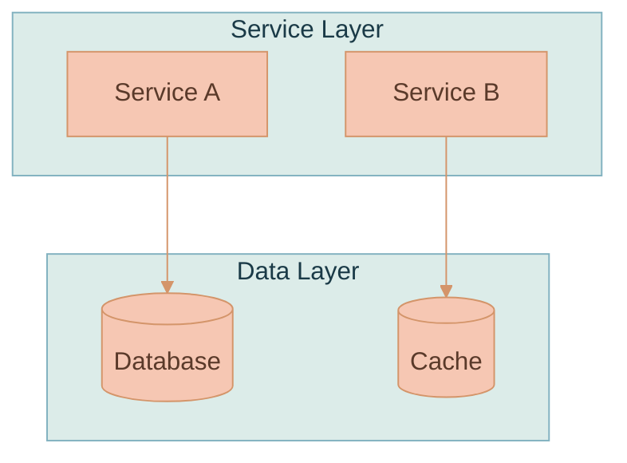
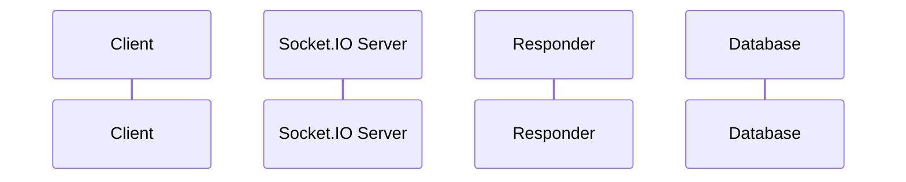
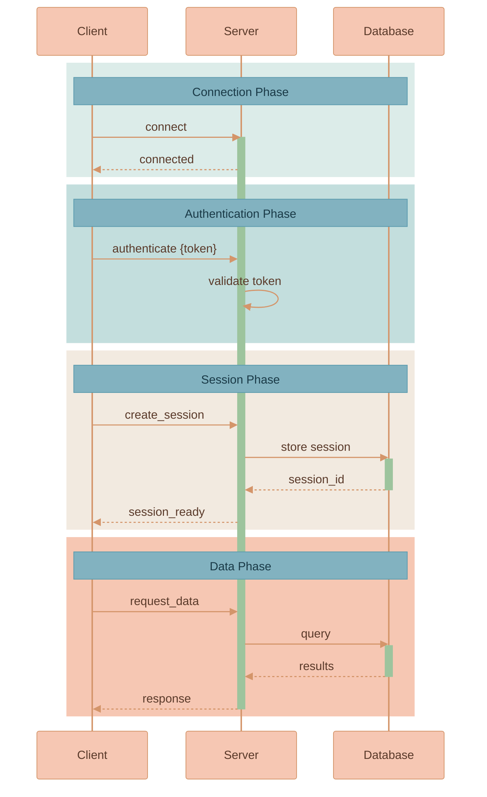
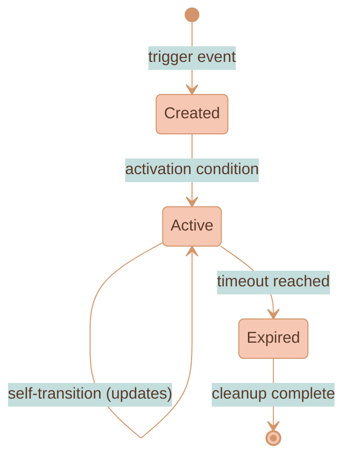

# Mermaid Diagrams Style Guide for AI Agents

This guide defines best practices for creating consistent, readable Mermaid diagrams in documentation. All diagrams should use the **"In the Sunshine"** pastel palette for visual consistency across the codebase.

## Table of Contents

- [Color Palette Reference](#color-palette-reference)
- [Theme Configuration](#theme-configuration)
- [Flowchart / Graph Diagrams](#flowchart--graph-diagrams)
- [Sequence Diagrams](#sequence-diagrams)
- [State Diagrams](#state-diagrams)
- [General Best Practices](#general-best-practices)

---

## Color Palette Reference

All diagrams use the **"In the Sunshine"** pastel palette:

| Color | Hex | RGB | Usage |
|-------|-----|-----|-------|
| Mint | `#DCECE9` | `rgb(220, 236, 233)` | Tertiary backgrounds, Phase 1 rect blocks |
| Light Teal | `#C3DEDD` | `rgb(195, 222, 221)` | Secondary backgrounds, Phase 2 rect blocks |
| Cream | `#F2EAE0` | `rgb(242, 234, 224)` | Phase 3 rect backgrounds |
| Peach | `#F6C7B3` | `rgb(246, 199, 179)` | Primary nodes, Phase 4 rect blocks, participant boxes |
| **Dusty Sage** | `#9DC49D` | `rgb(181, 201, 181)` | **ACTIVATIONS ONLY** — must use this color |
| Teal | `#82B2C0` | — | Notes, tertiary borders |
| Terracotta | `#d4956a` | — | Borders, arrows, lines |
| Dark Brown | `#5a3a2a` | — | Text on peach backgrounds |
| Dark Teal | `#1a3a47` | — | Text on teal backgrounds |

> ⚠️ **CRITICAL: Activation Color**
>
> The **Dusty Sage** (`#9DC49D`) color is specifically reserved for activation bars in sequence diagrams. This muted green provides clear visual distinction from all phase background colors. **Never use Light Teal or any phase color for activations** — they will blend into the phase backgrounds and become invisible.
>
> **Important:** Set BOTH `activationBkgColor` AND `activationBorderColor` to `#9DC49D`. This makes the border invisible, creating a clean look without the orange accent border.

### Phase Color Progression

When using `rect` blocks for phases in sequence diagrams, use this progression:

1. **Phase 1** (Connection): `rgb(220, 236, 233)` - Mint
2. **Phase 2** (Authentication): `rgb(195, 222, 221)` - Light Teal
3. **Phase 3** (Session/Setup): `rgb(242, 234, 224)` - Cream
4. **Phase 4** (Data/Processing): `rgb(246, 199, 179)` - Peach
5. **Phase 5** (AI/Streaming): `rgb(200, 220, 228)` - Light Blue-Teal
6. **Phase 6** (Completion): `rgb(240, 226, 195)` - Warm Cream

---

## Theme Configuration

**IMPORTANT:** Always put themeVariables on a SINGLE LINE. Multi-line format can cause rendering issues in some Mermaid implementations.

### Flowchart / Graph / State Diagram Theme

```
%%{init: {'theme': 'base', 'themeVariables': { 'primaryColor': '#F6C7B3', 'primaryTextColor': '#5a3a2a', 'primaryBorderColor': '#d4956a', 'secondaryColor': '#C3DEDD', 'secondaryTextColor': '#1a3a47', 'secondaryBorderColor': '#4a8a9d', 'tertiaryColor': '#DCECE9', 'tertiaryTextColor': '#1a3a47', 'tertiaryBorderColor': '#82B2C0', 'lineColor': '#d4956a', 'textColor': '#5a3a2a'}}}%%
```

### Sequence Diagram Theme

```
%%{init: {'theme': 'base', 'themeVariables': { 'noteBkgColor': '#82B2C0', 'noteTextColor': '#1a3a47', 'noteBorderColor': '#5a9aad', 'actorBkg': '#F6C7B3', 'actorBorder': '#d4956a', 'actorTextColor': '#5a3a2a', 'actorLineColor': '#d4956a', 'signalColor': '#d4956a', 'signalTextColor': '#5a3a2a', 'labelBoxBkgColor': '#F6C7B3', 'labelBoxBorderColor': '#d4956a', 'labelTextColor': '#5a3a2a', 'loopTextColor': '#5a3a2a', 'activationBorderColor': '#9DC49D', 'activationBkgColor': '#9DC49D', 'sequenceNumberColor': '#5a3a2a'}}}%%
```

### ER Diagram Theme

```
%%{init: {'theme': 'base', 'themeVariables': { 'primaryColor': '#F6C7B3', 'primaryTextColor': '#5a3a2a', 'primaryBorderColor': '#d4956a', 'lineColor': '#d4956a', 'textColor': '#5a3a2a'}}}%%
```

---

## Flowchart / Graph Diagrams

### When to Use

- **Architecture overviews**: Show system components and their relationships
- **Component hierarchies**: Display layered architectures
- **Simple workflows**: Linear or branching process flows
- **Dependency graphs**: Package or service dependencies

### Structure Guidelines

#### 1. Use Subgraphs for Logical Grouping

Group related components into named subgraphs:



#### 2. Node Naming Conventions

| Node Type | Syntax | Example |
|-----------|--------|---------|
| Process/Service | `NodeId[Display Name]` | `API[API Gateway]` |
| Database | `NodeId[(Database Name)]` | `Redis[(Redis)]` |
| External Service | `NodeId[Name<br/>Description]` | `Bedrock[AWS Bedrock<br/>Claude]` |
| Start/End | `NodeId([Label])` | `START([START])` |
| Decision | `NodeId{Decision?}` | `Check{Valid?}` |

#### 3. Arrow Types

| Arrow | Meaning | Use Case |
|-------|---------|----------|
| `-->` | Direct flow | Primary data flow |
| `-.->` | Optional/async | Optional connections, async calls |
| `<-->` | Bidirectional | Two-way communication |
| `-->|label|` | Labeled flow | Describe the relationship |

#### 4. Layer Organization Pattern

Organize architectures in logical layers from top to bottom:

```
graph TB
    subgraph "Clients"
        %% Entry points
    end

    subgraph "Service Name"
        subgraph "Entry Layer"
            %% API, WebSocket servers
        end

        subgraph "Application Layer"
            %% Business logic handlers
        end

        subgraph "Services Layer"
            %% Domain services
        end

        subgraph "Gateway Layer"
            %% External service clients
        end
    end

    subgraph "External Services"
        %% Third-party services, databases
    end
```

#### 5. Include Component Descriptions

Add brief descriptions in nodes using `<br/>` for line breaks:

```
FastAPI[FastAPI App]
SIOServer[Socket.IO Server<br/>socketio-service]
Redis[(Redis<br/>Sessions / Rate Limits)]
```

---

## Sequence Diagrams

### When to Use

- **Request flows**: Show end-to-end request processing
- **Protocol documentation**: Document event sequences
- **Multi-service interactions**: Show service-to-service communication
- **State transitions with timing**: When order matters

---

### ⚠️ CRITICAL REQUIREMENTS FOR SEQUENCE DIAGRAMS

Every sequence diagram **MUST** follow these mandatory requirements:

#### 1. Full-Width Phase Titles with `Note over`

Each phase block **MUST** have a title that spans the full width of the diagram using `Note over FirstParticipant, LastParticipant:`. This ensures:
- No empty/dead space on dark backgrounds
- Clear visual separation between phases
- Consistent professional appearance

```
rect rgb(220, 236, 233)
    Note over Client, Database: PHASE 1 - CONNECTION
    %% interactions here
end
```

**❌ WRONG — Note over single participant (leaves empty space):**
```
Note over Server: Phase 1
```

**✅ CORRECT — Note spans first to last participant:**
```
Note over Client, Database: PHASE 1 - CONNECTION
```

#### 2. Activations Are Mandatory

Every sequence diagram **MUST** include `activate`/`deactivate` pairs to show when participants are actively processing. Activations use **Dusty Sage** (`#9DC49D`) color which is visually distinct from all phase backgrounds.

**❌ WRONG — No activations:**
```
Client->>Server: request
Server->>Database: query
Database-->>Server: result
Server-->>Client: response
```

**✅ CORRECT — With activations:**
```
Client->>Server: request
activate Server
Server->>Database: query
activate Database
Database-->>Server: result
deactivate Database
Server-->>Client: response
deactivate Server
```

#### 3. Phase Blocks with Colored Backgrounds

Every logical phase **MUST** be wrapped in a `rect rgb(...)` block with the appropriate phase color.

---

### Structure Guidelines

#### 1. Define Participants First

List all participants at the top in logical order (left-to-right = flow direction):



Use `as` for readable display names while keeping IDs short.

#### 2. Organize with Phase Blocks

**The `rect` blocks with RGB colors are what create the colored phase backgrounds.** This is critical for readable diagrams. Each phase should have a distinct color from the palette.

**Phase color progression (use in order):**

| Phase | Color | RGB Value | Typical Use |
|-------|-------|-----------|-------------|
| 1 | Mint | `rgb(220, 236, 233)` | Connection, initialization |
| 2 | Light Teal | `rgb(195, 222, 221)` | Authentication, validation |
| 3 | Cream | `rgb(242, 234, 224)` | Session setup, configuration |
| 4 | Peach | `rgb(246, 199, 179)` | Data processing, main logic |

**Phase block structure:**

> ⚠️ **IMPORTANT:** The `Note over` MUST span from the FIRST participant to the LAST participant in the diagram to create a full-width phase title bar. This prevents empty/dead space on dark backgrounds.

```
    %% ═══════════════════════════════════════════════════════════════
    %% PHASE NAME IN CAPS
    %% ═══════════════════════════════════════════════════════════════
    rect rgb(220, 236, 233)
        Note over Client, Database: PHASE 1 - Phase Name
        %% All interactions for this phase go here
        Client->>Server: request
        activate Server
        Server-->>Client: response
        deactivate Server
    end
```

**Complete sequence diagram example:**



**Rules:**
1. Comment separators (`%% ═══...`) before each phase for readability in source
2. Each `rect` block must use the RGB value, not hex (e.g., `rgb(220, 236, 233)` not `#DCECE9`)
3. **`Note over` MUST span first-to-last participant** to create full-width phase title (e.g., `Note over Client, Database:`)
4. Keep `alt/else` blocks INSIDE the `rect` block they belong to
5. **Every diagram MUST have `activate`/`deactivate` pairs** — keep them balanced

#### 3. Use Activations to Show Processing

> ⚠️ **MANDATORY:** All sequence diagrams must include activations. The activation color is **Dusty Sage** (`#9DC49D`), specifically chosen to be visually distinct from all phase background colors.

Activations indicate when a participant is actively processing:

```
    Client->>Server: request
    activate Server
    Server->>Database: query
    activate Database
    Database-->>Server: result
    deactivate Database
    Server-->>Client: response
    deactivate Server
```

**Activation rules:**
- `activate` when a participant starts processing
- `deactivate` when processing completes
- Nest activations for sub-calls
- Keep activations balanced (every activate has a deactivate)

#### 4. Arrow Types for Sequence Diagrams

| Arrow | Meaning | Example |
|-------|---------|---------|
| `->>` | Synchronous call | `Client->>Server: request` |
| `-->>` | Response/return | `Server-->>Client: response` |
| `--)` | Async message | `Server--)Queue: enqueue` |
| `--x` | Lost/failed message | `Server--xClient: disconnect` |

#### 5. Use Notes for Context

Add notes to explain non-obvious behavior:

```
    Server->>Server: validate JWT
    Note over Server: Token stored in socket session<br/>(no client response on success)
```

**Note placement:**
- `Note over A: text` - Note above participant A
- `Note over A, B: text` - Note spanning A to B
- `Note left of A: text` - Note to the left
- `Note right of A: text` - Note to the right

#### 6. Conditional Flows with Alt/Else

Show branching logic:

```
    alt Rate limit exceeded
        Server-->>Client: rate_limit_exceeded {windowEnd}
        Server--xClient: disconnect
    else Rate limit OK
        Server-->>Client: connected
    end
```

#### 7. Repeated Actions with Loop

Show streaming or repeated operations:

```
    loop Token Streaming
        Service->>AI: request chunk
        AI-->>Service: token
        Service-->>Client: message_chunk {type: TEXT, content}
    end
```

#### 8. Message Format

Use descriptive message labels with payload hints:

```
Client->>Server: user_message {form_id, root_object_id, prompt_name}
Server-->>Client: message_chunk {type: PROGRESS, status: fetching_data}
```

---

## State Diagrams

### When to Use

- **Lifecycle documentation**: Entity or session states
- **Workflow states**: Document valid state transitions
- **Simple FSMs**: Finite state machines

### Structure Guidelines



**State diagram rules:**
- Use `[*]` for start and end states
- Label transitions with trigger events
- Include self-transitions for in-state updates
- Keep state names concise but descriptive

---

## General Best Practices

### 1. Diagram Placement in Documentation

- Place diagrams immediately after the section heading they illustrate
- Include a brief text description before complex diagrams
- Follow diagrams with tables explaining components

### 2. Companion Tables

Always pair architecture diagrams with explanatory tables:

```markdown
| Component | Responsibility |
|-----------|----------------|
| `ComponentA` | Brief description of what it does |
| `ComponentB` | Brief description of what it does |
```

### 3. Diagram Sizing

- Keep flowcharts to 10-15 nodes maximum
- Sequence diagrams should fit 6-8 participants
- If a diagram is too complex, split into multiple diagrams

### 4. Naming Consistency

- Use the same names in diagrams as in code
- Include technology/framework in external service nodes
- Use consistent capitalization

### 5. Accessibility

- Use descriptive node labels, not just abbreviations
- Include context in notes for complex interactions
- Don't rely solely on color to convey meaning

### 6. Common Patterns

#### Error Handling in Sequences

```
    alt Error condition
        Server-->>Client: session_error {error, code}
    else Success
        Server-->>Client: success response
    end
```

#### Async Operations

```
    Server--)Worker: enqueue job
    Note over Worker: Processing async
    Worker--)Server: job complete callback
```

#### Nested Subgraphs for Complex Systems

```
    subgraph "Main Service"
        subgraph "Layer 1"
            A[Component A]
        end
        subgraph "Layer 2"
            B[Component B]
        end
        A --> B
    end
```

---

## Quick Reference: Complete Examples

### Architecture Diagram Template

```
%%{init: {'theme': 'base', 'themeVariables': { 'primaryColor': '#F6C7B3', 'primaryTextColor': '#5a3a2a', 'primaryBorderColor': '#d4956a', 'secondaryColor': '#C3DEDD', 'secondaryTextColor': '#1a3a47', 'secondaryBorderColor': '#4a8a9d', 'tertiaryColor': '#DCECE9', 'tertiaryTextColor': '#1a3a47', 'tertiaryBorderColor': '#82B2C0', 'lineColor': '#d4956a', 'textColor': '#5a3a2a'}}}%%
graph TB
    subgraph "Clients"
        Client[Client App]
    end

    subgraph "Service Name"
        API[API Layer]
        Logic[Business Logic]
        Data[Data Access]
    end

    subgraph "External"
        DB[(Database)]
        Cache[(Cache)]
    end

    Client --> API
    API --> Logic
    Logic --> Data
    Data --> DB
    Data --> Cache
```

### Sequence Diagram Template

```
%%{init: {'theme': 'base', 'themeVariables': { 'noteBkgColor': '#82B2C0', 'noteTextColor': '#1a3a47', 'noteBorderColor': '#5a9aad', 'actorBkg': '#F6C7B3', 'actorBorder': '#d4956a', 'actorTextColor': '#5a3a2a', 'actorLineColor': '#d4956a', 'signalColor': '#d4956a', 'signalTextColor': '#5a3a2a', 'labelBoxBkgColor': '#F6C7B3', 'labelBoxBorderColor': '#d4956a', 'labelTextColor': '#5a3a2a', 'loopTextColor': '#5a3a2a', 'activationBorderColor': '#9DC49D', 'activationBkgColor': '#9DC49D', 'sequenceNumberColor': '#5a3a2a'}}}%%
sequenceDiagram
    participant Client
    participant Server
    participant Service
    participant Database

    %% ═══════════════════════════════════════════════════════════════
    %% PHASE 1: SETUP
    %% ═══════════════════════════════════════════════════════════════
    rect rgb(220, 236, 233)
        Note over Client, Database: Setup Phase
        Client->>Server: connect
        activate Server
        Server-->>Client: connected
        deactivate Server
    end

    %% ═══════════════════════════════════════════════════════════════
    %% PHASE 2: PROCESSING
    %% ═══════════════════════════════════════════════════════════════
    rect rgb(195, 222, 221)
        Note over Client, Database: Processing Phase
        Client->>Server: request {data}
        activate Server
        Server->>Service: process(data)
        activate Service
        Service->>Database: query
        activate Database
        Database-->>Service: result
        deactivate Database
        Service-->>Server: processed result
        deactivate Service
        Server-->>Client: response {result}
        deactivate Server
    end
```

### State Diagram Template

```
%%{init: {'theme': 'base', 'themeVariables': { 'primaryColor': '#F6C7B3', 'primaryTextColor': '#5a3a2a', 'primaryBorderColor': '#d4956a', 'secondaryColor': '#C3DEDD', 'lineColor': '#d4956a', 'textColor': '#5a3a2a'}}}%%
stateDiagram-v2
    [*] --> Idle: initialize
    Idle --> Processing: start
    Processing --> Processing: update
    Processing --> Complete: finish
    Processing --> Failed: error
    Complete --> [*]
    Failed --> Idle: retry
    Failed --> [*]: abandon
```

---

## Checklist for AI Agents

Before finalizing a diagram, verify:

### Sequence Diagram Checklist (CRITICAL)

- [ ] **Theme initialization** with `activationBkgColor: '#9DC49D'` AND `activationBorderColor: '#9DC49D'` (both Dusty Sage — matching colors hide the border)
- [ ] **Every phase has a `rect rgb(...)` block** with appropriate color
- [ ] **Phase titles use `Note over FirstParticipant, LastParticipant:`** — MUST span full width
- [ ] **Activations are present** — every processing participant has `activate`/`deactivate` pairs
- [ ] **Activations are balanced** — every `activate` has a matching `deactivate`
- [ ] **No empty spaces** — phase title bars fill the diagram width

### General Checklist

- [ ] Theme initialization is included at the top
- [ ] Colors match the "In the Sunshine" palette
- [ ] Node names are descriptive and consistent with code
- [ ] Complex flows include explanatory notes
- [ ] Diagram is accompanied by a descriptive table
- [ ] Diagram fits within reasonable size limits
- [ ] Arrow types correctly represent the relationship type
