# Lixpi AI Bridge

Version:  0.0.2

## Preview here: https://slides.com/lixpi/lixpi-ai-bridge-tech-preview/fullscreen

## Quick Start

### 1. Environment Setup

Run the interactive setup wizard to generate your `.env` file.

```bash
# macOS / Linux
./init.sh

# Windows
init.bat
```

Or run Docker commands directly:

```bash
# macOS / Linux
docker build -t lixpi/setup infrastructure/init-script && docker run -it --rm -v "$(pwd):/workspace" lixpi/setup

# Windows (CMD: use %cd%, PowerShell: use ${PWD})
docker build -t lixpi/setup infrastructure/init-script && docker run -it --rm -v "%cd%:/workspace" lixpi/setup
```

For CI/automation (non-interactive), see [`infrastructure/init-script/README.md`](infrastructure/init-script/README.md).

### 2. Start the Application

Run the startup script which will let you select an environment and optionally initialize the database:

```bash
# macOS / Linux
./start.sh

# Windows
start.bat
```

---

## Mock Authentication for Local Development

LocalAuth0 provides zero-config Auth0 mocking for offline development.

**Configuration:** Set `VITE_MOCK_AUTH=true` in your `.env` file (default in local environment)

**Default user:** `test@local.dev` / `local|test-user-001`

See [`services/localauth0/README.md`](services/localauth0/README.md) for details.

---


# Build and run individual services

## Web UI

```shell
# remove all previous builds including dangling images and force re-build and run
# unix
./rebuild-containers.sh lixpi-web-ui

# Then run single service
docker-compose --env-file .env.<stage-name> up lixpi-web-ui
```

## API

```shell
# remove all previous builds including dangling images and force re-build and run
# unix
./rebuild-containers.sh lixpi-api

# Then run single service
docker-compose --env-file .env.<stage-name> up lixpi-api
```

## LLM API

```shell
# remove all previous builds including dangling images and force re-build and run
# unix
./rebuild-containers.sh lixpi-llm-api

# Then run single service
docker-compose --env-file .env.<stage-name> up lixpi-llm-api
```

**Note:** Before running the LLM API service, ensure you have generated NKey credentials:

```shell
# Generate LLM service NKey user credentials (NOT account!)
docker exec -it lixpi-nats-cli nsc generate nkey --user

# Add the seed to your .env file as NATS_LLM_SERVICE_NKEY_SEED
# Add the public key to your .env file as NATS_LLM_SERVICE_NKEY_PUBLIC
```


##### Pulumi

We use Pulumi to manage our infrastructure code.

First you have to create twp *S3* buckets with the following names
 - `lixpi-pulumi-<your-name>-local`    // For local development
 - `lixpi-pulumi-<your-name>-dev`      // For dev deployments

To rebuild Pulumi container from scratch run:
```shell
./rebuild-containers.sh lixpi-pulumi
```

To run Pulumi:
```shell
docker-compose --env-file .env.<stage-name> up lixpi-pulumi
```


# Deploying to prod:

To build Web-ui

```shell
docker exec -it lixpi-web-ui pnpm build
```


# Architecture

Lixpi AI Bridge is a real-time AI-powered document collaboration platform built on a microservices architecture with NATS as the central nervous system for all inter-service and client-server communication.

## High-Level System Overview

```mermaid
flowchart LR
    WebUI["🌐 Web UI"] <-->|WebSocket| NATS["⚡ NATS"]
    NATS <--> API["⚙️ Main API"]
    NATS <--> LLM["🤖 LLM API"]
    API --> DB[(DynamoDB)]
    LLM --> AI(("AI Providers"))
```



**The core idea is simple:**
- **Everything talks through NATS** — browser clients, API service, and LLM service all communicate via the same message bus
- **Web UI connects directly to NATS** via WebSocket, enabling real-time streaming without HTTP polling
- **API Service** handles authentication, business logic, and database operations
- **LLM API Service** streams AI responses directly to clients (bypassing API for lower latency)

## Service Responsibilities

| Service | Role |
|---------|------|
| **Web UI** | Browser-based client, real-time document editing, AI chat interface |
| **API** | Gateway service, JWT authentication, business logic, DynamoDB access |
| **LLM API** | AI model orchestration, token streaming, usage tracking |
| **NATS Cluster** | Message broker, pub/sub, request/reply |
| **LocalAuth0** | Mock Auth0 for offline development |
| **DynamoDB** | Document storage, user data, AI model metadata |

## NATS as the Communication Backbone

All communication in Lixpi flows through NATS, enabling:
- **End-to-end messaging**: Browser ↔ NATS ↔ Backend services
- **Real-time streaming**: AI token streaming directly to clients
- **Centralized auth**: NATS auth_callout delegates authentication to API service
- **Queue groups**: Load balancing across service instances

### Subject Naming Convention

```
domain.entity.action[.qualifier]

Examples:
  user.get                           # Request: Get user data
  document.create                    # Request: Create document
  ai.interaction.chat.sendMessage    # Publish: Send AI chat message
  ai.interaction.chat.receiveMessage.{documentId}  # Subscribe: Receive AI stream
  ai.interaction.chat.process        # Internal: API → LLM API
```

## Authentication Flow

### Step 1: Get Token from Auth0


### Step 2: Connect to NATS with Token

```mermaid
flowchart LR
    A["Web UI"] -->|JWT| B["NATS"]
    B -->|validate| C["Auth Callout"]
    C -->|✓| B
    B -->|connected| A
```



### Step 3: Make Authenticated Requests


Both services connect to NATS, but only API can access the database. LLM API must publish messages back through NATS if it needs to persist data (e.g., usage tracking) — a tradeoff for simpler access control.

### Two Authentication Modes

1. **User Authentication (Auth0/LocalAuth0)**
   - OAuth2 flow with RS256 JWTs
   - JWKS endpoint validation
   - Permissions derived from subscription configurations

2. **Service Authentication (NKey-signed JWTs)**
   - For internal service-to-service communication (e.g., LLM API)
   - Ed25519 cryptographic signatures
   - No external Auth0 dependency

## AI Chat Flow

**Step 1:** Web UI sends message → API validates & enriches


**Step 2:** API forwards to LLM API → LLM calls AI provider


**Step 3:** LLM streams response directly to Web UI (API is bypassed!)


This is the key architectural decision — the response bypasses API entirely, going straight from LLM API to the client for minimal latency.

### Key Design Decisions

1. **Direct client streaming**: LLM API publishes tokens directly to the client's subscribed subject (`receiveMessage.{documentId}`), bypassing the API service for lower latency.

2. **API as gateway**: The API service acts as a gateway—it receives client requests, validates tokens, enriches data (e.g., AI model metadata), and forwards to LLM API.

3. **LangGraph workflows**: LLM API uses LangGraph state machines for structured processing: `validate → stream → calculate_usage → cleanup`.

4. **Provider abstraction**: OpenAI and Anthropic share a common base class, making it easy to add new AI providers.

## Data Flow Patterns

### Request/Reply Pattern

Used for synchronous operations (CRUD):


**Subjects:** `user.get`, `document.create`, `document.update`, etc.

### Pub/Sub Pattern

Used for real-time streaming:


**Subjects:** `ai.interaction.chat.receiveMessage.{documentId}`

### Queue Groups

Used for load balancing across service instances:


Only one instance receives each message.

**Queue groups:** `aiInteraction`, `llm-workers`


# A big thanks to all open source technologies that make this project possible!

 - ProseMirror: https://prosemirror.net
 - CodeMirror: https://codemirror.net
 - NATS: https://nats.io
 - D3: https://d3js.org
 - Svelte: https://svelte.dev
 - LangGraph: https://www.langchain.com/langgraph
 - shadcn & shadcn-svelte: https://www.shadcn-svelte.com
 - CSS Spinners: https://cssloaders.github.io

