# Lixpi AI Bridge

Version:  0.0.2

## Preview here: https://slides.com/lixpi/lixpi-ai-bridge-tech-preview/fullscreen

## Quick Start

### 1. Environment Setup

Run the interactive setup wizard to generate your `.env` file.

```bash
# macOS / Linux
./init.sh

# Windows
init.bat
```

Or run Docker commands directly:

```bash
# macOS / Linux
docker build -t lixpi/setup infrastructure/init-script && docker run -it --rm -v "$(pwd):/workspace" lixpi/setup

# Windows (CMD: use %cd%, PowerShell: use ${PWD})
docker build -t lixpi/setup infrastructure/init-script && docker run -it --rm -v "%cd%:/workspace" lixpi/setup
```

For CI/automation (non-interactive), see [`infrastructure/init-script/README.md`](infrastructure/init-script/README.md).

### 2. Start the Application

Run the startup script which will let you select an environment and optionally initialize the database:

```bash
# macOS / Linux
./start.sh

# Windows
start.bat
```

---

## Mock Authentication for Local Development

LocalAuth0 provides zero-config Auth0 mocking for offline development.

**Configuration:** Set `VITE_MOCK_AUTH=true` in your `.env` file (default in local environment)

**Default user:** `test@local.dev` / `local|test-user-001`

See [`services/localauth0/README.md`](services/localauth0/README.md) for details.

---


# Build and run individual services

## Web UI

```shell
# remove all previous builds including dangling images and force re-build and run
# unix
./rebuild-containers.sh lixpi-web-ui

# Then run single service
docker-compose --env-file .env.<stage-name> up lixpi-web-ui
```

## API

```shell
# remove all previous builds including dangling images and force re-build and run
# unix
./rebuild-containers.sh lixpi-api

# Then run single service
docker-compose --env-file .env.<stage-name> up lixpi-api
```

## LLM API

```shell
# remove all previous builds including dangling images and force re-build and run
# unix
./rebuild-containers.sh lixpi-llm-api

# Then run single service
docker-compose --env-file .env.<stage-name> up lixpi-llm-api
```

**Note:** Before running the LLM API service, ensure you have generated NKey credentials:

```shell
# Generate LLM service NKey user credentials (NOT account!)
docker exec -it lixpi-nats-cli nsc generate nkey --user

# Add the seed to your .env file as NATS_LLM_SERVICE_NKEY_SEED
# Add the public key to your .env file as NATS_LLM_SERVICE_NKEY_PUBLIC
```


##### Pulumi

We use Pulumi to manage our infrastructure code.

First you have to create twp *S3* buckets with the following names
 - `lixpi-pulumi-<your-name>-local`    // For local development
 - `lixpi-pulumi-<your-name>-dev`      // For dev deployments

To rebuild Pulumi container from scratch run:
```shell
./rebuild-containers.sh lixpi-pulumi
```

To run Pulumi:
```shell
docker-compose --env-file .env.<stage-name> up lixpi-pulumi
```


# Deploying to prod:

To build Web-ui

```shell
docker exec -it lixpi-web-ui pnpm build
```


# Architecture

Lixpi AI Bridge is a real-time AI-powered document collaboration platform built on a microservices architecture with NATS as the central nervous system for all inter-service and client-server communication.

## High-Level System Overview

```mermaid
flowchart LR
    WebUI["🌐 Web UI"] <-->|WebSocket| NATS["⚡ NATS"]
    NATS <--> API["⚙️ Main API"]
    NATS <--> LLM["🤖 LLM API"]
    API --> DB[(DynamoDB)]
    LLM --> AI(("AI Providers"))
```



**The core idea is simple:**
- **Everything talks through NATS** — browser clients, API service, and LLM service all communicate via the same message bus
- **Web UI connects directly to NATS** via WebSocket, enabling real-time streaming without HTTP polling
- **API Service** handles authentication, business logic, and database operations
- **LLM API Service** streams AI responses directly to clients (bypassing API for lower latency)

## Service Responsibilities

| Service | Role |
|---------|------|
| **Web UI** | Browser-based client, real-time document editing, AI chat interface |
| **API** | Gateway service, JWT authentication, business logic, DynamoDB access |
| **LLM API** | AI model orchestration, token streaming, usage tracking |
| **NATS Cluster** | Message broker, pub/sub, request/reply |
| **LocalAuth0** | Mock Auth0 for offline development |
| **DynamoDB** | Document storage, user data, AI model metadata |

## NATS as the Communication Backbone

All communication in Lixpi flows through NATS, enabling:
- **End-to-end messaging**: Browser ↔ NATS ↔ Backend services
- **Real-time streaming**: AI token streaming directly to clients
- **Centralized auth**: NATS auth_callout delegates authentication to API service
- **Queue groups**: Load balancing across service instances

### Subject Naming Convention

```
domain.entity.action[.qualifier]

Examples:
  user.get                           # Request: Get user data
  document.create                    # Request: Create document
  ai.interaction.chat.sendMessage    # Publish: Send AI chat message
  ai.interaction.chat.receiveMessage.{documentId}  # Subscribe: Receive AI stream
  ai.interaction.chat.process        # Internal: API → LLM API
```

## Authentication Flow

```mermaid
flowchart TB
    subgraph Step1["1️⃣ Get Token"]
        A["Web UI"] -->|OAuth2| B["Auth0"]
        B -->|JWT| A
    end

    subgraph Step2["2️⃣ Connect to NATS"]
        C["Web UI"] -->|JWT| D["NATS"]
        D -->|validate| E["Auth Callout"]
        E -->|✓| D
        D -->|connected| C
    end

    subgraph Step3["3️⃣ Make Requests"]
        F["Web UI"] --> G["NATS"]
        G --> H["API"] --> I[(DB)]
        G --> J["LLM API"] --> K(("AI"))
    end

    Step1 --> Step2 --> Step3
```



Only API can access the database directly. LLM API must publish messages through NATS if it needs to persist data — a tradeoff for simpler access control.

### Two Authentication Modes

1. **User Authentication (Auth0/LocalAuth0)**
   - OAuth2 flow with RS256 JWTs
   - JWKS endpoint validation
   - Permissions derived from subscription configurations

2. **Service Authentication (NKey-signed JWTs)**
   - For internal service-to-service communication (e.g., LLM API)
   - Ed25519 cryptographic signatures
   - No external Auth0 dependency

## AI Chat Flow

```mermaid
flowchart TB
    subgraph Step1["1️⃣ Request: Web UI → API"]
        A["Web UI"] -->|sendMessage| B["NATS"] --> C["API"]
    end

    subgraph Step2["2️⃣ Forward: API → LLM API"]
        D["API"] -->|process| E["NATS"] --> F["LLM API"] --> G(("AI"))
    end

    subgraph Step3["3️⃣ Response: Direct Stream to Client"]
        H(("AI")) -->|tokens| I["LLM API"] -->|receiveMessage| J["NATS"] --> K["Web UI"]
    end

    Step1 --> Step2 --> Step3
```



**Key insight:** Response tokens stream directly from LLM API → NATS → Web UI, bypassing the API service for minimal latency.

### Key Design Decisions

1. **Direct client streaming**: LLM API publishes tokens directly to the client's subscribed subject (`receiveMessage.{documentId}`), bypassing the API service for lower latency.

2. **API as gateway**: The API service acts as a gateway—it receives client requests, validates tokens, enriches data (e.g., AI model metadata), and forwards to LLM API.

3. **LangGraph workflows**: LLM API uses LangGraph state machines for structured processing: `validate → stream → calculate_usage → cleanup`.

4. **Provider abstraction**: OpenAI and Anthropic share a common base class, making it easy to add new AI providers.

## Scalability & Load Balancing

The system is designed to scale horizontally with zero configuration changes. Both `main-api` and `llm-api` services are stateless and can be replicated to handle increased load.

### NATS Queue Groups

Instead of using traditional external load balancers (like Nginx or AWS ALB), we leverage NATS **Queue Groups**.

When multiple instances of a service subscribe to the same subject with the same queue group name, NATS automatically distributes messages among them.

```mermaid
flowchart LR
    Client["Web UI / Client"] -->|Request| NATS["⚡ NATS Cluster"]

    subgraph API_Group["Queue Group: 'aiInteraction'"]
        API1["API Instance 1"]
        API2["API Instance 2"]
        API3["API Instance 3"]
    end

    subgraph LLM_Group["Queue Group: 'llm-workers'"]
        LLM1["LLM Instance 1"]
        LLM2["LLM Instance 2"]
    end

    NATS -.->|Randomly Distributed| API1
    NATS -.->|Randomly Distributed| API2
    NATS -.->|Randomly Distributed| API3

    NATS -.->|Randomly Distributed| LLM1
    NATS -.->|Randomly Distributed| LLM2
```



### How It Works

1. **Service Registration**: When a new instance of `main-api` or `llm-api` starts, it connects to NATS and subscribes to its relevant subjects (e.g., `ai.interaction.chat.process`) using a specific queue group name (e.g., `llm-workers`).
2. **Automatic Discovery**: NATS immediately recognizes the new subscriber as part of the group.
3. **Load Distribution**: When a message is published to that subject, NATS delivers it to **only one** member of the group, chosen at random.
4. **Fault Tolerance**: If an instance crashes, NATS detects the disconnection and stops sending messages to it, automatically rerouting traffic to the remaining healthy instances.

This architecture allows us to add or remove service instances dynamically based on CPU/memory usage without updating any routing configurations.


# A big thanks to all open source technologies that make this project possible!

 - ProseMirror: https://prosemirror.net
 - CodeMirror: https://codemirror.net
 - NATS: https://nats.io
 - D3: https://d3js.org
 - Svelte: https://svelte.dev
 - LangGraph: https://www.langchain.com/langgraph
 - shadcn & shadcn-svelte: https://www.shadcn-svelte.com
 - CSS Spinners: https://cssloaders.github.io

