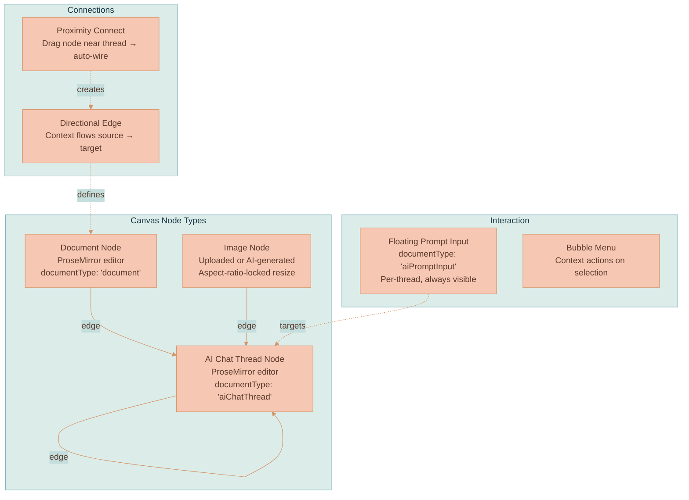
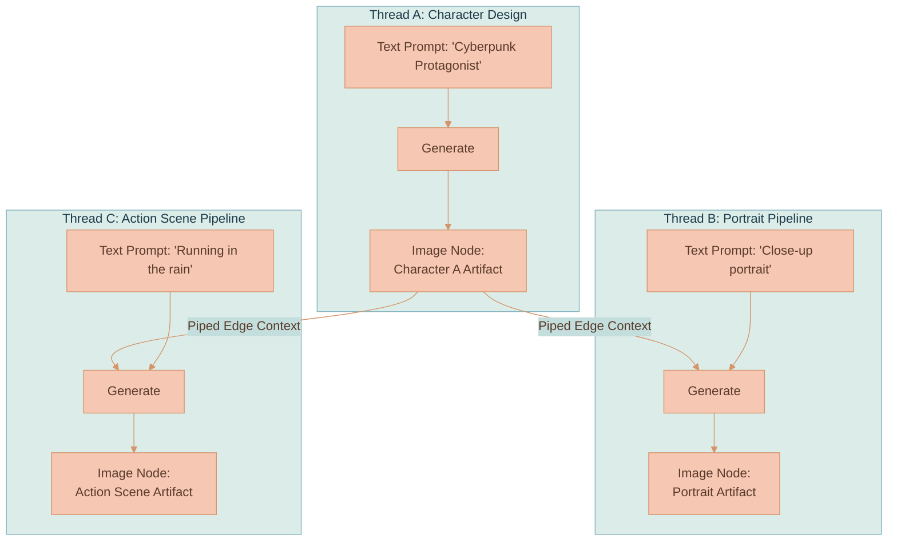
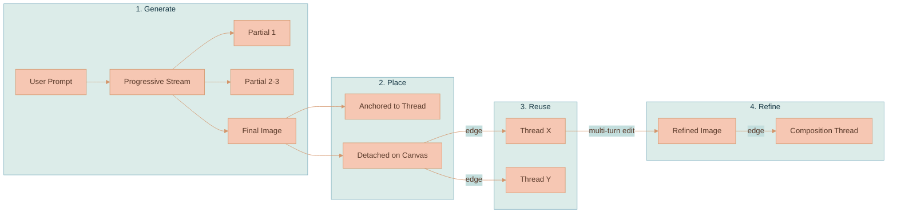
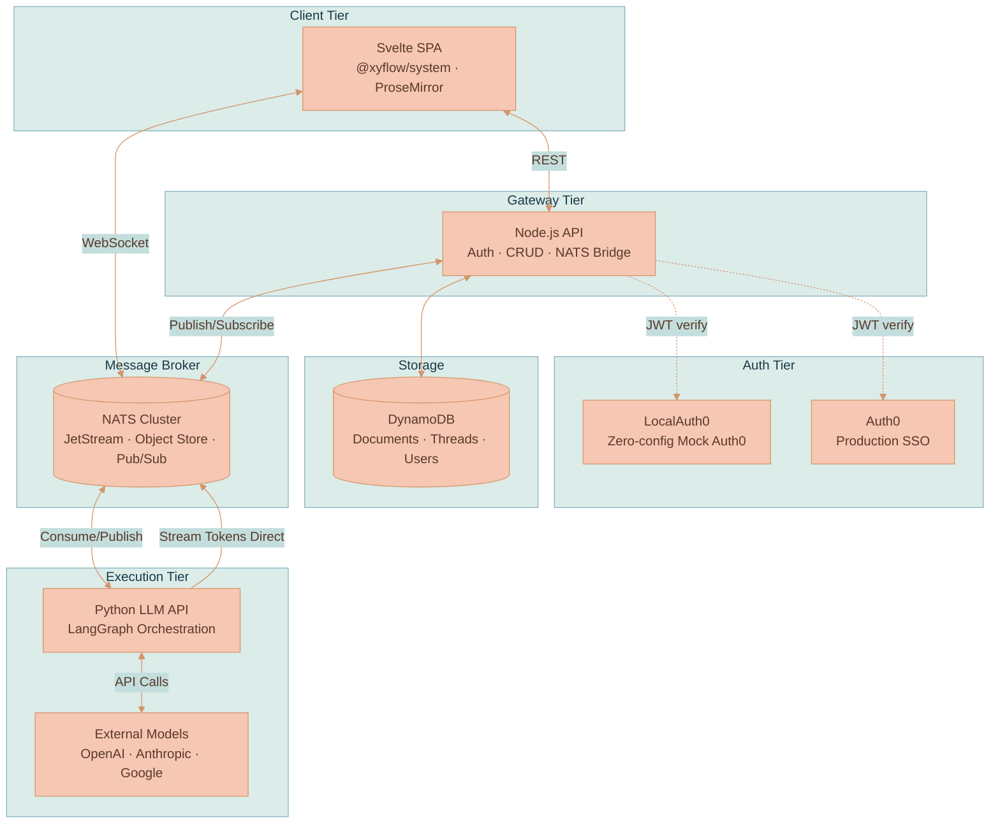
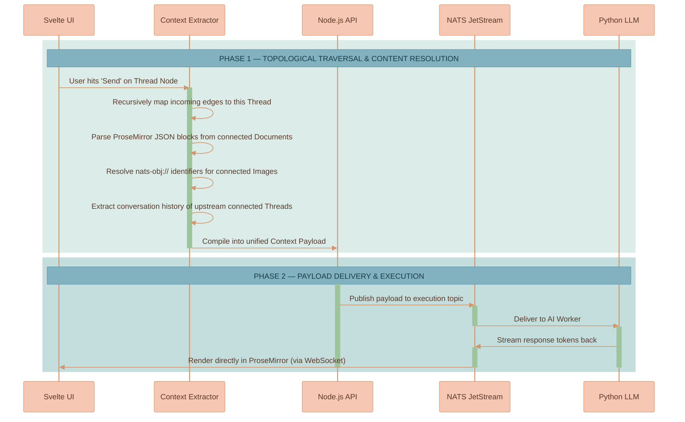
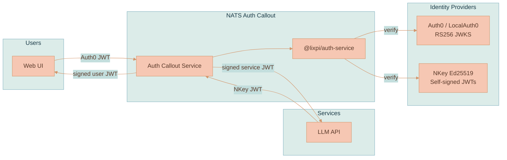

# Lixpi - Product Overview

Lixpi is a visual, node-based workflow engine engineered for building advanced AI image and video generation pipelines. Functionally, it sits at the intersection of an infinite spatial canvas (similar to Miro) and a visual logic execution pipeline (similar to n8n). Conceived and architected well before n8n's public release, Lixpi introduces a fundamental paradigm shift for generative AI tools: **spatial arrangement IS the workflow**.

Instead of writing complex workflow DSLs or using linear chat prompts, users map out ideas topologically. The spatial relationships between documents, images, and AI chat threads on the canvas directly dictate the context extraction, dependency chains, and execution sequence of the underlying AI models.

---

## 1. Core Concept & Capabilities

Lixpi solves the problem of "context collapse" and isolated text-generation loops found in traditional AI interfaces.

It is tailored specifically for complex multi-model setups, excelling at **AI image and video generation workflows**. The standout feature is its mechanical ability to enable complex scene creation and maintain strict character consistency without relying solely on fragile prompt engineering.

By treating all generated text, images, and video iterations as concrete "nodes" that exist statically on the canvas, engineers and creators can physically pipe these individual artifacts into subsequent generation threads. This visual piping ensures that any AI model downstream receives the exact generated output of an upstream model as direct, unambiguous context.

---

## 2. Canvas Primitives

The workspace canvas is an infinite, zoomable surface rendered in vanilla TypeScript using `@xyflow/system` for pan/zoom coordinate math. Every node embeds a full ProseMirror rich-text editor. The canvas supports three node types and directional edges between them.

| Node Type | Editor | Resize | Persistence |
|-----------|--------|--------|-------------|
| **Document** | ProseMirror (`documentType: 'document'`) | Free | DynamoDB Documents table |
| **Image** | None (img element) | Aspect-ratio locked | NATS JetStream Object Store |
| **AI Chat Thread** | ProseMirror (`documentType: 'aiChatThread'`) | Free | DynamoDB AI-Chat-Threads table |

**Edges** are directional connections stored in `canvasState.edges`. Each edge means "include your content as context for the target." Edges can be created by explicit handle drag or by **Proximity Connect** — dragging a node within range of an AI thread shows a dashed ghost line; dropping commits the connection.

**Floating Prompt Input** is a separate ProseMirror editor (`documentType: 'aiPromptInput'`) that appears below each AI thread node. It provides rich-text composition, an AI model selector dropdown, an image generation size picker, and Cmd/Ctrl+Enter to submit. The input is decoupled from threads — it only handles composition; an `AiPromptInputController` routes messages to the correct target.

---

## 3. Artifact Piping & Character Consistency

In typical AI generators, maintaining the exact same character across multiple different poses or scenes using text prompts alone is notoriously difficult. Lixpi solves this through **Artifact Piping**.

When an AI thread generates an image, that image becomes an independent artifact node on the canvas. You can then draw directional edges from this single image node into multiple separate AI threads to use as source material.

By piping the exact same reference artifact into different threads, consistency is guaranteed mechanically. This architecture naturally extends to video generation, allowing users to pipe static character reference sheets or specific keyframes into video generation models.

---

## 4. Image Generation Pipeline

Image generation is powered by OpenAI's gpt-image-1 via the Responses API and Google's Gemini models (Nano Banana) via the Gen AI SDK. The pipeline includes progressive streaming, canvas placement, and multi-turn editing.

**Progressive streaming**: An animated placeholder appears immediately when generation starts (`IMAGE_PARTIAL` with empty data). Up to 3 progressively sharper partial previews update the canvas node in real-time. The final high-resolution image replaces them (`IMAGE_COMPLETE`). All images are stored in NATS JetStream Object Store with SHA-256 content-hash deduplication.

**Placement modes**: Generated images can appear **anchored** (visually overlapping the thread, moving with it during drag) or as **separate canvas nodes** connected by an edge. Anchored images can be detached by dragging their center outside the thread bounds.

**Multi-turn editing**: "Edit in New Thread" creates a fresh AI thread pre-linked to the image, carrying OpenAI's `previousResponseId` for fidelity continuity. The AI remembers the exact image it generated and can make targeted modifications without regenerating from scratch. Users can branch at any point — editing the same image in multiple directions simultaneously.

**Size options**: OpenAI: Square (1024×1024), Landscape (1536×1024), Portrait (1024×1536), Auto. Google: 1:1, 3:2, 2:3, 16:9, 9:16, 4:3, 3:4, 4:5, 5:4, 21:9, Auto. The size picker adapts automatically based on the selected provider.

---

## 5. System Architecture

Lixpi operates on a highly decoupled microservices architecture. All inter-service communication flows through NATS — no REST polling for real-time data.

| Service | Language | Role |
|---------|----------|------|
| **web-ui** | Svelte / TypeScript | Browser SPA — canvas rendering, ProseMirror editors, AI chat UI, context extraction |
| **api** | Node.js / TypeScript | Gateway — JWT auth, CRUD operations, DynamoDB persistence, NATS bridge for client requests |
| **llm-api** | Python (LangGraph) | AI orchestration — 4-stage workflow (validate → stream → calculate_usage → cleanup), streams responses directly to NATS |
| **nats** | Go (3-node cluster) | Message bus — pub/sub, request/reply, JetStream Object Store for image storage |
| **localauth0** | Node.js | Mock Auth0 for zero-config offline development — RS256 JWT signing, JWKS, same OAuth flows as production |

### Key Architecture Decisions

**NATS-native**: The entire system runs through NATS — auth, messaging, file storage (Object Store), streaming. The browser connects via WebSocket directly to NATS. AI token streaming bypasses the API service entirely: the Python LLM service publishes tokens straight to per-thread NATS subjects that the browser subscribes to, giving sub-100ms delivery latency.

**Framework-agnostic canvas**: `WorkspaceCanvas.ts` is pure vanilla TypeScript with zero framework imports. It receives DOM elements and callbacks. Svelte is a thin binding layer. This insulates the canvas from framework churn.

**Provider-agnostic AI**: Every AI request sends the full conversation history — no provider-specific session IDs. Users can start a conversation with Claude, switch to GPT-5, switch to Gemini, and switch back. Adding a new provider means implementing the `BaseLLMProvider` class (a LangGraph 4-stage workflow).

**Context extraction is client-side**: When a user sends a message, the browser-side `AiChatThreadService` traverses the edge graph, extracts content from connected nodes, and assembles the multimodal payload. The API service forwards it to NATS without needing to understand the graph.

---

## 6. Multi-Model Support

Each AI thread has a model selector dropdown. Users can switch models between messages mid-conversation.

| Provider | Models | Capabilities |
|----------|--------|-------------|
| **OpenAI** | GPT-5, GPT-4.1, GPT-4.1-mini, GPT-4.1-nano, o3, o4-mini | Text generation |
| **OpenAI** | gpt-image-1 | Image generation (progressive streaming) |
| **Anthropic** | Claude 4 Opus, Claude Sonnet 4 | Text generation |
| **Google** | Gemini 2.5 Pro, Gemini 2.5 Flash | Text generation |
| **Google** | Nano Banana, Nano Banana Pro, Nano Banana 2 | Image generation (progressive streaming via Thinking) |

Each model carries metadata: context window size, max completion, supported modalities, and detailed pricing (input/output token rates, cached rates, image tiers by resolution). Five modalities are defined in the type system: `text`, `image`, `audio`, `voice`, `video` — image is fully implemented, others are infrastructure-ready.

---

## 7. Context Extraction Flow

When a user submits a prompt in an AI chat thread, the system traverses the preceding node graph to build the LLM's multimodal context payload.

### Execution Steps:
1. **Graph Traversal**: `findConnectedNodes()` filters workspace edges targeting the active thread. Traversal depth is configurable: `'direct'` (one hop, default) or `'full'` (recursive with cycle detection).
2. **Content Extraction**: `extractConnectedContext()` parses connected nodes — ProseMirror JSON → plain text for documents, `nats-obj://` URL references for images, full conversation history for upstream threads.
3. **Message Assembly**: `buildContextMessage()` assembles everything into multimodal `input_text` + `input_image` blocks, prepended to the conversation history.
4. **Image Resolution**: The Python LLM API resolves `nats-obj://` URLs to base64 data URLs using magic-byte MIME detection, then converts to the target provider's format (OpenAI Responses API or Anthropic Messages API).

---

## 8. Streaming Architecture

The complete token path from AI provider to rendered DOM, bypassing the API service entirely:

```mermaid
%%{init: {'theme': 'base', 'themeVariables': { 'primaryColor': '#F6C7B3', 'primaryTextColor': '#5a3a2a', 'primaryBorderColor': '#d4956a', 'secondaryColor': '#C3DEDD', 'secondaryTextColor': '#1a3a47', 'secondaryBorderColor': '#4a8a9d', 'tertiaryColor': '#DCECE9', 'tertiaryTextColor': '#1a3a47', 'tertiaryBorderColor': '#82B2C0', 'lineColor': '#d4956a', 'textColor': '#5a3a2a'}}}%%
graph LR
    subgraph "AI Provider"
        LLM[OpenAI / Anthropic]
    end

    subgraph "LLM API · Python"
        LG[LangGraph Workflow]
        Pub[NATS Publish]
    end

    subgraph "NATS"
        Subj["ai.interaction.chat<br/>.receiveMessage<br/>.{workspaceId}.{threadId}"]
    end

    subgraph "Browser"
        AIS[AiInteractionService]
        MSP[MarkdownStreamParser]
        Plug[aiChatThreadPlugin]
        SI[StreamingInserter]
        DOM[ProseMirror DOM]
    end

    LLM -->|SSE tokens| LG
    LG --> Pub
    Pub -->|STREAMING chunks| Subj
    Subj -->|WebSocket| AIS
    AIS -->|raw text| MSP
    MSP -->|structured segments| Plug
    Plug -->|ProseMirror transactions| SI
    SI --> DOM
```

**Stream events**: `START_STREAM` → `STREAMING` chunks → `END_STREAM`. Image events (`IMAGE_PARTIAL`, `IMAGE_COMPLETE`) bypass the text pipeline and go directly to the canvas renderer.

**MarkdownStreamParser** converts raw token text into structured segments (headers, paragraphs, code blocks, inline marks). The `StreamingInserter` translates these into ProseMirror transactions that insert content into the editor DOM in real-time.

**Circuit breaker**: A 20-minute timeout prevents runaway requests from consuming resources indefinitely.

---

## 9. Authentication & Security

Lixpi uses a dual authentication model — Auth0 JWTs for users, Ed25519 NKey JWTs for internal services.

**NATS Auth Callout** intercepts every NATS connection attempt. It decrypts the request, verifies the token via `@lixpi/auth-service`, builds permissions, and returns a signed user JWT to NATS. Services like `llm-api` run in isolated NATS accounts with minimal permissions — they cannot access DynamoDB or receive client messages directly.

**LocalAuth0** provides zero-config offline development. It generates RS256 keypairs, issues JWTs matching production Auth0's OAuth flows, and persists state in a Docker volume. No Auth0 account needed, no internet required.

---

## 10. Shared Infrastructure

Cross-language packages keep TypeScript and Python services in sync:

| Package | Purpose |
|---------|---------|
| `@lixpi/constants` | NATS subjects (single JSON source of truth), shared types, AI model metadata with pricing |
| `@lixpi/nats-service` | Dual TypeScript + Python NATS client with identical API, JetStream Object Store, NKey auth |
| `@lixpi/auth-service` | JWT verification (Auth0 RS256 + NKey Ed25519) used by API and NATS Auth Callout |
| `@lixpi/nats-auth-callout-service` | NATS connection auth with per-service permission scoping |
| `@xyflow/system` (vendored) | Framework-agnostic pan/zoom/coordinate math — used at the low-level API, not React Flow or Svelte Flow |
