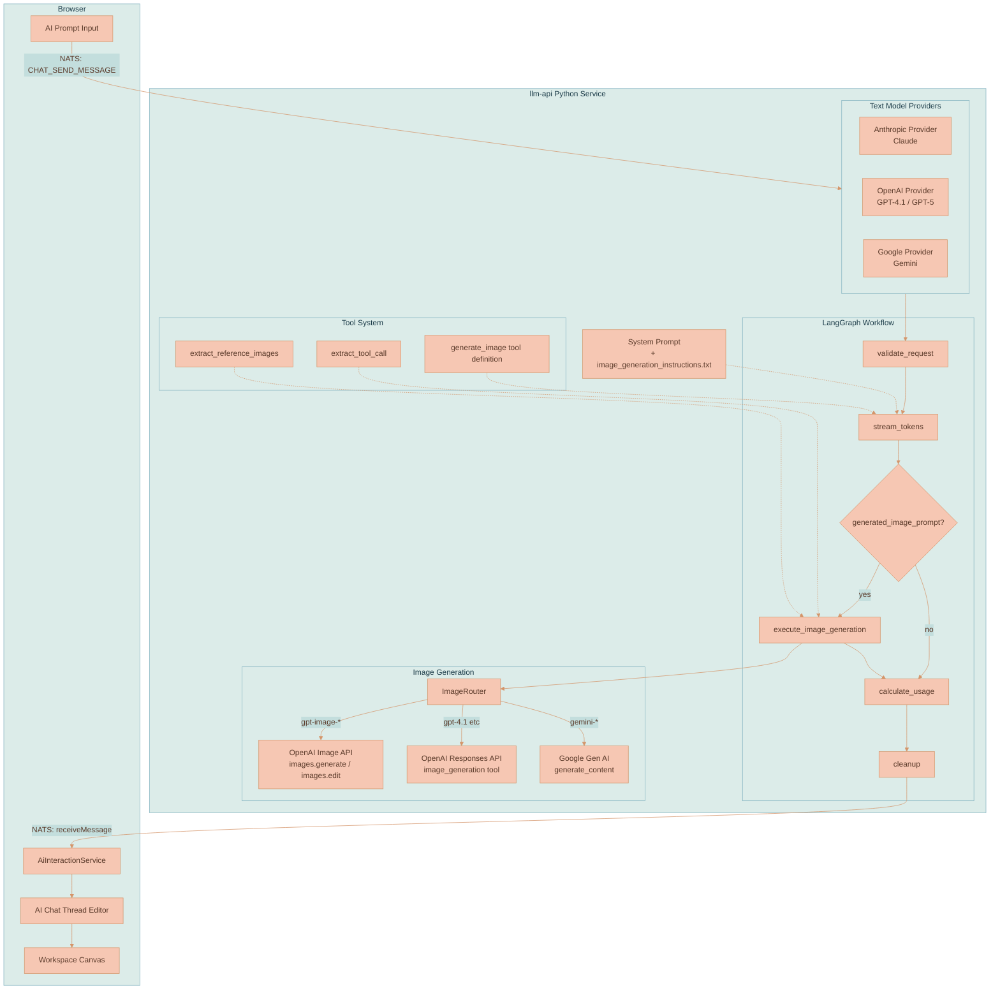
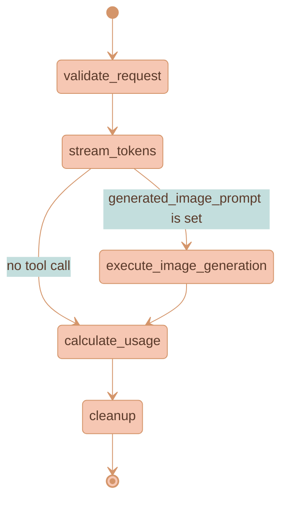
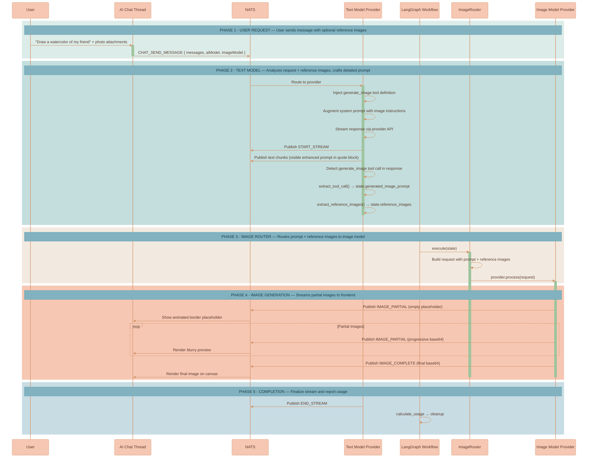

# Image Generation

The platform supports AI-powered image generation through a dual-model architecture. A **text model** (Claude, GPT, Gemini) analyzes the user's request and crafts a detailed enhanced prompt, then a dedicated **image model** (GPT Image 1.5, Gemini native, etc.) generates the actual image. This separation lets each model do what it's best at — language models excel at understanding intent and writing rich descriptions, while image models excel at visual synthesis.

## Core Concepts

**Dual-Model Routing** — The user selects a text model and an image model independently. The text model receives the conversation (including any reference photos), understands the request, writes a comprehensive image prompt, and emits a `generate_image` tool call. The system then routes that prompt to the selected image model for actual generation.

**Tool Calling** — The text model doesn't generate images directly. Instead, it calls a `generate_image` function tool with its enhanced prompt. LangGraph's conditional edges detect this tool call and route execution to the ImageRouter.

**Reference Images** — When users attach photos to their message, these reference images are extracted from the conversation and forwarded to the image model. For OpenAI GPT Image models, this means using `images.edit()` (which accepts reference images) instead of `images.generate()` (text-only).

**System Prompt Enhancement** — When an image model is selected, the text model's system prompt is augmented with detailed instructions on how to craft image prompts, how to describe reference images, and the requirement to show the enhanced prompt to the user in a quote block.

**Stream Lifecycle Management** — When the image model is called via ImageRouter, it must not emit its own `START_STREAM`/`END_STREAM` events — the text model already manages the stream lifecycle. The image model only publishes `IMAGE_PARTIAL` and `IMAGE_COMPLETE` events.

## System Architecture



## LangGraph State Machine

Every provider (Anthropic, OpenAI, Google) shares the same LangGraph workflow defined in `BaseLLMProvider`. The workflow is a state machine that processes each request through a fixed sequence of nodes with one conditional branch for image generation.



### State (`ProviderState`)

The LangGraph state is a `TypedDict` that flows through every node. Key fields for image generation:

| Field | Type | Purpose |
|-------|------|---------|
| `messages` | `list` | Raw conversation messages from frontend (OpenAI-like `input_image` blocks) |
| `model_version` | `str` | Text model ID (e.g., `claude-sonnet-4-20250514`) |
| `enable_image_generation` | `bool` | `True` when called as image model by ImageRouter |
| `image_model_version` | `str` | Selected image model ID (e.g., `gpt-image-1.5`) |
| `image_provider_name` | `str` | Image model provider (`OpenAI`, `Google`) |
| `image_model_meta_info` | `dict` | Image model pricing and metadata |
| `generated_image_prompt` | `str` | Enhanced prompt extracted from text model's tool call |
| `reference_images` | `list[str]` | Data URLs of user-attached images, extracted after tool call |
| `image_size` | `str` | Requested size (`1024x1024`, `auto`, etc.) |
| `image_usage` | `dict` | Image generation usage stats for billing |

### Workflow Nodes

**`validate_request`** — Validates required fields, extracts model metadata.

**`stream_tokens`** — Calls the provider's `_stream_impl()`. The text model streams its response, publishes `START_STREAM` + text chunks + `END_STREAM`. If it detects a `generate_image` tool call, it sets `state['generated_image_prompt']` and `state['reference_images']`.

**`execute_image_generation`** — Conditional node. Only runs if `generated_image_prompt` is set. Creates an `ImageRouter` which instantiates a fresh provider for the image model and calls `provider.process()`.

**`calculate_usage`** — Computes costs from token counts and image generation metrics.

**`cleanup`** — Publishes final usage report via NATS.

## Dual-Model Flow

This is the primary image generation path. The user has selected both a text model (e.g., Claude Opus 4.6) and an image model (e.g., GPT Image 1.5).



## Tool Calling Mechanism

### Tool Definition

The `generate_image` tool is defined in `tools/image_generation.py` and formatted per-provider:

| Provider | Format Key | Schema Key |
|----------|-----------|------------|
| OpenAI | `type: "function"` | `parameters` |
| Anthropic | — | `input_schema` |
| Google | — | `parameters` (wrapped in `FunctionDeclaration`) |

All share the same schema:

```python
{
    "type": "object",
    "properties": {
        "prompt": {
            "type": "string",
            "description": "A detailed, descriptive prompt for image generation..."
        }
    },
    "required": ["prompt"]
}
```

### Tool Injection

The tool is injected into the text model's request only when:
1. An image model is selected (`has_image_model = True`)
2. The provider is NOT being called as the image model itself (`not enable_image_generation`)

This prevents infinite recursion — the image model provider must never see the `generate_image` tool.

### Tool Call Extraction

After the text model completes, each provider extracts the tool call from its response format:

- **OpenAI**: Scans `response.output` for `type: 'function_call'` with `name: 'generate_image'`, parses `item.arguments` JSON
- **Anthropic**: Scans `final_message.content` for `type: 'tool_use'` with `name: 'generate_image'`, reads `block.input`
- **Google**: Iterates `response.candidates[].content.parts[]` looking for `function_call` with `name: 'generate_image'`

### Reference Image Extraction

When a tool call is detected, `extract_reference_images()` scans all user messages for attached images. It handles all three provider formats since messages may have been converted already:

| Format | Block Type | Image Data Location |
|--------|-----------|---------------------|
| OpenAI | `input_image` | `block.image_url` (data URL string) |
| Anthropic | `image` | `block.source.data` (base64) + `block.source.media_type` |
| Google | `inline_data` | `block.data` (base64) + `block.mime_type` |

Each provider passes its **already-resolved** messages (after NATS object store refs are converted to data URLs) to ensure all images are available as base64.

## Image Model Provider Paths

### OpenAI: GPT Image Models (`gpt-image-1`, `gpt-image-1.5`, `gpt-image-1-mini`)

GPT Image models use the **Image API** (`client.images.generate()` / `client.images.edit()`), not the Responses API. The `_stream_impl` method routes based on model prefix:

```
if enable_image_generation and model_version.startswith('gpt-image-'):
    → _generate_via_image_api()      # Image API
else:
    → _generate_via_responses_api()   # Responses API
```

**Without reference images** → `client.images.generate(stream=True, partial_images=3)`

**With reference images** → `client.images.edit(image=files, stream=True, partial_images=3)`

Reference image data URLs are converted to `BytesIO` file objects via `_data_url_to_file()` before passing to the SDK.

The streaming response yields `ImageGenPartialImageEvent` (with progressive base64) and `ImageGenCompletedEvent` (with final base64 + usage data).

### OpenAI: Responses API Models (`gpt-4.1`, `gpt-5`, etc.)

When the image model is a mainline model with built-in `image_generation` tool (not a `gpt-image-*` model), it uses the Responses API with the native image generation tool configured:

```python
tools = [{
    'type': 'image_generation',
    'quality': 'high',
    'partial_images': 3,
    'size': image_size
}]
```

The model generates images internally (calling GPT Image under the hood) and streams response events including `response.image_generation_call.partial_image` and `response.completed`.

### Google: Native Image Generation (Gemini)

Google models with image output capability use `generate_content()` with `response_modalities: ['TEXT', 'IMAGE']`. The response contains `inline_data` parts with raw bytes that are base64-encoded before publishing.

For Gemini 3+ models, `thinking_config` is enabled, and thought images (intermediate generation steps) are published as `IMAGE_PARTIAL` events.

## System Prompt Enhancement

When an image model is selected, the text model receives augmented system instructions via `get_system_prompt(include_image_generation=True)`. This appends `image_generation_instructions.txt` to the base system prompt.

The instructions tell the text model to:

1. **Always use the `generate_image` tool** for visual requests — never describe images in text
2. **Show the enhanced prompt** in a quote block (`>` prefix) so the user can see exactly what's being sent
3. **Write exhaustive prompts** (100+ words) covering subject description, artistic direction, composition, color palette, lighting, and mood
4. **Handle reference images explicitly** — when the user provides photos, describe every observable detail (facial features, hair, skin tone, body type, clothing, pose, expression) and instruct the image model to use the provided reference images

## ImageRouter

The `ImageRouter` bridges the text model's tool call to the image model's provider. It:

1. Reads `generated_image_prompt`, `reference_images`, `image_provider_name`, `image_model_version` from state
2. Instantiates a fresh provider for the image model (`OpenAIProvider`, `GoogleProvider`, etc.)
3. Builds a request with the enhanced prompt as the user message, including reference images as `input_image` content blocks
4. Calls `provider.process(request)` which runs a full LangGraph workflow for the image model

The image model provider receives `enableImageGeneration: True` in its request, which:
- Skips `START_STREAM` / `END_STREAM` publishing (the text model manages these)
- Routes to the appropriate image generation API (Image API for GPT Image models, native for Google)

## NATS Event Types

Image generation publishes these event types through the standard `receiveMessage.{workspaceId}.{threadId}` NATS subject:

| Event | Status | Payload | Purpose |
|-------|--------|---------|---------|
| Stream start | `START_STREAM` | — | Begin streaming (text model only) |
| Text chunk | `STREAMING` | `{ content }` | Streaming text delta |
| Image placeholder | `IMAGE_PARTIAL` | `{ imageBase64: "", partialIndex: 0 }` | Trigger animated border in UI |
| Partial image | `IMAGE_PARTIAL` | `{ imageBase64: "...", partialIndex: N }` | Progressive image preview |
| Final image | `IMAGE_COMPLETE` | `{ imageBase64: "...", revisedPrompt }` | Completed image |
| Stream end | `END_STREAM` | `{ usage }` | End streaming (text model only) |

## Provider Comparison

| Capability | OpenAI (GPT Image) | OpenAI (Responses API) | Google (Gemini Native) |
|---|---|---|---|
| API Method | `images.generate()` / `images.edit()` | `responses.create()` with `image_generation` tool | `generate_content()` with `response_modalities` |
| Streaming | `partial_images=3` | Built-in partial image events | Non-streaming (single response) |
| Reference Images | `images.edit(image=files)` | Inline `input_image` in messages | Inline `inline_data` in contents |
| Placeholder | Empty `IMAGE_PARTIAL` before API call | `response.output_item.added` event | Empty `IMAGE_PARTIAL` before API call |
| Usage Data | `ImageGenCompletedEvent.usage` | `response.completed` usage object | `usage_metadata` on response |

## File Structure

```
services/llm-api/src/
├── providers/
│   ├── base.py                    # LangGraph workflow, ProviderState, BaseLLMProvider
│   ├── openai/
│   │   └── provider.py            # _generate_via_image_api(), _generate_via_responses_api()
│   ├── anthropic/
│   │   └── provider.py            # Tool injection + extraction for Claude
│   └── google/
│       └── provider.py            # Native image gen + tool injection
├── tools/
│   ├── image_generation.py        # Tool definitions, extract_tool_call(), extract_reference_images()
│   └── image_router.py            # ImageRouter — bridges text model → image model
└── prompts/
    ├── __init__.py                # get_system_prompt(include_image_generation)
    └── image_generation_instructions.txt  # Detailed instructions for text models
```
