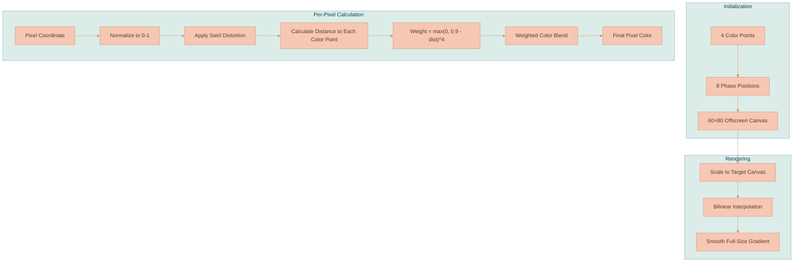
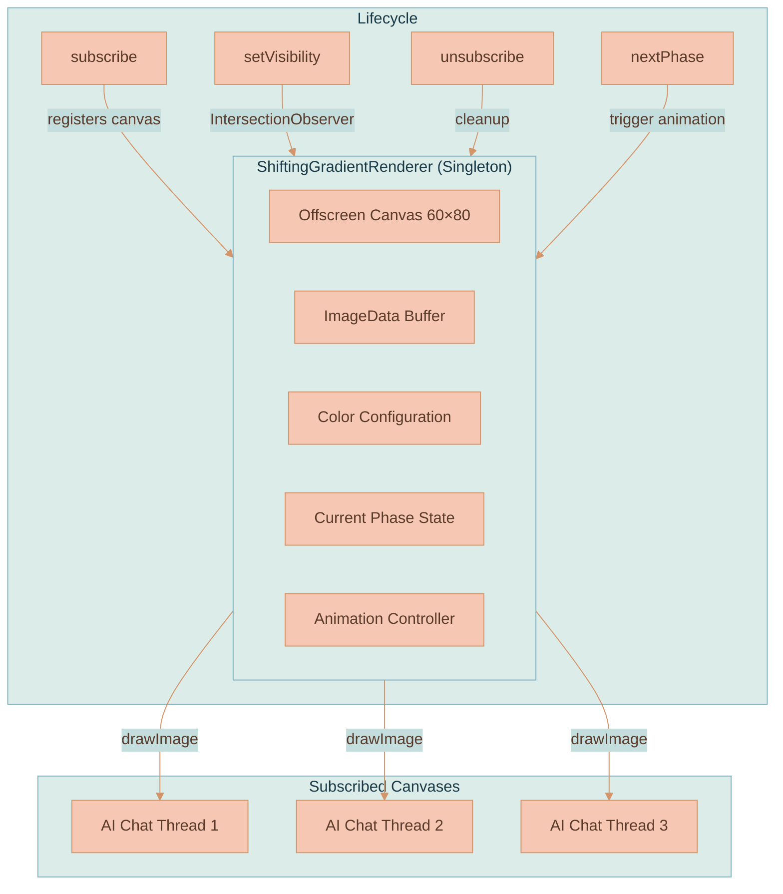
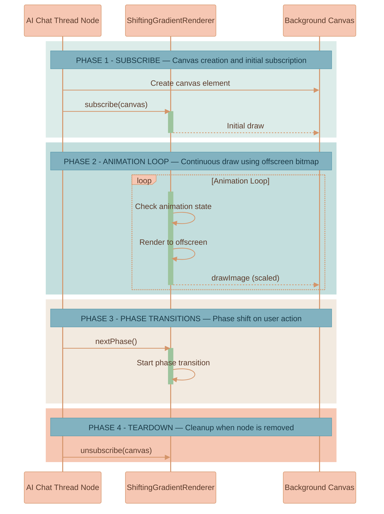

# Shifting Gradient Background

The AI Chat Thread nodes in the workspace feature a beautiful animated gradient background that smoothly shifts between color positions. This creates a living, breathing feel for the AI conversation space.

## Inspiration

We took inspiration from animated freeform gradient wallpapers found in modern messaging apps. The clever trick is rendering to a tiny 60×80 pixel bitmap and then letting the browser's bilinear interpolation do the heavy lifting when scaling up. The result is buttery smooth gradients at virtually zero CPU cost.

We've built our own implementation that works as a singleton renderer powering multiple canvas elements simultaneously.

## How It Works

The gradient uses four color points positioned around the canvas. Each pixel's color is calculated using inverse distance weighting — the closer a pixel is to a color point, the more that color influences the final result. The weighting uses a `distance^4` falloff, which creates those nice soft blobs rather than harsh linear gradients.

On top of that, there's a swirl distortion applied to the coordinates before the color calculation. This prevents the gradient from looking too "geometric" — it adds an organic, flowing quality.

### The Algorithm



### Phase Positions

The gradient has 8 predefined phases, each defining where the 4 color points sit on the canvas. When the user sends a message, the gradient animates from one phase to the next, creating that subtle shift effect.

```
Phase 0: Color points mostly in upper-right area
Phase 1: Points spread between upper-left and lower-right
Phase 2: Points moving toward center and bottom
...and so on through Phase 7
```

The animation uses a cubic bezier easing curve (`0.33, 0, 0, 1`) which gives it that nice ease-out feel — fast at the start, gentle landing at the end.

## Architecture



The renderer is a singleton. There's only ever one instance, and it maintains a single 60×80 offscreen canvas. Multiple AI chat thread nodes can subscribe to it, and they all share the same rendered gradient. This is efficient — we're not recalculating the gradient for every node.

### Key Components

| Component | Location | Purpose |
|-----------|----------|---------|
| `ShiftingGradientRenderer` | `services/web-ui/src/utils/shiftingGradientRenderer.ts` | Core gradient rendering engine |
| `GRADIENT_COLORS` | Same file, top | The 4 colors used for the gradient |
| `PHASE_POSITIONS` | Same file | The 8 position coordinates for each phase |

### Swirl Distortion

The swirl effect is what makes the gradient feel organic rather than mathematical. Here's how it works:

1. Calculate distance from pixel to center (0.5, 0.5)
2. Rotation angle = `(distance × 0.35)² × 0.8 × 8.0`
3. Rotate the coordinate around the center by that angle

Pixels near the center barely rotate. Pixels near the edges rotate more. This creates a subtle spiral effect in the final gradient.

## Color Selection

The gradient uses 4 colors that blend together. Choosing good colors is important — they need to:

1. Be harmonious (work well together when blended)
2. Have appropriate contrast (not too similar, not too jarring)
3. Match the overall design aesthetic

The current colors are ultra-light pastels inspired by a desert sunset sky palette:

```typescript
const GRADIENT_COLORS = {
    color1: { r: 0xff, g: 0xf5, b: 0xfa }, // #FFF5FA - whisper pink
    color2: { r: 0xf5, g: 0xef, b: 0xf9 }, // #F5EFF9 - whisper lavender
    color3: { r: 0xe6, g: 0xe9, b: 0xf6 }, // #E6E9F6 - whisper periwinkle
    color4: { r: 0xf3, g: 0xe4, b: 0xf2 }, // #F3E4F2 - whisper orchid
}
```

## Color Analysis Tool

When you want to extract colors from a reference image (like a gradient wallpaper screenshot), we have a Python tool that does perceptual color fitting.

### Location

```
random-useful-things/image-color-analysis-tool/advanced_gradient_color_analysis.py
```

### What It Does

```mermaid
%%{init: {'theme': 'base', 'themeVariables': { 'primaryColor': '#F6C7B3', 'primaryTextColor': '#5a3a2a', 'primaryBorderColor': '#d4956a', 'secondaryColor': '#C3DEDD', 'secondaryTextColor': '#1a3a47', 'secondaryBorderColor': '#4a8a9d', 'tertiaryColor': '#DCECE9', 'tertiaryTextColor': '#1a3a47', 'tertiaryBorderColor': '#82B2C0', 'lineColor': '#d4956a', 'textColor': '#5a3a2a'}}}%%
flowchart LR
    subgraph Input
        IMG[Reference Image]
    end

    subgraph Preprocessing
        BLUR[Gaussian Blur]
        GRID[50×50 Sample Grid]
    end

    subgraph Analysis
        LAB[Convert to LAB Color Space]
        LCH[Analyze Lightness/Chroma/Hue]
        REGIONS[Extract Regional Averages]
    end

    subgraph Optimization
        DE[Differential Evolution]
        DELTAE[Delta E Perceptual Error]
        PHASES[Test Multiple Phases]
    end

    subgraph Output
        COLORS[Optimized 4 Colors]
        PHASE[Best Phase Number]
        TS[TypeScript Code Snippet]
    end

    IMG --> BLUR
    BLUR --> GRID
    GRID --> LAB
    LAB --> LCH
    LCH --> REGIONS
    REGIONS --> DE
    DE --> DELTAE
    DELTAE --> PHASES
    PHASES --> COLORS
    COLORS --> PHASE
    PHASE --> TS
```



### How to Use It

1. Get your reference image (screenshot of a gradient you like)
2. Copy it to a location accessible inside the Docker container
3. Run the analysis

```bash
# Copy the tool and image to the llm-api container's mounted directory
cp random-useful-things/image-color-analysis-tool/advanced_gradient_color_analysis.py services/llm-api/src/tmp/
cp my-gradient.jpg services/llm-api/src/tmp/

# Run analysis (the llm-api container has the required Python dependencies)
docker compose exec -T lixpi-llm-api python \
  /app/src/tmp/advanced_gradient_color_analysis.py \
  /app/src/tmp/my-gradient.jpg
```

The tool accepts either a local file path or a URL.

### Understanding the Output

The tool outputs several sections:

**Color Distribution Analysis**
```
Lightness range: 54.5 - 94.4
Lightness mean: 73.3, std: 7.3
Chroma range: 0.6 - 40.3
Hue range: 110.3° - 230.5°
```

This tells you about the overall color properties of the reference image. Lightness is in the LAB L* scale (0=black, 100=white). Hue is in degrees (0°=red, 120°=green, 240°=blue).

**Regional Color Averages**
```
top_right: #90BA8A
center_right: #9EBF94
top_left: #B8CA8B
bottom_center: #8FB396
```

The tool samples different regions of the image and reports the average color in each. This gives you a quick sense of the gradient structure.

**Perceptual Optimization Results**

The tool runs optimization for multiple phases and reports the perceptual error (Delta E) for each:

```
Phase 0:
  Perceptual error (Delta E): 11.01
  Colors:
    1: #7DB467 (L=68.0)
    2: #A9B181 (L=70.5)
    ...
```

Lower Delta E = better match to the reference. The tool picks the phase with the lowest error.

**Final TypeScript Snippet**

At the end, you get ready-to-paste code:

```typescript
const GRADIENT_COLORS = {
    color1: { r: 0x7c, g: 0xbb, b: 0x6c }, // #7CBB6C
    color2: { r: 0xab, g: 0xb8, b: 0x87 }, // #ABB887
    color3: { r: 0x9f, g: 0xcd, b: 0x91 }, // #9FCD91
    color4: { r: 0x80, g: 0xb2, b: 0x91 }, // #80B291
}

const CURRENT_PHASE = 0
```

### Why LAB Color Space?

The tool uses CIE LAB color space for optimization because it's perceptually uniform. In RGB, a numerical difference of 10 units might look huge in one color range and invisible in another. In LAB, equal numerical distances correspond to roughly equal perceived differences. Delta E is just the Euclidean distance in LAB space.

### Pattern Overlay Removal

Many gradient wallpapers have decorative pattern overlays (icons, doodles, etc.). The tool applies Gaussian blur to remove these high-frequency patterns before analysis, so you're measuring the underlying gradient colors, not the overlay.

## Integration with AI Chat Threads

When an AI chat thread node is created on the workspace canvas, it subscribes to the gradient renderer:



### Visibility Optimization

We use `IntersectionObserver` to track which nodes are actually visible on screen. Hidden nodes (scrolled out of view or behind other elements) don't receive gradient updates, saving rendering work.

## Performance Characteristics

| Metric | Value | Notes |
|--------|-------|-------|
| Bitmap size | 60×80 pixels | 4,800 pixels total |
| Render cost | ~5000 pixel ops | Per frame, trivial for modern CPUs |
| Memory | ~20KB | One offscreen canvas + ImageData |
| Animation FPS | 60fps | Uses requestAnimationFrame |
| Phase transition | 500ms | Cubic-bezier eased |

The design is intentionally simple. No WebGL, no shaders, just plain Canvas 2D. This keeps it portable and predictable across browsers.

## Customization

### Changing Colors

Edit the `GRADIENT_COLORS` constant at the top of `shiftingGradientRenderer.ts`:

```typescript
const GRADIENT_COLORS = {
    color1: { r: 0xff, g: 0xf5, b: 0xfa },
    color2: { r: 0xf5, g: 0xef, b: 0xf9 },
    color3: { r: 0xe6, g: 0xe9, b: 0xf6 },
    color4: { r: 0xf3, g: 0xe4, b: 0xf2 },
}
```

Colors are in RGB format with values 0-255 (or hex 0x00-0xff).

### Changing Animation Speed

Edit `ANIMATION_DURATION_MS`:

```typescript
const ANIMATION_DURATION_MS = 500  // milliseconds
```

### Changing Swirl Intensity

Edit `SWIRL_FACTOR`:

```typescript
const SWIRL_FACTOR = 0.35  // 0 = no swirl, 1 = extreme swirl
```

### Changing Initial Phase

Edit `currentPhase` in the constructor:

```typescript
private currentPhase: number = 0  // 0-7
```

## CSS Integration

The gradient canvas is positioned behind the AI chat thread content using CSS. The canvas element itself is given a class that positions it absolutely within the node container:

```scss
.workspace-ai-chat-thread-node {
    position: relative;

    .shifting-gradient-canvas {
        position: absolute;
        inset: 0;
        border-radius: inherit;
        z-index: 0;
    }

    .ai-chat-content {
        position: relative;
        z-index: 1;
    }
}
```

## Pattern Overlay Support

The renderer supports an optional pattern overlay (decorative icons/doodles on top of the gradient). This isn't currently used but the infrastructure exists:

```typescript
// In shiftingGradientRenderer.ts
private pattern: {
    image: HTMLImageElement
    options: Required<PatternOptions>
} | null = null
```

If enabled, patterns are drawn after the gradient with configurable alpha, blend mode, tint color, and scale.

## Troubleshooting

**Gradient looks banded/posterized**
- Check that `imageSmoothingEnabled = true` is set on the target canvas context
- Ensure `imageSmoothingQuality = 'high'`

**Gradient not animating**
- Verify the canvas is subscribed via `subscribe(canvas)`
- Check that visibility is set correctly via `setVisibility(canvas, true)`
- Confirm the animation loop is running (check for subscribers)

**Colors don't match reference image**
- Run the color analysis tool to get proper color values
- Pay attention to the lightness values — the gradient renderer doesn't add brightness
- Check if the reference has a pattern overlay that's affecting perception

**Multiple nodes showing different states**
- This shouldn't happen — the singleton ensures all nodes share state
- If you see this, check for multiple renderer instances (there should only be one)

## References

- CIE LAB color space: https://en.wikipedia.org/wiki/CIELAB_color_space
- Delta E color difference: https://en.wikipedia.org/wiki/Color_difference#CIELAB_%CE%94E*
