# Workspace Feature

A workspace is the primary container where users organize and edit their documents and images. Think of it as an infinite canvas where cards float, can be arranged freely, resized, and edited in place.

## Core Concepts

**Workspace** — A named container owned by a user. Has a canvas state (viewport position, zoom level, and node positions) plus references to documents, AI chat threads, and uploaded files.

**Canvas Node** — A positioned rectangle on the canvas. Can be a document node (with ProseMirror editor), an image node, or an AI chat thread node. Stores position, dimensions, and type-specific data.

**Document** — The actual text content (ProseMirror JSON). Lives separately from its canvas representation so the same document could theoretically appear in multiple workspaces. Documents use `documentType: 'document'` and contain block-level content (paragraphs, headings, lists, etc.).

**AI Chat Thread** — An independent AI conversation canvas node with its own persistence and lifecycle. Stored in the AI-Chat-Threads DynamoDB table. Each thread has its own `AiInteractionService` instance for streaming AI responses. Uses `documentType: 'aiChatThread'` for its ProseMirror editor.

**Image** — An uploaded image file stored in NATS Object Store. Referenced by canvas nodes and automatically deleted when removed from the canvas.

**Viewport** — The current view: x/y offset and zoom level. Persisted so users return to where they left off.

## System Architecture

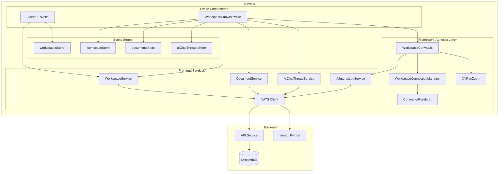

## Data Model

### Workspace (Backend)

```typescript
type Workspace = {
    workspaceId: string
    name: string
    accessType: 'private' | 'shared'
    files: string[]              // Document IDs
    canvasState: CanvasState
    createdAt: number
    updatedAt: number
}
```

### CanvasState

```typescript
type CanvasState = {
    viewport: {
        x: number      // Pan offset X
        y: number      // Pan offset Y
        zoom: number   // 0.1 to 2.0
    }
    nodes: CanvasNode[]
    edges: WorkspaceEdge[]  // Connections between nodes
}
```

### WorkspaceEdge

Edges represent visual connections between canvas nodes, used for showing context flows and dependencies.

```typescript
type WorkspaceEdge = {
    edgeId: string
    sourceNodeId: string
    targetNodeId: string
    sourceHandle?: string  // e.g., 'right'
    targetHandle?: string  // e.g., 'left'
}
```

### CanvasNode

Canvas nodes use a discriminated union based on the `type` field:

```typescript
type CanvasNodeType = 'document' | 'image' | 'aiChatThread'

// Document node - contains a ProseMirror editor
type DocumentCanvasNode = {
    nodeId: string
    type: 'document'
    referenceId: string    // Points to Document.documentId
    position: { x: number; y: number }
    dimensions: { width: number; height: number }
}

// Image node - displays an uploaded image
type ImageCanvasNode = {
    nodeId: string
    type: 'image'
    fileId: string         // Points to file in NATS Object Store
    workspaceId: string    // For deletion context
    src: string            // Full URL for rendering
    aspectRatio: number    // Used for aspect-ratio-locked resize
    position: { x: number; y: number }
    dimensions: { width: number; height: number }
}

// AI Chat Thread node - contains an AI conversation
type AiChatThreadCanvasNode = {
    nodeId: string
    type: 'aiChatThread'
    referenceId: string    // Points to AiChatThread.threadId
    position: { x: number; y: number }
    dimensions: { width: number; height: number }
}

type CanvasNode = DocumentCanvasNode | ImageCanvasNode | AiChatThreadCanvasNode
```

## User Flows

### Opening a Workspace

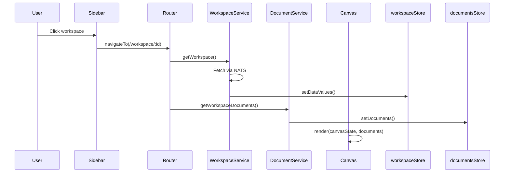

### Creating a Document

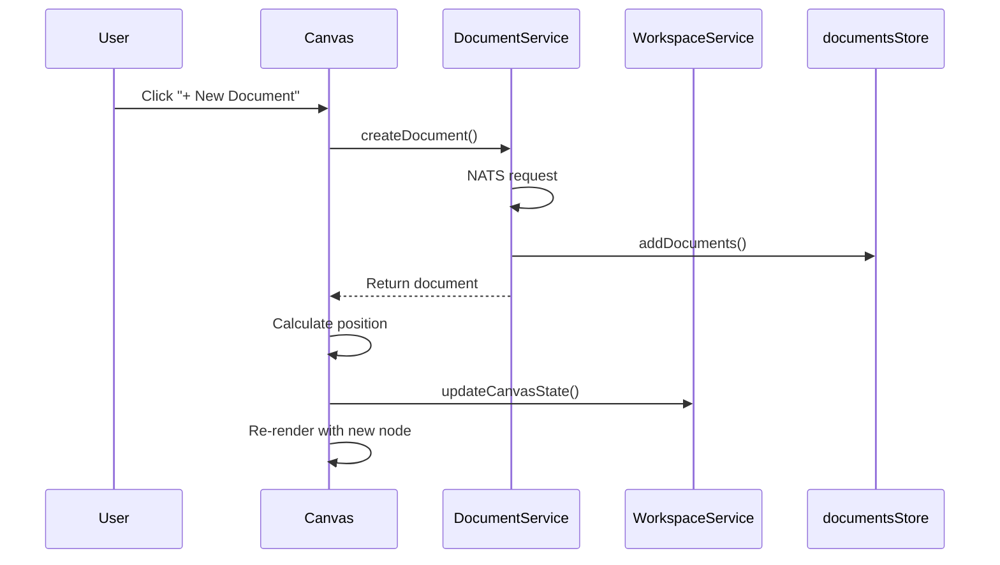

### Adding an Image

```mermaid
sequenceDiagram
    participant User
    participant Svelte as WorkspaceCanvas.svelte
    participant Modal as ImageUploadModal
    participant API as /api/images/:workspaceId
    participant ObjStore as NATS Object Store
    participant WSvc as WorkspaceService

    User->>Svelte: Click "+ Add Image"
    Svelte->>Modal: show()
    User->>Modal: Select/drop image file
    Modal->>API: POST file (multipart)
    API->>ObjStore: putObject(fileId, buffer)
    API-->>Modal: { fileId, url }
    Modal->>Svelte: onComplete({ fileId, src })
    Svelte->>Svelte: Load image to get aspectRatio
    Svelte->>Svelte: Create ImageCanvasNode
    Svelte->>WSvc: updateCanvasState()
    Svelte->>Svelte: Re-render with new image node

Note: after an image is uploaded the client loads it to determine the natural aspect ratio. On load the client verifies that the stored node dimensions match that ratio; if they do not match it corrects the node dimensions and persists the corrected values so stale nodes self-heal. Image resize uses a diagonal-based algorithm for smooth, aspect-locked resizing and the UI computes resize handle size/offsets dynamically so handles remain visually consistent regardless of canvas zoom.
```

### Deleting an Image

When an image node is removed from the canvas (either by user action or programmatically):

```mermaid
sequenceDiagram
    participant User
    participant Canvas as WorkspaceCanvas.ts
    participant Tracker as canvasImageLifecycle
    participant NATS as NATS Client
    participant API as API Service
    participant ObjStore as NATS Object Store

    User->>Canvas: Remove image node
    Canvas->>Canvas: commitCanvasState(newState)
    Note: committing canvas state persists corrected dimensions and triggers the image lifecycle tracker which will detect removed fileIds and call `deleteImage` to remove orphaned files from storage.
    Canvas->>Tracker: trackCanvasState(newState)
    Tracker->>Tracker: Compare previous vs current
    Tracker->>Tracker: Detect removed image
    Tracker->>NATS: DELETE_IMAGE request
    NATS->>API: Handle deletion
    API->>ObjStore: deleteObject(fileId)
    API->>API: Remove from workspace.files
```

### Editing Content

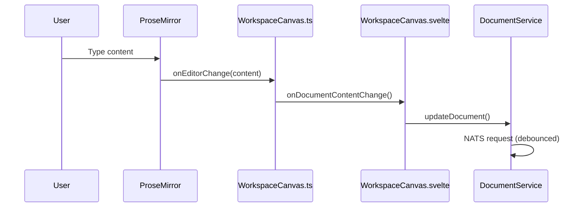

### Moving a Document

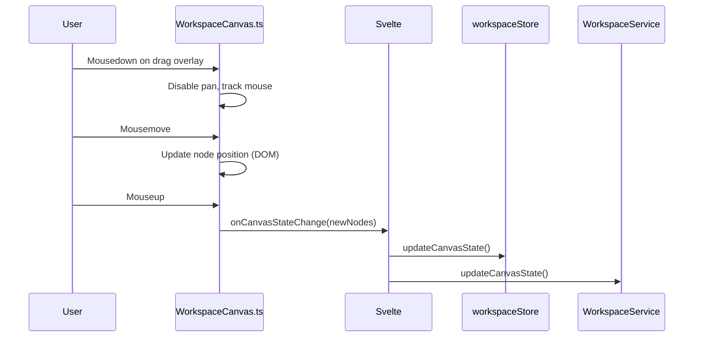

## Frontend Stores

### workspacesStore

Holds the list of workspaces shown in the sidebar. Minimal metadata only (id, name, timestamps).

```typescript
{
    meta: { loadingStatus },
    data: WorkspaceMeta[]
}
```

### workspaceStore

The currently open workspace with full canvas state.

```typescript
{
    meta: { loadingStatus, isInEdit, requiresSave },
    data: {
        workspaceId,
        name,
        canvasState,
        files,
        ...
    }
}
```

### documentsStore

Documents belonging to the current workspace.

```typescript
{
    meta: { loadingStatus },
    data: Document[]
}
```

### aiChatThreadsStore

AI chat threads belonging to the current workspace.

```typescript
{
    meta: { loadingStatus },
    data: Map<string, AiChatThread>  // Keyed by threadId for O(1) lookup
}
```

## Backend API (NATS Subjects)

| Subject | Purpose |
|---------|---------|
| `WORKSPACE.GET_USER_WORKSPACES` | List user's workspaces |
| `WORKSPACE.GET_WORKSPACE` | Get single workspace with canvas state |
| `WORKSPACE.CREATE_WORKSPACE` | Create new workspace |
| `WORKSPACE.UPDATE_WORKSPACE` | Update name |
| `WORKSPACE.UPDATE_CANVAS_STATE` | Persist viewport and node positions |
| `WORKSPACE.DELETE_WORKSPACE` | Delete workspace |
| `WORKSPACE.GET_WORKSPACE_DOCUMENTS` | Get documents in workspace |
| `DOCUMENT.CREATE_DOCUMENT` | Create document |
| `DOCUMENT.UPDATE_DOCUMENT` | Update document content/title |
| `DOCUMENT.DELETE_DOCUMENT` | Delete document |
| `AI_CHAT_THREAD.CREATE` | Create AI chat thread |
| `AI_CHAT_THREAD.GET` | Get AI chat thread by workspaceId + threadId |
| `AI_CHAT_THREAD.UPDATE` | Update AI chat thread content |
| `AI_CHAT_THREAD.DELETE` | Delete AI chat thread |
| `AI_CHAT_THREAD.GET_BY_WORKSPACE` | Get all AI chat threads in workspace |
| `AI_INTERACTION.CHAT_SEND_MESSAGE` | Send message to AI for processing |
| `AI_INTERACTION.CHAT_STOP_MESSAGE` | Stop active AI streaming |
| `WORKSPACE_IMAGE.DELETE_IMAGE` | Delete image from Object Store |

### Image HTTP Endpoints

| Endpoint | Method | Purpose |
|----------|--------|---------|
| `/api/images/:workspaceId` | POST | Upload image (multipart/form-data) |
| `/api/images/:workspaceId/:fileId` | GET | Serve image with auth token |

## Rendering Pipeline

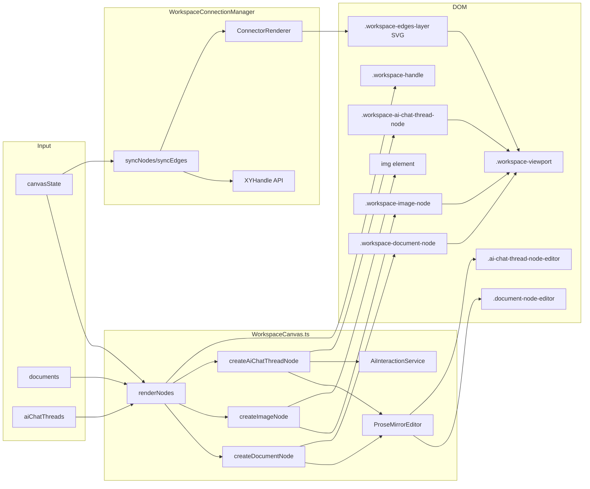

## Persistence Strategy

Canvas state changes are debounced (1 second) before persisting. This prevents hammering the backend during continuous pan/zoom operations.

Document content changes are handled by `DocumentService.updateDocument()` which has its own debouncing logic.

AI chat thread content changes are handled by `AiChatThreadService.updateAiChatThread()` with similar debouncing.

Position and dimension changes after drag/resize are persisted immediately via `onCanvasStateChange`.

Edge changes are persisted immediately when edges are created, deleted, or reconnected.

## Image Lifecycle Management

Images on the canvas are tracked by `canvasImageLifecycle.ts`. When an image node is removed from the canvas state:

1. The tracker compares previous and current canvas states
2. Detects which fileIds are no longer present
3. Calls `deleteImage()` from `imageUtils.ts` to delete from storage
4. The same `deleteImage()` utility is shared with ProseMirror's `imageLifecyclePlugin`

This ensures orphaned images don't accumulate in storage.

## Lazy Content Loading

Canvas nodes store dimensions in `canvasState` but content is fetched only when nodes enter the viewport. This optimizes initial workspace load and memory usage for large workspaces.

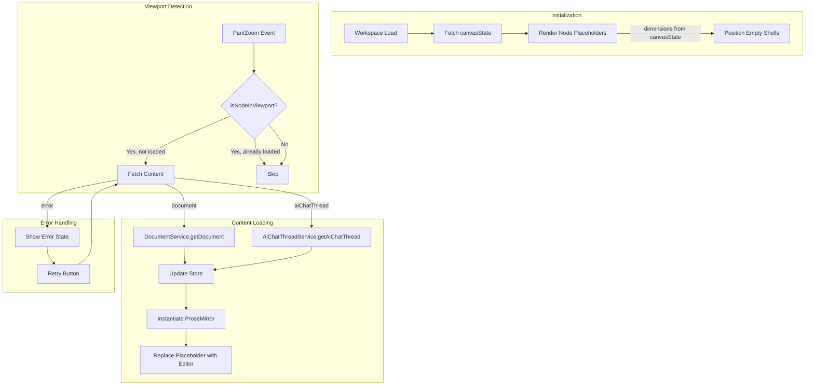

### Content Fetching Strategy

- **No debouncing** — Content is fetched immediately when node enters viewport for responsive UX
- **No unloading** — Once loaded, content remains in memory to avoid re-fetch on pan back
- **Parallel fetching** — Multiple nodes entering viewport simultaneously trigger parallel fetch requests
- **ResizeObserver** — Pane bounds are tracked for accurate visibility detection during window resizes

## AI Interaction Routing

AI chat threads use a workspace-scoped routing pattern for streaming responses:

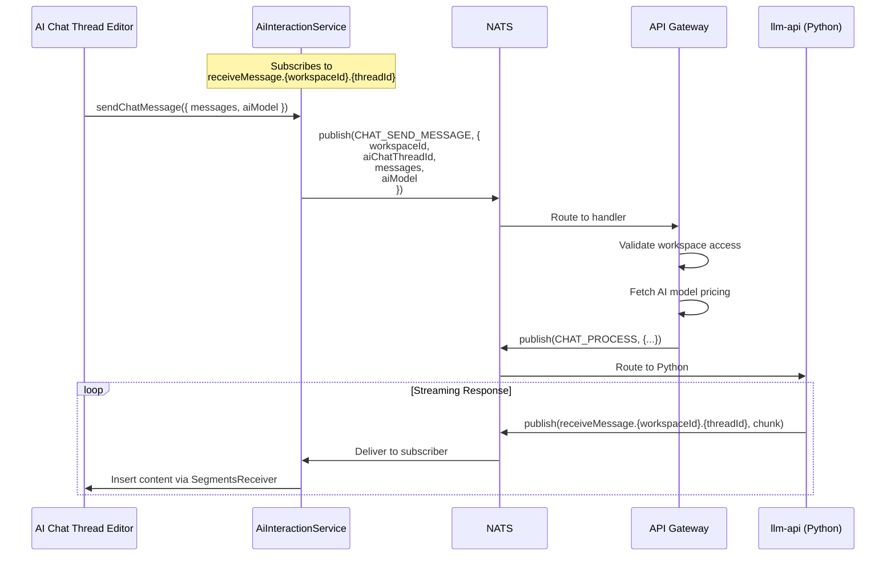

Each AI chat thread node has its own `AiInteractionService` instance, enabling concurrent AI streams across multiple threads in the same workspace.

---

## Workspace Edges

Visual connections (edges/arrows) between canvas nodes allow users to show relationships, context flows, and dependencies between workspace entities. Users can drag from a handle on one node to another to create a relationship line.

### Key Features

- **Connection handles** on each node (small circles on the sides, visible on hover)
- **Drag-to-connect** interaction using `XYHandle.onPointerDown` from `@xyflow/system`
- **Edge rendering** using ConnectorRenderer from `src/infographics/connectors/`
- **Edge selection and deletion** (click to select, Delete/Backspace to remove)
- **Edge reconnection** (drag an edge endpoint to move it to a different node, or drop in empty space to delete)
- **Persistence** of edges in `CanvasState`

### Architecture

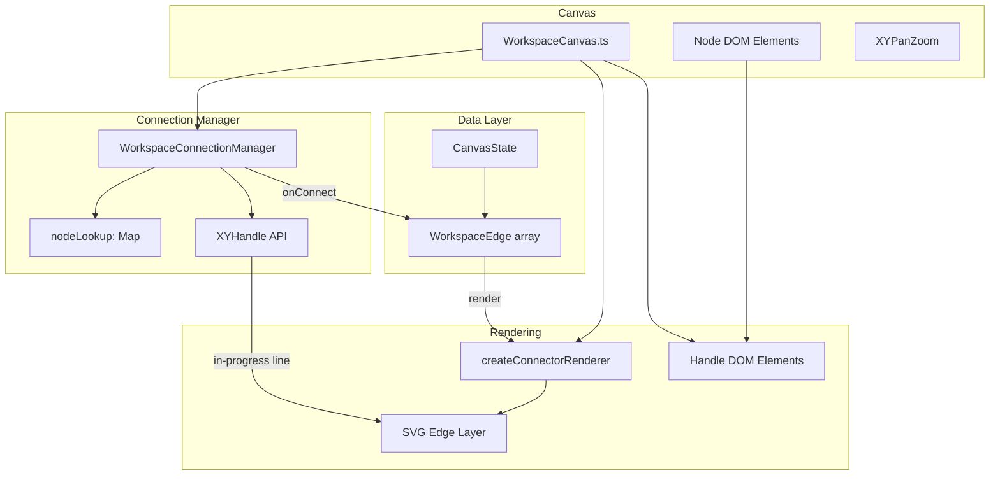

### Connection Flow

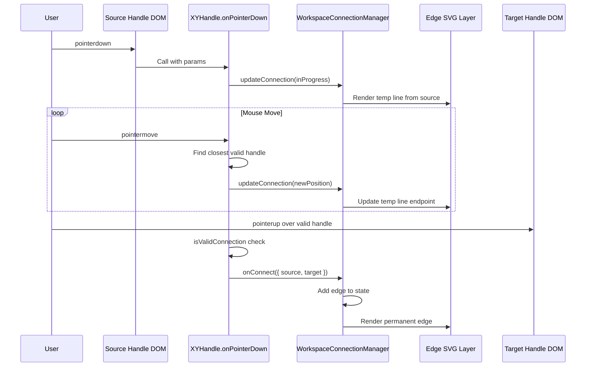

### WorkspaceConnectionManager

Lives at `src/infographics/workspace/WorkspaceConnectionManager.ts`. This is the brain of the connection system.

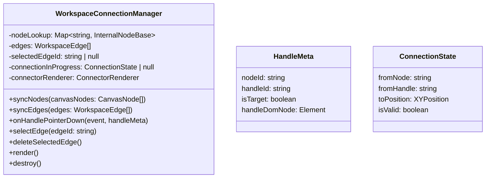

Responsibilities:
- Maintains `nodeLookup` (Map of node ID → internal node representation with handle bounds)
- Tracks in-progress connection state for rendering the temporary line
- Validates connections (no duplicates, no self-loops)
- Delegates to `XYHandle.onPointerDown` for the actual drag interaction
- Manages edge selection state

### Handle DOM Elements

Each workspace node has connection handles — small circles at the left (target) and right (source) edges:

```
┌─────────────────────────────────────────┐
│ ○                                     ○ │
│ left                               right│
│ (target)                         (source)│
│                                         │
│         Node Content                    │
│                                         │
└─────────────────────────────────────────┘
```

Handles are:
- Hidden by default, shown on node hover (CSS)
- Marked with `data-nodeid`, `data-handleid`, `data-handlepos` attributes (required by XYHandle)
- Wired with `pointerdown` listener that calls `WorkspaceConnectionManager.onHandlePointerDown`

### Edge Rendering

Edges are rendered as SVG paths using `createConnectorRenderer` from `src/infographics/connectors/`. The edge layer sits below node cards but above the canvas background.

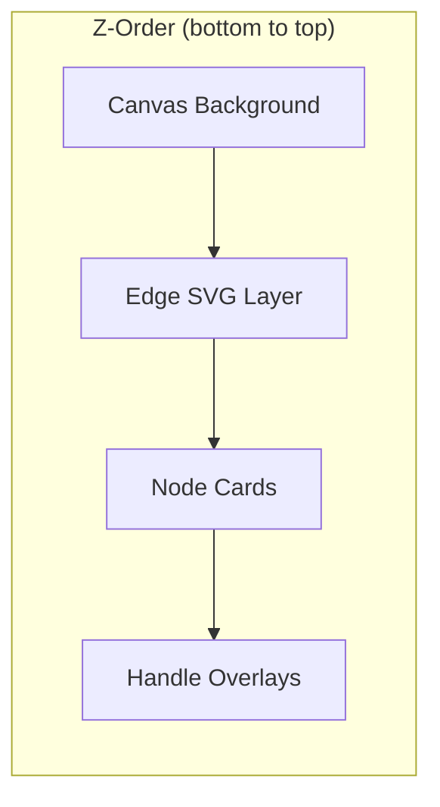

Edge styling:
- Path type: `horizontal-bezier`
- Stroke width: `2px` (3px when selected)
- Marker (arrowhead) size: `12px`
- Color: `rgba(190, 190, 200, 0.95)` (primary color when selected)

### Edge Selection and Deletion

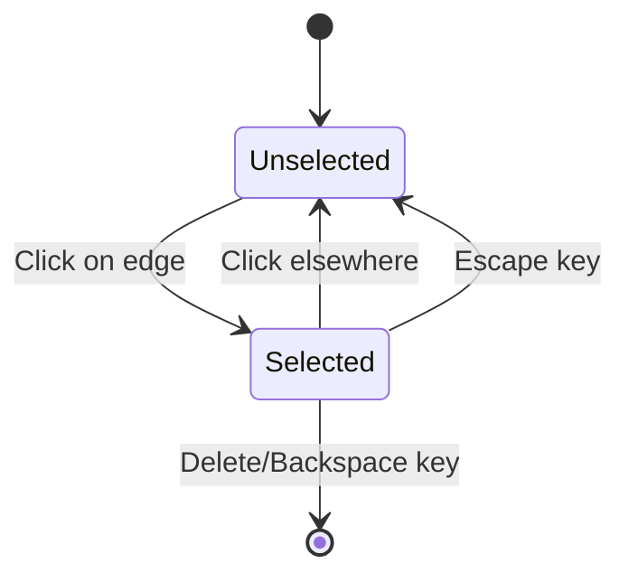

When an edge is selected, small draggable circles appear at the source and target endpoints for reconnection.

### Edge Persistence

Edge changes follow the same pattern as node changes:

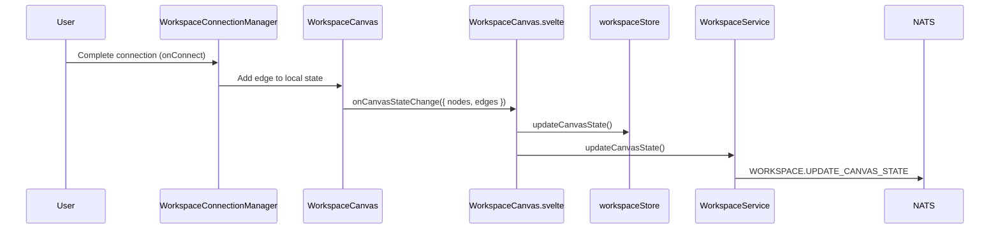

---

## AI Chat Context from Connected Nodes

When nodes are connected TO an AI chat thread (incoming edges), the AI chat automatically extracts their content and passes it to the AI model. This includes text from documents, text from other AI chat threads, and images (converted to base64). Context is extracted by walking the edge graph backwards from the AI chat node, collecting all connected content recursively.

### How It Works

1. **Edge Traversal** — When a user sends a message in an AI chat thread, `AiChatThreadService.extractConnectedContext()` finds all nodes connected via incoming edges (recursively)
2. **Content Extraction** — Documents and AI threads have their ProseMirror content parsed for text; embedded images are also extracted. Standalone image nodes are fetched and converted to base64
3. **Message Building** — `buildContextMessage()` formats the extracted context as a multimodal message with interleaved text and images
4. **API Format** — All content uses the OpenAI Responses API format (`input_text`, `input_image` blocks) as the canonical format. The `llm-api` service converts to provider-specific formats (e.g., Anthropic) as needed

### Multimodal Content Format

```typescript
// Text content block
{ type: 'input_text'; text: string }

// Image content block
{ type: 'input_image'; image_url: string; detail?: 'auto' | 'low' | 'high' }
```

### Key Files

| File | Purpose |
|------|---------|
| `services/web-ui/src/services/ai-chat-thread-service.ts` | Context extraction (`extractConnectedContext`, `buildContextMessage`) |
| `services/web-ui/src/infographics/workspace/WorkspaceCanvas.ts` | Integration point (`onAiChatSubmit` calls context extraction) |
| `services/llm-api/src/utils/attachments.py` | Attachment format conversion for LLM providers |
| `packages/lixpi/constants/ts/types.ts` | Shared multimodal types (`TextContentBlock`, `ImageContentBlock`) |

---

## Follow-up Tasks

The following items are pending implementation:

### Handle Styling Polish

- [ ] Show handles on AI chat thread node hover (CSS selector missing `.workspace-ai-chat-thread-node:hover .workspace-handle`)
- [ ] Add hover effect on handle itself (`:hover` style)
- [ ] Add transition for smooth fade in/out

### Context Icon for AI Chat Thread Nodes

The "branch" icon at the bottom-right corner of AI chat thread cards currently uses the old `contextSelector` plugin. It needs to be refactored to work with the workspace edge system:

- [ ] Refactor icon click handler to work with workspace connection system
- [ ] Show popover listing nodes connected TO this thread (incoming edges)
- [ ] Allow quick disconnect (remove edge) from the popover
- [ ] Optionally highlight connected edges on canvas when popover is open

### Cleanup Old Code

Once the context icon is refactored:

- [ ] Delete `src/components/proseMirror/plugins/primitives/contextSelector/` folder
- [ ] Remove import from `aiChatThreadNode.ts`
- [ ] Remove SCSS import from `ai-chat-thread.scss`

### Edge Cases

- [ ] When a node with edges is deleted, connected edges should be removed too
- [ ] Verify edges update correctly during node drag

### Testing

- [ ] Create edges between different node types (document ↔ document, document ↔ AI thread, etc.)
- [ ] Test edge selection and deletion
- [ ] Test edge reconnection
- [ ] Test with pan/zoom (edges should transform correctly)
- [ ] Test persistence (reload page, edges should still be there)
- [ ] Test with many nodes and edges (performance)
