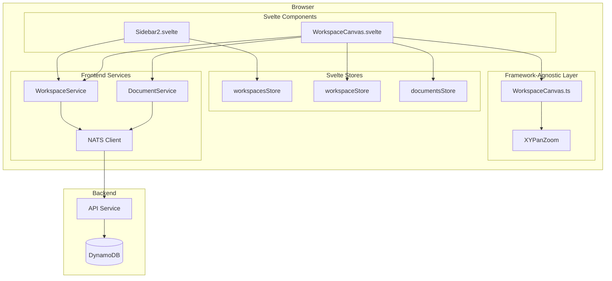
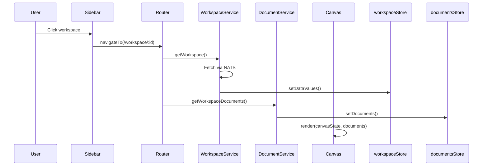
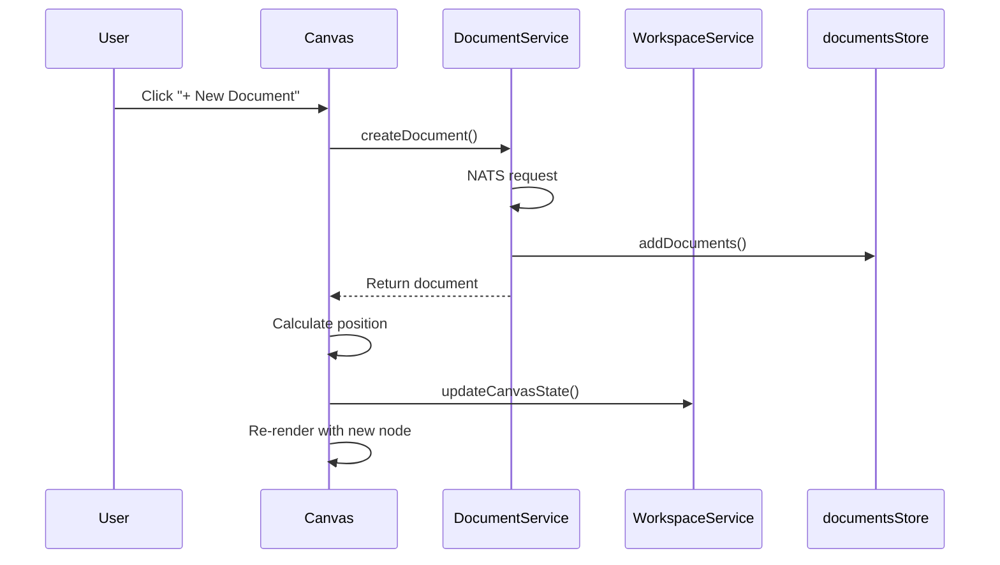
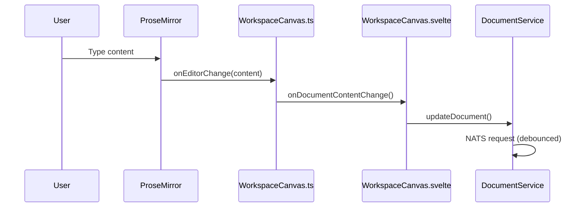
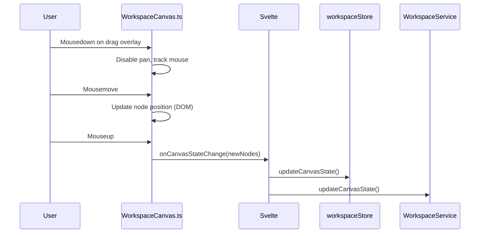
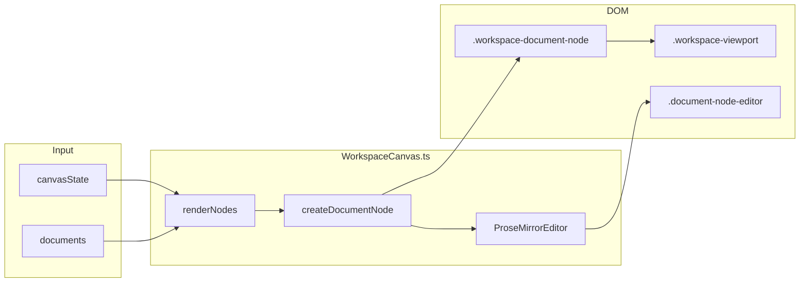

# Workspace Feature

A workspace is the primary container where users organize and edit their documents. Think of it as an infinite canvas where document cards float, can be arranged freely, resized, and edited in place.

## Core Concepts

**Workspace** — A named container owned by a user. Has a canvas state (viewport position, zoom level, and node positions) plus references to documents.

**Canvas Node** — A positioned rectangle on the canvas representing a document. Stores position, dimensions, and a reference ID pointing to the actual document.

**Document** — The actual content (ProseMirror JSON). Lives separately from its canvas representation so the same document could theoretically appear in multiple workspaces.

**Viewport** — The current view: x/y offset and zoom level. Persisted so users return to where they left off.

## System Architecture



## Data Model

### Workspace (Backend)

```typescript
type Workspace = {
    workspaceId: string
    name: string
    accessType: 'private' | 'shared'
    files: string[]              // Document IDs
    canvasState: CanvasState
    createdAt: number
    updatedAt: number
}
```

### CanvasState

```typescript
type CanvasState = {
    viewport: {
        x: number      // Pan offset X
        y: number      // Pan offset Y
        zoom: number   // 0.1 to 2.0
    }
    nodes: CanvasNode[]
}
```

### CanvasNode

```typescript
type CanvasNode = {
    nodeId: string
    type: 'document'
    referenceId: string    // Points to Document.documentId
    position: { x: number; y: number }
    dimensions: { width: number; height: number }
}
```

## User Flows

### Opening a Workspace



### Creating a Document



### Editing Content



### Moving a Document



## Frontend Stores

### workspacesStore

Holds the list of workspaces shown in the sidebar. Minimal metadata only (id, name, timestamps).

```typescript
{
    meta: { loadingStatus },
    data: WorkspaceMeta[]
}
```

### workspaceStore

The currently open workspace with full canvas state.

```typescript
{
    meta: { loadingStatus, isInEdit, requiresSave },
    data: {
        workspaceId,
        name,
        canvasState,
        files,
        ...
    }
}
```

### documentsStore

Documents belonging to the current workspace.

```typescript
{
    meta: { loadingStatus },
    data: Document[]
}
```

## Backend API (NATS Subjects)

| Subject | Purpose |
|---------|---------|
| `WORKSPACE.GET_USER_WORKSPACES` | List user's workspaces |
| `WORKSPACE.GET_WORKSPACE` | Get single workspace with canvas state |
| `WORKSPACE.CREATE_WORKSPACE` | Create new workspace |
| `WORKSPACE.UPDATE_WORKSPACE` | Update name |
| `WORKSPACE.UPDATE_CANVAS_STATE` | Persist viewport and node positions |
| `WORKSPACE.DELETE_WORKSPACE` | Delete workspace |
| `WORKSPACE.GET_WORKSPACE_DOCUMENTS` | Get documents in workspace |
| `DOCUMENT.CREATE_DOCUMENT` | Create document |
| `DOCUMENT.UPDATE_DOCUMENT` | Update document content/title |
| `DOCUMENT.DELETE_DOCUMENT` | Delete document |

## Rendering Pipeline



## Persistence Strategy

Canvas state changes are debounced (1 second) before persisting. This prevents hammering the backend during continuous pan/zoom operations.

Document content changes are handled by `DocumentService.updateDocument()` which has its own debouncing logic.

Position and dimension changes after drag/resize are persisted immediately via `onCanvasStateChange`.

## Future Considerations

- **Multi-user collaboration** — Real-time sync of canvas state and document content
- **Node types beyond documents** — Images, embeds, connectors between nodes
- **Workspace templates** — Pre-arranged layouts for common use cases
- **Tags on workspaces** — Already stubbed in `WorkspaceService.addTagToWorkspace()`
