# Workspace Feature

A workspace is the primary container where users organize and edit their documents and images. Think of it as an infinite canvas where cards float, can be arranged freely, resized, and edited in place.

## Core Concepts

**Workspace** — A named container owned by a user. Has a canvas state (viewport position, zoom level, and node positions) plus references to documents, AI chat threads, and uploaded files.

**Canvas Node** — A positioned rectangle on the canvas. Can be a document node (with ProseMirror editor), an image node, or an AI chat thread node. Stores position, dimensions, and type-specific data.

**Document** — The actual text content (ProseMirror JSON). Lives separately from its canvas representation so the same document could theoretically appear in multiple workspaces. Documents use `documentType: 'document'` and contain block-level content (paragraphs, headings, lists, etc.).

**AI Chat Thread** — An independent AI conversation canvas node with its own persistence and lifecycle. Stored in the AI-Chat-Threads DynamoDB table. Each thread has its own `AiInteractionService` instance for streaming AI responses. Uses `documentType: 'aiChatThread'` for its ProseMirror editor.

**Image** — An uploaded image file stored in NATS Object Store. Referenced by canvas nodes and automatically deleted when removed from the canvas.

**Viewport** — The current view: x/y offset and zoom level. Persisted so users return to where they left off.

## System Architecture

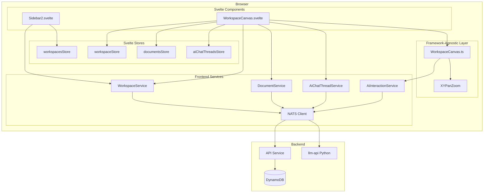

## Data Model

### Workspace (Backend)

```typescript
type Workspace = {
    workspaceId: string
    name: string
    accessType: 'private' | 'shared'
    files: string[]              // Document IDs
    canvasState: CanvasState
    createdAt: number
    updatedAt: number
}
```

### CanvasState

```typescript
type CanvasState = {
    viewport: {
        x: number      // Pan offset X
        y: number      // Pan offset Y
        zoom: number   // 0.1 to 2.0
    }
    nodes: CanvasNode[]
}
```

### CanvasNode

Canvas nodes use a discriminated union based on the `type` field:

```typescript
type CanvasNodeType = 'document' | 'image' | 'aiChatThread'

// Document node - contains a ProseMirror editor
type DocumentCanvasNode = {
    nodeId: string
    type: 'document'
    referenceId: string    // Points to Document.documentId
    position: { x: number; y: number }
    dimensions: { width: number; height: number }
}

// Image node - displays an uploaded image
type ImageCanvasNode = {
    nodeId: string
    type: 'image'
    fileId: string         // Points to file in NATS Object Store
    workspaceId: string    // For deletion context
    src: string            // Full URL for rendering
    aspectRatio: number    // Used for aspect-ratio-locked resize
    position: { x: number; y: number }
    dimensions: { width: number; height: number }
}

// AI Chat Thread node - contains an AI conversation
type AiChatThreadCanvasNode = {
    nodeId: string
    type: 'aiChatThread'
    referenceId: string    // Points to AiChatThread.threadId
    position: { x: number; y: number }
    dimensions: { width: number; height: number }
}

type CanvasNode = DocumentCanvasNode | ImageCanvasNode | AiChatThreadCanvasNode
```

## User Flows

### Opening a Workspace

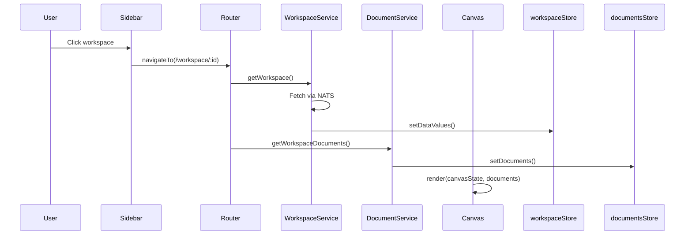

### Creating a Document

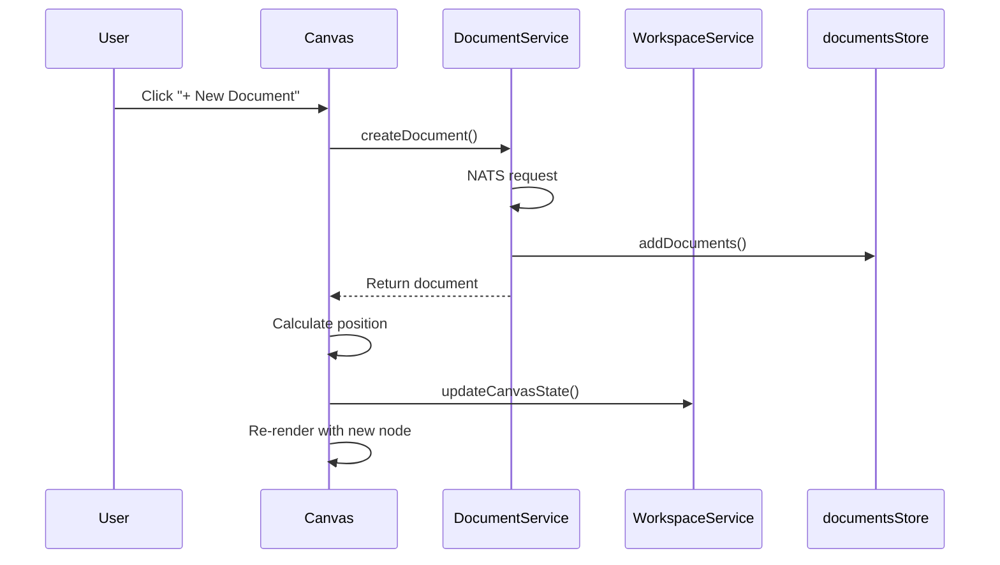

### Adding an Image

```mermaid
sequenceDiagram
    participant User
    participant Svelte as WorkspaceCanvas.svelte
    participant Modal as ImageUploadModal
    participant API as /api/images/:workspaceId
    participant ObjStore as NATS Object Store
    participant WSvc as WorkspaceService

    User->>Svelte: Click "+ Add Image"
    Svelte->>Modal: show()
    User->>Modal: Select/drop image file
    Modal->>API: POST file (multipart)
    API->>ObjStore: putObject(fileId, buffer)
    API-->>Modal: { fileId, url }
    Modal->>Svelte: onComplete({ fileId, src })
    Svelte->>Svelte: Load image to get aspectRatio
    Svelte->>Svelte: Create ImageCanvasNode
    Svelte->>WSvc: updateCanvasState()
    Svelte->>Svelte: Re-render with new image node

Note: after an image is uploaded the client loads it to determine the natural aspect ratio. On load the client verifies that the stored node dimensions match that ratio; if they do not match it corrects the node dimensions and persists the corrected values so stale nodes self-heal. Image resize uses a diagonal-based algorithm for smooth, aspect-locked resizing and the UI computes resize handle size/offsets dynamically so handles remain visually consistent regardless of canvas zoom.
```

### Deleting an Image

When an image node is removed from the canvas (either by user action or programmatically):

```mermaid
sequenceDiagram
    participant User
    participant Canvas as WorkspaceCanvas.ts
    participant Tracker as canvasImageLifecycle
    participant NATS as NATS Client
    participant API as API Service
    participant ObjStore as NATS Object Store

    User->>Canvas: Remove image node
    Canvas->>Canvas: commitCanvasState(newState)
    Note: committing canvas state persists corrected dimensions and triggers the image lifecycle tracker which will detect removed fileIds and call `deleteImage` to remove orphaned files from storage.
    Canvas->>Tracker: trackCanvasState(newState)
    Tracker->>Tracker: Compare previous vs current
    Tracker->>Tracker: Detect removed image
    Tracker->>NATS: DELETE_IMAGE request
    NATS->>API: Handle deletion
    API->>ObjStore: deleteObject(fileId)
    API->>API: Remove from workspace.files
```

### Editing Content

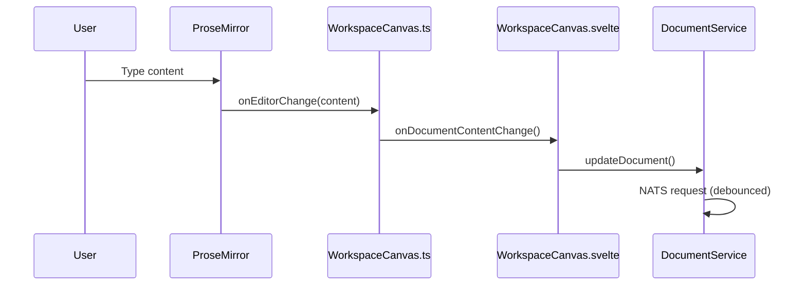

### Moving a Document

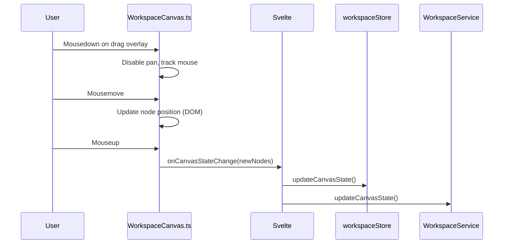

## Frontend Stores

### workspacesStore

Holds the list of workspaces shown in the sidebar. Minimal metadata only (id, name, timestamps).

```typescript
{
    meta: { loadingStatus },
    data: WorkspaceMeta[]
}
```

### workspaceStore

The currently open workspace with full canvas state.

```typescript
{
    meta: { loadingStatus, isInEdit, requiresSave },
    data: {
        workspaceId,
        name,
        canvasState,
        files,
        ...
    }
}
```

### documentsStore

Documents belonging to the current workspace.

```typescript
{
    meta: { loadingStatus },
    data: Document[]
}
```

### aiChatThreadsStore

AI chat threads belonging to the current workspace.

```typescript
{
    meta: { loadingStatus },
    data: Map<string, AiChatThread>  // Keyed by threadId for O(1) lookup
}
```

## Backend API (NATS Subjects)

| Subject | Purpose |
|---------|---------|
| `WORKSPACE.GET_USER_WORKSPACES` | List user's workspaces |
| `WORKSPACE.GET_WORKSPACE` | Get single workspace with canvas state |
| `WORKSPACE.CREATE_WORKSPACE` | Create new workspace |
| `WORKSPACE.UPDATE_WORKSPACE` | Update name |
| `WORKSPACE.UPDATE_CANVAS_STATE` | Persist viewport and node positions |
| `WORKSPACE.DELETE_WORKSPACE` | Delete workspace |
| `WORKSPACE.GET_WORKSPACE_DOCUMENTS` | Get documents in workspace |
| `DOCUMENT.CREATE_DOCUMENT` | Create document |
| `DOCUMENT.UPDATE_DOCUMENT` | Update document content/title |
| `DOCUMENT.DELETE_DOCUMENT` | Delete document |
| `AI_CHAT_THREAD.CREATE` | Create AI chat thread |
| `AI_CHAT_THREAD.GET` | Get AI chat thread by workspaceId + threadId |
| `AI_CHAT_THREAD.UPDATE` | Update AI chat thread content |
| `AI_CHAT_THREAD.DELETE` | Delete AI chat thread |
| `AI_CHAT_THREAD.GET_BY_WORKSPACE` | Get all AI chat threads in workspace |
| `AI_INTERACTION.CHAT_SEND_MESSAGE` | Send message to AI for processing |
| `AI_INTERACTION.CHAT_STOP_MESSAGE` | Stop active AI streaming |
| `WORKSPACE_IMAGE.DELETE_IMAGE` | Delete image from Object Store |

### Image HTTP Endpoints

| Endpoint | Method | Purpose |
|----------|--------|---------|
| `/api/images/:workspaceId` | POST | Upload image (multipart/form-data) |
| `/api/images/:workspaceId/:fileId` | GET | Serve image with auth token |

## Rendering Pipeline

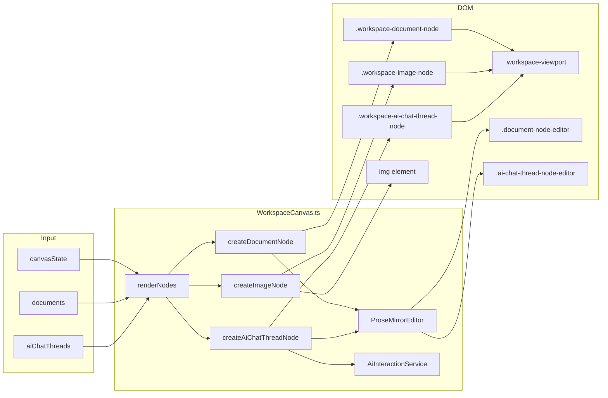

## Persistence Strategy

Canvas state changes are debounced (1 second) before persisting. This prevents hammering the backend during continuous pan/zoom operations.

Document content changes are handled by `DocumentService.updateDocument()` which has its own debouncing logic.

Position and dimension changes after drag/resize are persisted immediately via `onCanvasStateChange`.

## Image Lifecycle Management

Images on the canvas are tracked by `canvasImageLifecycle.ts`. When an image node is removed from the canvas state:

1. The tracker compares previous and current canvas states
2. Detects which fileIds are no longer present
3. Calls `deleteImage()` from `imageUtils.ts` to delete from storage
4. The same `deleteImage()` utility is shared with ProseMirror's `imageLifecyclePlugin`

This ensures orphaned images don't accumulate in storage.

## Lazy Content Loading

Canvas nodes store dimensions in `canvasState` but content is fetched only when nodes enter the viewport. This optimizes initial workspace load and memory usage for large workspaces.

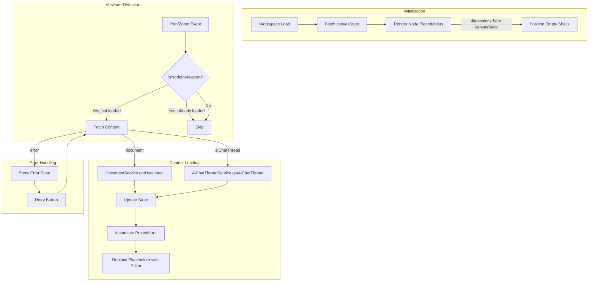

### Content Fetching Strategy

- **No debouncing** — Content is fetched immediately when node enters viewport for responsive UX
- **No unloading** — Once loaded, content remains in memory to avoid re-fetch on pan back
- **Parallel fetching** — Multiple nodes entering viewport simultaneously trigger parallel fetch requests
- **ResizeObserver** — Pane bounds are tracked for accurate visibility detection during window resizes

## AI Interaction Routing

AI chat threads use a workspace-scoped routing pattern for streaming responses:

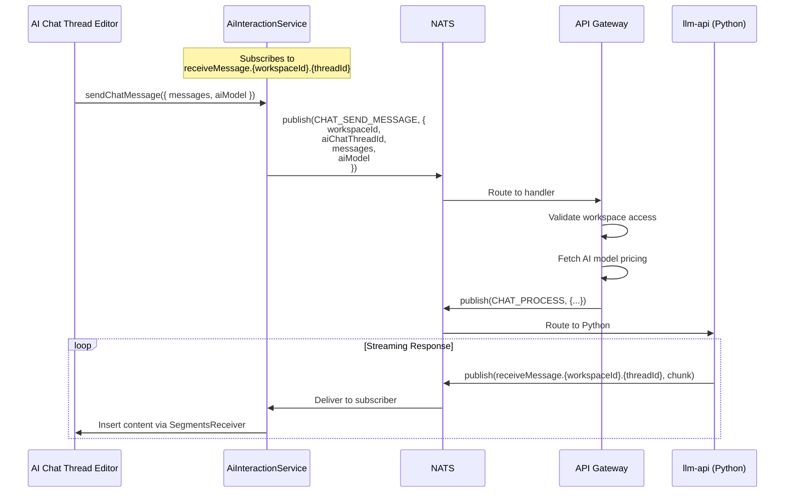

Each AI chat thread node has its own `AiInteractionService` instance, enabling concurrent AI streams across multiple threads in the same workspace.

## Persistence Strategy

Canvas state changes are debounced (1 second) before persisting. This prevents hammering the backend during continuous pan/zoom operations.

Document content changes are handled by `DocumentService.updateDocument()` which has its own debouncing logic.

AI chat thread content changes are handled by `AiChatThreadService.updateAiChatThread()` with similar debouncing.

Position and dimension changes after drag/resize are persisted immediately via `onCanvasStateChange`.

## Image Lifecycle Management

Images on the canvas are tracked by `canvasImageLifecycle.ts`. When an image node is removed from the canvas state:

1. The tracker compares previous and current canvas states
2. Detects which fileIds are no longer present
3. Calls `deleteImage()` from `imageUtils.ts` to delete from storage
4. The same `deleteImage()` utility is shared with ProseMirror's `imageLifecyclePlugin`

This ensures orphaned images don't accumulate in storage.

---

## Workspace Edges — Technical Proposal

This section describes how to add visual connections (edges/arrows) between canvas nodes. Users will be able to drag from a handle on one node to another node to create a relationship line. This is useful for showing context flows, dependencies, or any kind of relationship between workspace entities.

### Why We Need This

The old `contextSelector` plugin inside ProseMirror handled AI context visualization — showing which documents/threads feed into an AI chat. But that was tightly coupled to the document-level concept of "threads within a document." Now that AI chat threads are first-class workspace nodes (not nested inside documents), we need a workspace-level way to draw connections between nodes.

The good news: most of the rendering code already exists in `src/infographics/connectors/`. We just need to wire it into the workspace canvas and add the interaction layer using `@xyflow/system`'s `XYHandle` API.

### What We're Building

1. **Connection handles** on each node (small circles on the sides, visible on hover)
2. **Drag-to-connect** interaction using `XYHandle.onPointerDown`
3. **Edge rendering** using our existing connector system
4. **Edge selection and deletion** (click to select, Delete key to remove)
5. **Edge reconnection** (drag an edge endpoint to move it to a different node)
6. **Persistence** of edges in `CanvasState`
7. **Context icon on AI chat threads** — the "branch" icon at the bottom-right corner of AI chat thread nodes (see below)

### Context Icon on AI Chat Thread Nodes

The current implementation has a small icon (looks like a git branch / network icon) at the bottom-right corner of AI chat thread cards. When clicked, it opens the context selector bubble. We need to **keep this icon** but repurpose it for the new workspace-level connection system.

```
┌─────────────────────────────────────────┐
│  AI Chat Thread                         │
│                                         │
│  [conversation content...]              │
│                                         │
│                                         │
│                                    ⎇   │ ← Context icon (bottom-right)
└─────────────────────────────────────────┘
```

The icon serves as a quick way to see/manage connections for that specific AI chat thread. When clicked, it could:
- Show a mini-popover listing all nodes currently connected to this thread
- Allow quick disconnect (remove edge) from the popover
- Possibly highlight connected edges on the canvas

This is especially useful because AI chat threads are the primary "sink" for context — users typically connect documents/other threads TO an AI chat thread to provide context for the AI conversation.

The icon remains part of the AI chat thread's ProseMirror NodeView (rendered inside the editor chrome), not a workspace-level element. It just needs to communicate with the workspace connection system to display and manage edges.

### Architecture Overview

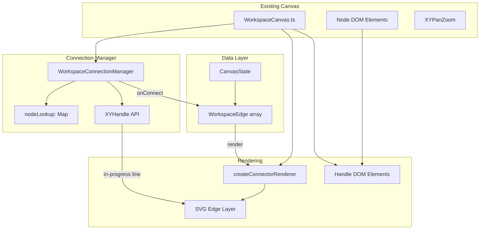

### How XYHandle Works

`@xyflow/system` provides `XYHandle` for connection creation. Here's the flow:

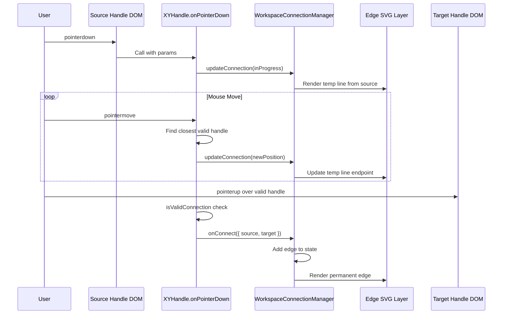

### Key Components

#### 1. WorkspaceConnectionManager

Lives at `src/infographics/workspace/WorkspaceConnectionManager.ts`. This is the brain of the connection system.

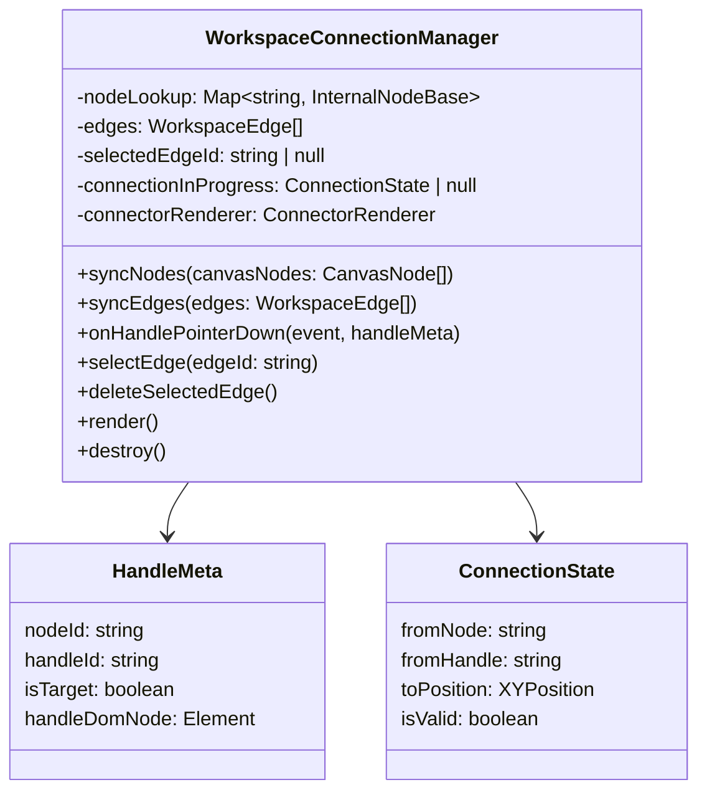

Responsibilities:
- Maintains `nodeLookup` (Map of node ID → internal node representation with handle bounds)
- Tracks in-progress connection state for rendering the temporary line
- Validates connections (no duplicates, no self-loops)
- Delegates to `XYHandle.onPointerDown` for the actual drag interaction
- Manages edge selection state

#### 2. Handle DOM Elements

Each workspace node gets connection handles — small circles at the left and right edges:

```
┌─────────────────────────────────────────┐
│  ○                                   ○  │
│ left                               right│
│ (target)                         (source)│
│                                         │
│         Node Content                    │
│                                         │
│  ○                                   ○  │
└─────────────────────────────────────────┘
```

Handles are:
- Hidden by default, shown on node hover (CSS transition)
- Marked with `data-nodeid`, `data-handleid`, `data-handlepos` attributes (required by XYHandle)
- Wired with `pointerdown` listener that calls `WorkspaceConnectionManager.onHandlePointerDown`

#### 3. Edge Rendering

We reuse the existing `createConnectorRenderer` from `src/infographics/connectors/`. Edges are rendered as SVG paths in a layer below the node cards but above the canvas background.

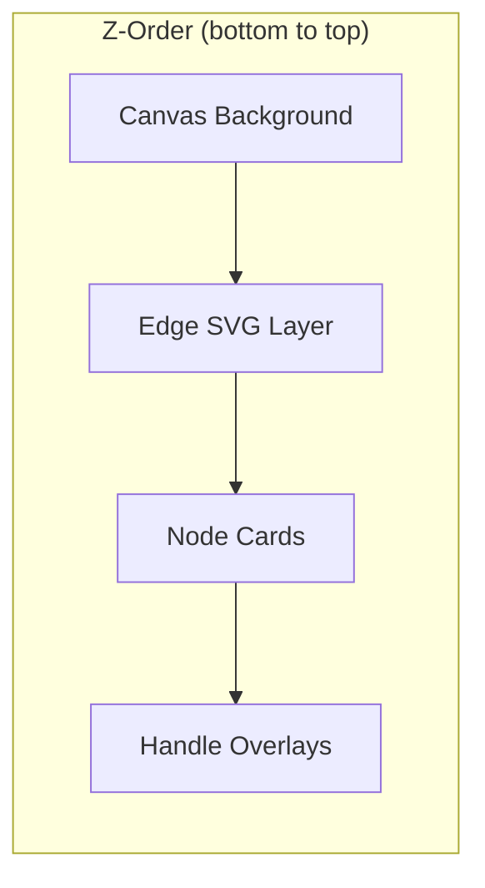

Edge styling (preserved from old contextSelector):
- Path type: `horizontal-bezier`
- Stroke width: `2px`
- Marker (arrowhead) size: `12px`
- Marker offset from node: `{ source: 5, target: 10 }`
- Color: `rgba(190, 190, 200, 0.95)` (matches existing connector styles)

#### 4. Edge Selection and Deletion

Clicking an edge selects it. The selected edge gets a highlight style (thicker stroke, different color). Pressing Delete or Backspace removes it from state.

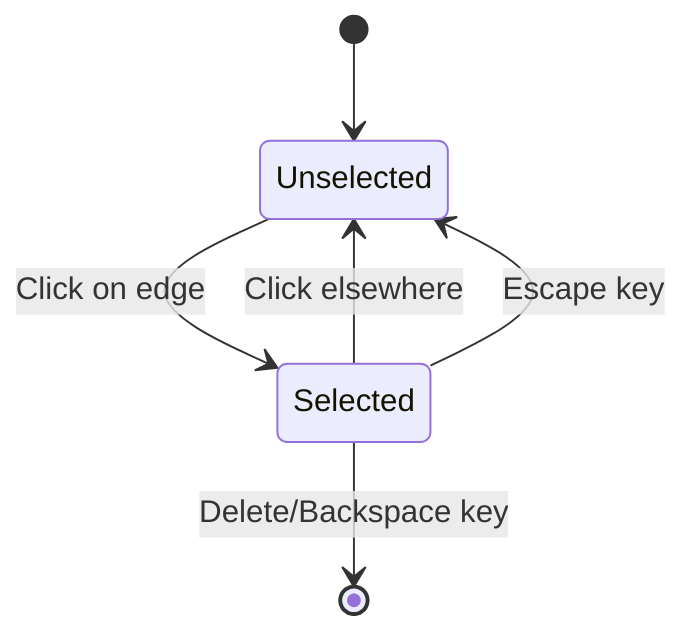

#### 5. Edge Reconnection

Users can drag an edge endpoint to reconnect it to a different node. This uses `XYHandle.onPointerDown` with `edgeUpdaterType` set to `'source'` or `'target'`.

When an edge is selected, small draggable circles appear at the source and target endpoints. Dragging one of these initiates a reconnection:

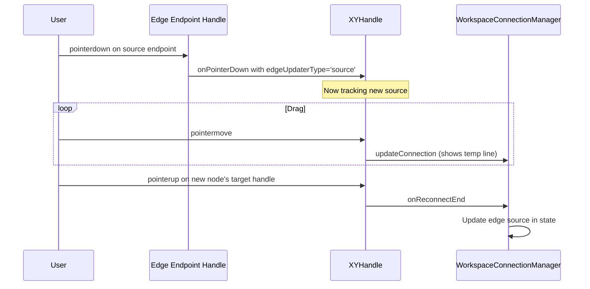

### Data Model Changes

#### WorkspaceEdge Type

Add to `@lixpi/constants`:

```typescript
type WorkspaceEdge = {
    edgeId: string
    sourceNodeId: string
    targetNodeId: string
    sourceHandle?: string  // e.g., 'right-top', 'right-bottom'
    targetHandle?: string  // e.g., 'left-top', 'left-bottom'
}
```

#### CanvasState Extension

```typescript
type CanvasState = {
    viewport: {
        x: number
        y: number
        zoom: number
    }
    nodes: CanvasNode[]
    edges: WorkspaceEdge[]  // NEW — defaults to []
}
```

### Integration with WorkspaceCanvas.ts

The existing `WorkspaceCanvas.ts` already manages nodes, drag, resize, and pan/zoom. We extend it to:

1. Instantiate `WorkspaceConnectionManager` on init
2. Add handle DOM elements when creating nodes
3. Create the edge SVG layer
4. Wire keyboard events for edge deletion
5. Update edges on `onCanvasStateChange`

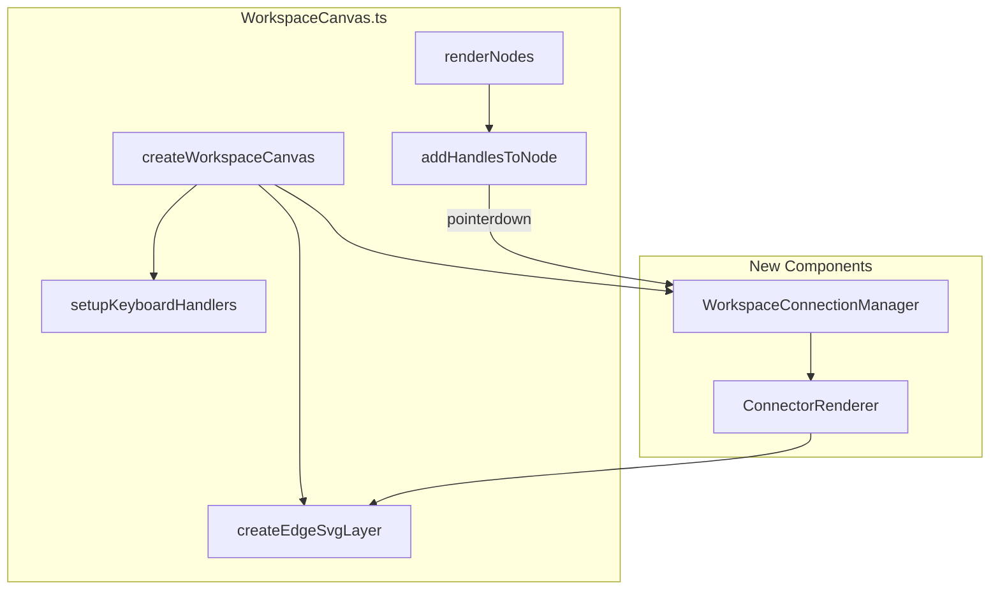

### Infographics Folder Consolidation

Before implementing edges, we need to clean up the duplicate infographics code:

**Current state:**
- `src/components/proseMirror/plugins/primitives/infographics/` — old location
- `src/infographics/` — new location (already has workspace/, connectors/, shapes/)

Both `connectors/` and `shapes/` folders are identical. The contextSelector plugin imports from the old location. After we delete contextSelector (it's obsolete), we can delete the old infographics folder entirely.

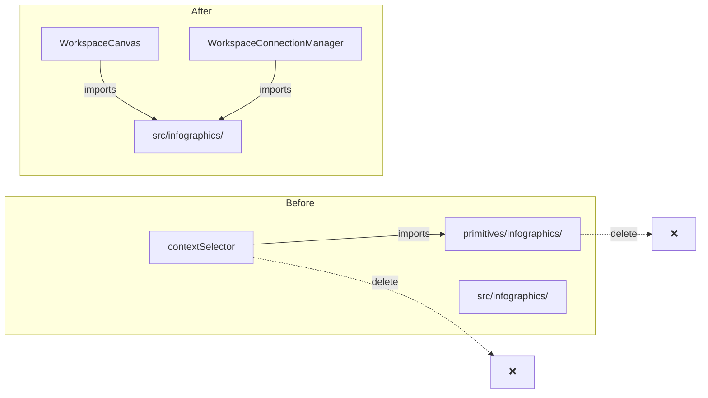

### Persistence Flow

Edge changes follow the same pattern as node changes:

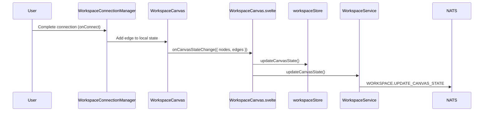

---

## Implementation Plan

### Phase 1: Infographics Consolidation

Copy `src/components/proseMirror/plugins/primitives/infographics` to `src/infographics/`

- [ ] **Verify folder parity**
  - [ ] Compare `src/components/proseMirror/plugins/primitives/infographics/connectors/` with `src/infographics/connectors/`
  - [ ] Compare `src/components/proseMirror/plugins/primitives/infographics/shapes/` with `src/infographics/shapes/`
  - [ ] Verify `animationConstants.ts` is identical in both locations
  - [ ] Document any differences (there shouldn't be any significant ones)

- [ ] **Check for imports from old location**
  - [ ] Search codebase for imports from `primitives/infographics`
  - [ ] List all files that need import path updates
  - [ ] Verify contextSelector is the only consumer

### Phase 2: Data Model

- [ ] **Add WorkspaceEdge type to @lixpi/constants**
  - [ ] Define `WorkspaceEdge` type with `edgeId`, `sourceNodeId`, `targetNodeId`, optional handle IDs
  - [ ] Export from constants package index

- [ ] **Extend CanvasState type**
  - [ ] Add `edges: WorkspaceEdge[]` field to `CanvasState`
  - [ ] Default to empty array for backward compatibility
  - [ ] Update any validation/schema if applicable

- [ ] **Update persistence layer**
  - [ ] Verify `WORKSPACE.UPDATE_CANVAS_STATE` handler accepts edges
  - [ ] Test that existing workspaces with no edges still load correctly

### Phase 3: WorkspaceConnectionManager

- [ ] **Create WorkspaceConnectionManager.ts**
  - [ ] Set up file at `src/infographics/workspace/WorkspaceConnectionManager.ts`
  - [ ] Define types: `ConnectionManagerConfig`, `ConnectionState`, `HandleMeta`
  - [ ] Import `XYHandle`, `ConnectionMode`, `Position` from `@xyflow/system`

- [ ] **Implement node lookup management**
  - [ ] `syncNodes(canvasNodes)` — converts CanvasNode[] to XYFlow's nodeLookup format
  - [ ] Store node positions and dimensions for handle positioning
  - [ ] Call `adoptUserNodes` and `updateNodeInternals` as needed

- [ ] **Implement connection initiation**
  - [ ] `onHandlePointerDown(event, handleMeta)` — delegates to `XYHandle.onPointerDown`
  - [ ] Configure: `connectionMode: Strict`, `connectionRadius: 30`, `autoPanOnConnect: true`
  - [ ] Set up `updateConnection` callback to track in-progress connection
  - [ ] Set up `cancelConnection` callback for cleanup

- [ ] **Implement connection validation**
  - [ ] `isValidConnection(connection)` — no self-loops, no duplicate edges
  - [ ] Check if edge already exists between source and target

- [ ] **Implement connection completion**
  - [ ] `onConnect(connection)` callback — creates new edge in state
  - [ ] Generate unique `edgeId`
  - [ ] Call external `onEdgeCreate` callback

- [ ] **Implement edge selection**
  - [ ] Track `selectedEdgeId` state
  - [ ] `selectEdge(edgeId)` / `deselectEdge()` methods
  - [ ] Expose selected state for styling

- [ ] **Implement edge deletion**
  - [ ] `deleteSelectedEdge()` — removes edge from state
  - [ ] Call external `onEdgeDelete` callback

- [ ] **Implement edge reconnection**
  - [ ] Support `edgeUpdaterType` parameter for reconnection mode
  - [ ] `onReconnectEnd` callback — updates existing edge instead of creating new

### Phase 4: Handle DOM Elements

- [ ] **Create handle elements in WorkspaceCanvas.ts**
  - [ ] Add function `createNodeHandles(nodeEl, nodeId)`
  - [ ] Create handle elements: left-target, right-source (initially, can add more later)
  - [ ] Position handles at node edges using absolute positioning
  - [ ] Set required data attributes: `data-nodeid`, `data-handleid`, `data-handlepos`

- [ ] **Style handles**
  - [ ] Add CSS for `.workspace-handle` (small circles, ~8px diameter)
  - [ ] Hide by default: `opacity: 0`
  - [ ] Show on node hover: `.workspace-node:hover .workspace-handle { opacity: 1 }`
  - [ ] Add hover effect on handle itself
  - [ ] Transition for smooth fade in/out

- [ ] **Wire handle events**
  - [ ] Add `pointerdown` listener on each handle
  - [ ] Call `WorkspaceConnectionManager.onHandlePointerDown`
  - [ ] Prevent event propagation to avoid triggering node drag

- [ ] **Register handles with XYFlow**
  - [ ] After node mount, call `updateNodeInternals` to register handle bounds
  - [ ] Handle bounds are needed for XYHandle to find closest valid handle during drag

- [ ] **Context icon for AI chat thread nodes**
  - [ ] Keep the existing "branch" icon at bottom-right of AI chat thread cards
  - [ ] Refactor icon click handler to work with workspace connection system
  - [ ] Show popover listing nodes connected TO this thread (incoming edges)
  - [ ] Allow quick disconnect (remove edge) from the popover
  - [ ] Optionally highlight connected edges on canvas when popover is open

### Phase 5: Edge Rendering Layer

- [ ] **Create SVG container for edges**
  - [ ] Add `<svg>` element to viewport, positioned below node cards
  - [ ] Set viewBox to match canvas dimensions
  - [ ] Apply same transform as viewport for pan/zoom

- [ ] **Integrate ConnectorRenderer**
  - [ ] Instantiate `createConnectorRenderer` with SVG container
  - [ ] Configure styling: `horizontal-bezier`, `strokeWidth: 2`, `markerSize: 12`

- [ ] **Render committed edges**
  - [ ] `renderEdges(edges: WorkspaceEdge[])` function
  - [ ] For each edge, calculate source/target positions from node bounds + handle positions
  - [ ] Use `connector.addEdge()` for each edge
  - [ ] Call `connector.render()`

- [ ] **Render in-progress connection**
  - [ ] When `connectionInProgress` is set, render temporary edge
  - [ ] Source: from dragged handle position
  - [ ] Target: current mouse position (or snapped handle if hovering valid target)
  - [ ] Use different style (dashed line or lower opacity)

- [ ] **Handle edge clicks for selection**
  - [ ] Add invisible wider stroke path for easier clicking (interaction area)
  - [ ] On click, call `selectEdge(edgeId)`
  - [ ] Apply `.selected` class for visual feedback

- [ ] **Render reconnection handles**
  - [ ] When edge is selected, show small circles at source/target endpoints
  - [ ] Wire pointerdown to `onHandlePointerDown` with `edgeUpdaterType`

### Phase 6: Keyboard and Selection

- [ ] **Set up keyboard listeners**
  - [ ] Listen for Delete and Backspace keys
  - [ ] When edge is selected, call `deleteSelectedEdge()`
  - [ ] Listen for Escape to deselect

- [ ] **Handle click-away deselection**
  - [ ] Click on canvas background deselects edge
  - [ ] Click on node deselects edge
  - [ ] Only edge click selects edge

- [ ] **Visual feedback for selection**
  - [ ] Selected edge: thicker stroke, highlight color
  - [ ] Maybe subtle glow or shadow effect

### Phase 7: Integration with WorkspaceCanvas.svelte

- [ ] **Pass edges to WorkspaceCanvas.ts**
  - [ ] Add `edges` to `createWorkspaceCanvas` options
  - [ ] Add `onEdgeCreate` and `onEdgeDelete` callbacks

- [ ] **Handle edge state changes**
  - [ ] When `onEdgeCreate` fires, update local state and persist
  - [ ] When `onEdgeDelete` fires, update local state and persist
  - [ ] Include edges in `onCanvasStateChange` payload

- [ ] **Update canvas on edge changes**
  - [ ] Call `connectionManager.syncEdges(edges)` when edges change
  - [ ] Re-render edge layer

### Phase 8: Cleanup Old Code

- [ ] **Remove contextSelector plugin**
  - [ ] Delete `src/components/proseMirror/plugins/primitives/contextSelector/` folder
  - [ ] Remove import from `aiChatThreadNode.ts`
  - [ ] Remove any Thread/Document/Workspace context mode code

- [ ] **Remove old infographics folder**
  - [ ] Delete `src/components/proseMirror/plugins/primitives/infographics/` folder
  - [ ] Verify no broken imports anywhere

- [ ] **Clean up related code**
  - [ ] Search for any remaining references to context modes
  - [ ] Remove unused types or interfaces
  - [ ] Update README files if they reference old architecture

### Phase 9: Testing and Polish

- [ ] **Manual testing**
  - [ ] Create edges between different node types (document ↔ document, document ↔ AI thread, etc.)
  - [ ] Test edge selection and deletion
  - [ ] Test edge reconnection
  - [ ] Test with pan/zoom (edges should transform correctly)
  - [ ] Test persistence (reload page, edges should still be there)
  - [ ] Test with many nodes and edges (performance)

- [ ] **Edge cases**
  - [ ] What happens when a node with edges is deleted? (edges should be removed too)
  - [ ] What happens during node drag? (connected edges should update position)
  - [ ] What about undo/redo? (out of scope for now, but note for future)

- [ ] **Update documentation**
  - [ ] Update this WORKSPACE-FEATURE.md with final architecture
  - [ ] Add edges to the data model diagrams
  - [ ] Document the new API surface
