# Workspace Feature

A workspace is the primary container where users organize and edit their documents and images. Think of it as an infinite canvas where cards float, can be arranged freely, resized, and edited in place.

## Core Concepts

**Workspace** — A named container owned by a user. Has a canvas state (viewport position, zoom level, and node positions) plus references to documents, AI chat threads, and uploaded files.

**Canvas Node** — A positioned rectangle on the canvas. Can be a document node (with ProseMirror editor), an image node, or an AI chat thread node. Stores position, dimensions, and type-specific data.

**Document** — The actual text content (ProseMirror JSON). Lives separately from its canvas representation so the same document could theoretically appear in multiple workspaces. Documents use `documentType: 'document'` and contain block-level content (paragraphs, headings, lists, etc.).

**AI Chat Thread** — An independent AI conversation canvas node with its own persistence and lifecycle. Stored in the AI-Chat-Threads DynamoDB table. Each thread has its own `AiInteractionService` instance for streaming AI responses. Uses `documentType: 'aiChatThread'` for its ProseMirror editor.

**Image** — An uploaded image file stored in NATS Object Store. Referenced by canvas nodes and automatically deleted when removed from the canvas.

**Viewport** — The current view: x/y offset and zoom level. Persisted so users return to where they left off.

## System Architecture

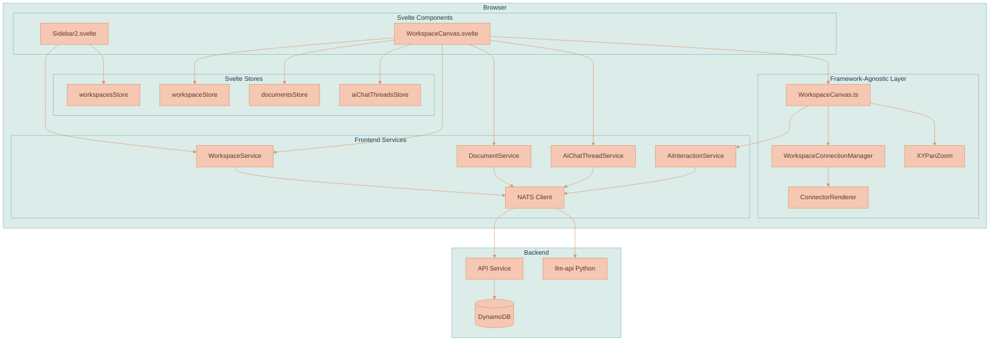

## Data Model

### Workspace (Backend)

```typescript
type Workspace = {
    workspaceId: string
    name: string
    accessType: 'private' | 'shared'
    files: string[]              // Document IDs
    canvasState: CanvasState
    createdAt: number
    updatedAt: number
}
```

### CanvasState

```typescript
type CanvasState = {
    viewport: {
        x: number      // Pan offset X
        y: number      // Pan offset Y
        zoom: number   // 0.1 to 2.0
    }
    nodes: CanvasNode[]
    edges: WorkspaceEdge[]  // Connections between nodes
}
```

### WorkspaceEdge

Edges represent visual connections between canvas nodes, used for showing context flows and dependencies.

```typescript
type WorkspaceEdge = {
    edgeId: string
    sourceNodeId: string
    targetNodeId: string
    sourceHandle?: string  // e.g., 'right'
    targetHandle?: string  // e.g., 'left'
    sourceT?: number       // Position along source side (0=top, 1=bottom, 0.5=center). Default: 0.5
    targetT?: number       // Position along target side (0=top, 1=bottom, 0.5=center). Default: 0.5
    sourceMessageId?: string  // Links edge to a specific aiResponseMessage (by its id attr) within the source AI chat thread
}
```

The `sourceT` and `targetT` properties allow edges to attach at any vertical position along a node's side, not just the center. When a user creates a connection by dragging, the `t` values are computed from the pointer position where they started and dropped.

The `sourceMessageId` property enables precise per-response-message tracking for AI-generated images. When an AI chat thread generates an image, the resulting canvas image node is connected back to the thread via an edge whose `sourceMessageId` identifies the specific `aiResponseMessage` that produced it. This allows context extraction to associate images with their originating conversation turns.

### Connection Routing

The `WorkspaceConnectionManager` handles the visual rendering logic for edges.

- **Routing Style**: Configured via the `CONNECTION_STYLE` constant. Defaults to `'orthogonal'` (circuit-board style) but can be switched to `'horizontal-bezier'` (smooth curves).
- **Auto-Alignment**: If a source node is vertically aligned with its target, the connection automatically snaps to a perfectly straight horizontal line by adjusting the `targetT` value.
- **Message-Level Anchoring**: When an edge has a `sourceMessageId` (connecting a specific AI response to an image), the renderer dynamically calculates `sourceT` to anchor the arrow exactly to the message bubble in the DOM. It also intelligently adjusts `targetT` to ensure the arrow points in a straight line to the target image height, preventing the "diving arrow" effect.
- **Corner Snapping**: If nodes are not aligned, the connector snaps to the nearest top/bottom corner (t=0.05 or t=0.95) to minimize diagonal visual clutter.
- **Drag Visualization**: While dragging, connections use a smooth bezier curve to distinguish them from committed orthogonal edges.
- **Proximity Connect**: Dragging a node (Document/Image) near an AI Chat Thread automatically suggests a connection with a dashed "ghost" line. Dropping the node creates the link. The proximity threshold is 1200px, and it prevents duplicate connections.

### AI Generated Content Layout

When an AI thread generates images, the workspace manages their placement automatically to maintain a clean layout:

- **Positioning**: Images are placed 50px to the right of their source thread.
- **Stacking**: Multiple images from the same thread are stacked vertically. The first image aligns with the top of the thread, and subsequent images are placed below the previous one with a 30px gap.
- **Race Condition Handling**: The layout engine tracks synchronous "partial" image states to ensure that simultaneous updates (e.g., partial stream + final completion) do not cause images to overlap or skip positional slots.

### CanvasNode

Canvas nodes use a discriminated union based on the `type` field:

```typescript
type CanvasNodeType = 'document' | 'image' | 'aiChatThread'

// Document node - contains a ProseMirror editor
type DocumentCanvasNode = {
    nodeId: string
    type: 'document'
    referenceId: string    // Points to Document.documentId
    position: { x: number; y: number }
    dimensions: { width: number; height: number }
}

// Image node - displays an uploaded image
type ImageCanvasNode = {
    nodeId: string
    type: 'image'
    fileId: string         // Points to file in NATS Object Store
    workspaceId: string    // For deletion context
    src: string            // Full URL for rendering
    aspectRatio: number    // Used for aspect-ratio-locked resize
    position: { x: number; y: number }
    dimensions: { width: number; height: number }
}

// AI Chat Thread node - contains an AI conversation
type AiChatThreadCanvasNode = {
    nodeId: string
    type: 'aiChatThread'
    referenceId: string    // Points to AiChatThread.threadId
    position: { x: number; y: number }
    dimensions: { width: number; height: number }
}

type CanvasNode = DocumentCanvasNode | ImageCanvasNode | AiChatThreadCanvasNode
```

## User Flows

### Opening a Workspace

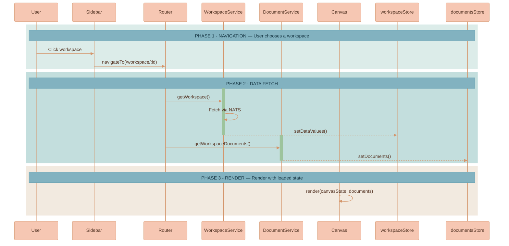

### Creating a Document

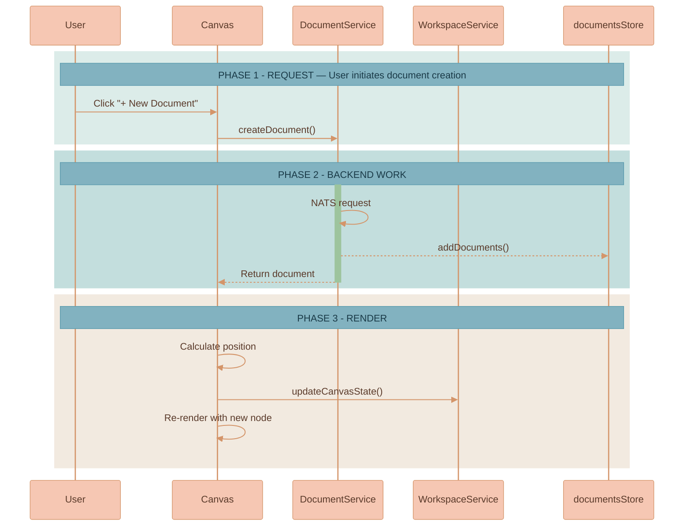

### Adding an Image

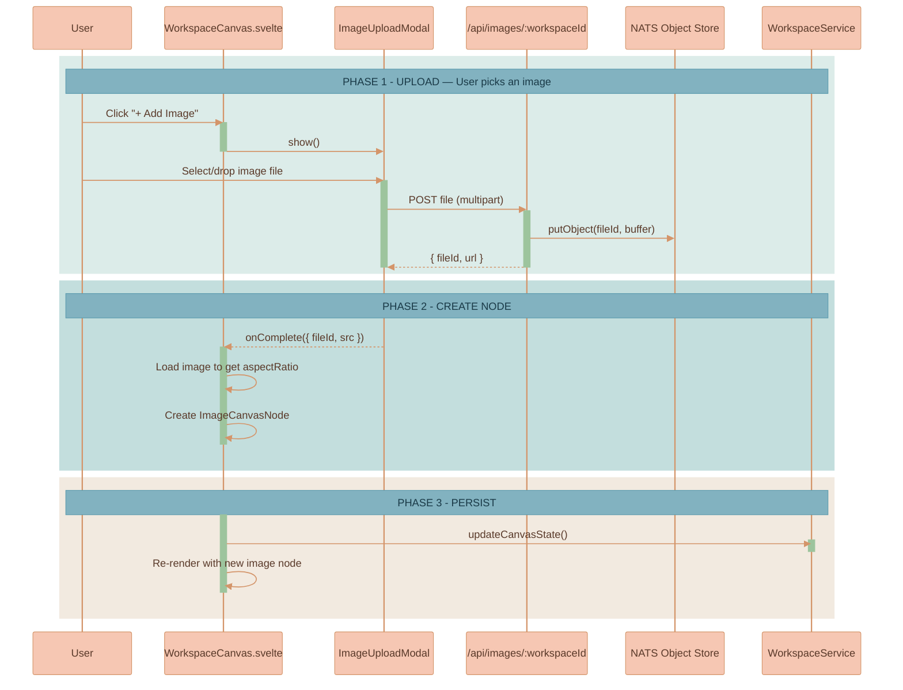

Note: after an image is uploaded the client loads it to determine the natural aspect ratio. On load the client verifies that the stored node dimensions match that ratio; if they do not match it corrects the node dimensions and persists the corrected values so stale nodes self-heal. Image resize uses a diagonal-based algorithm for smooth, aspect-locked resizing and the UI computes resize handle size/offsets dynamically so handles remain visually consistent regardless of canvas zoom.

### Deleting an Image

When an image node is removed from the canvas (either by user action or programmatically):

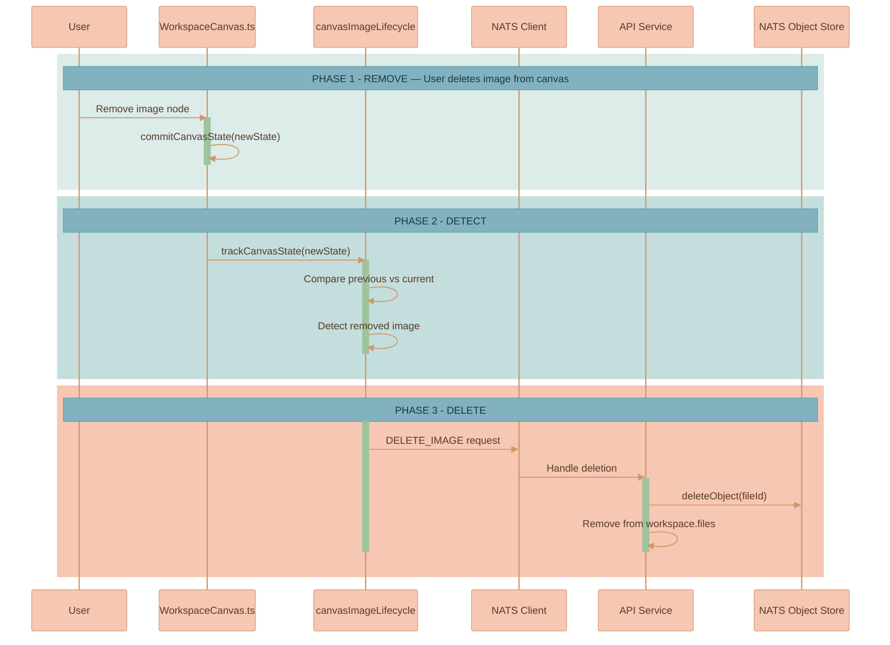

### Editing Content

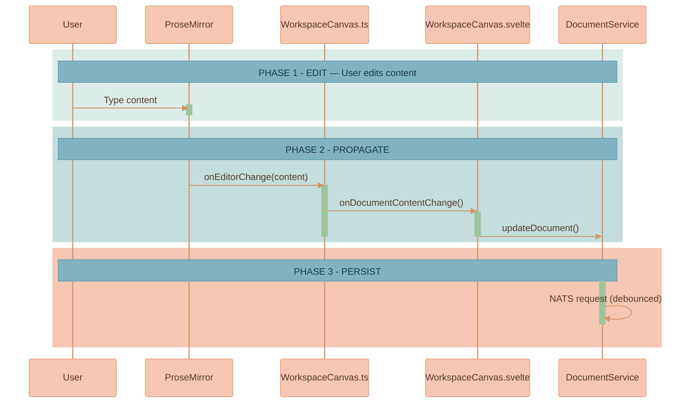

### Moving a Document

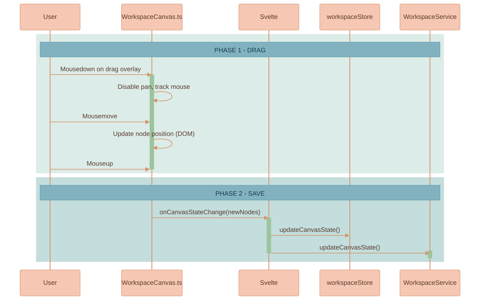

## Frontend Stores

### workspacesStore

Holds the list of workspaces shown in the sidebar. Minimal metadata only (id, name, timestamps).

```typescript
{
    meta: { loadingStatus },
    data: WorkspaceMeta[]
}
```

### workspaceStore

The currently open workspace with full canvas state.

```typescript
{
    meta: { loadingStatus, isInEdit, requiresSave },
    data: {
        workspaceId,
        name,
        canvasState,
        files,
        ...
    }
}
```

### documentsStore

Documents belonging to the current workspace.

```typescript
{
    meta: { loadingStatus },
    data: Document[]
}
```

### aiChatThreadsStore

AI chat threads belonging to the current workspace.

```typescript
{
    meta: { loadingStatus },
    data: Map<string, AiChatThread>  // Keyed by threadId for O(1) lookup
}
```

## Backend API (NATS Subjects)

| Subject | Purpose |
|---------|---------|
| `WORKSPACE.GET_USER_WORKSPACES` | List user's workspaces |
| `WORKSPACE.GET_WORKSPACE` | Get single workspace with canvas state |
| `WORKSPACE.CREATE_WORKSPACE` | Create new workspace |
| `WORKSPACE.UPDATE_WORKSPACE` | Update name |
| `WORKSPACE.UPDATE_CANVAS_STATE` | Persist viewport and node positions |
| `WORKSPACE.DELETE_WORKSPACE` | Delete workspace |
| `WORKSPACE.GET_WORKSPACE_DOCUMENTS` | Get documents in workspace |
| `DOCUMENT.CREATE_DOCUMENT` | Create document |
| `DOCUMENT.UPDATE_DOCUMENT` | Update document content/title |
| `DOCUMENT.DELETE_DOCUMENT` | Delete document |
| `AI_CHAT_THREAD.CREATE` | Create AI chat thread |
| `AI_CHAT_THREAD.GET` | Get AI chat thread by workspaceId + threadId |
| `AI_CHAT_THREAD.UPDATE` | Update AI chat thread content |
| `AI_CHAT_THREAD.DELETE` | Delete AI chat thread |
| `AI_CHAT_THREAD.GET_BY_WORKSPACE` | Get all AI chat threads in workspace |
| `AI_INTERACTION.CHAT_SEND_MESSAGE` | Send message to AI for processing |
| `AI_INTERACTION.CHAT_STOP_MESSAGE` | Stop active AI streaming |
| `WORKSPACE_IMAGE.DELETE_IMAGE` | Delete image from Object Store |

### Image HTTP Endpoints

| Endpoint | Method | Purpose |
|----------|--------|---------|
| `/api/images/:workspaceId` | POST | Upload image (multipart/form-data) |
| `/api/images/:workspaceId/:fileId` | GET | Serve image with auth token |

## Rendering Pipeline

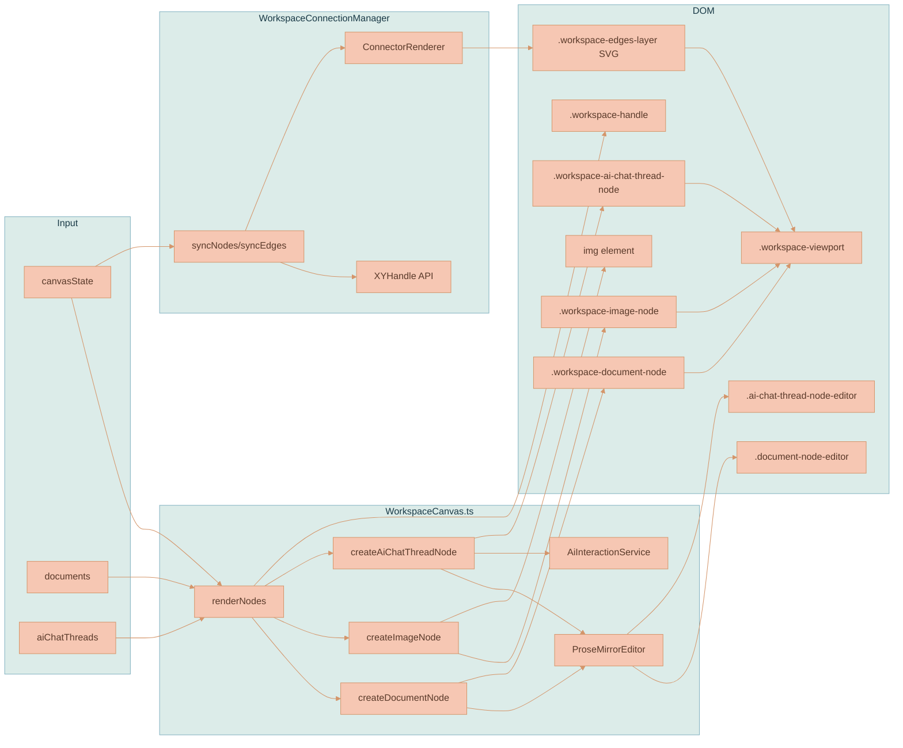

## Persistence Strategy

Canvas state changes are debounced (1 second) before persisting. This prevents hammering the backend during continuous pan/zoom operations.

Document content changes are handled by `DocumentService.updateDocument()` which has its own debouncing logic.

AI chat thread content changes are handled by `AiChatThreadService.updateAiChatThread()` with similar debouncing.

Position and dimension changes after drag/resize are persisted immediately via `onCanvasStateChange`.

Edge changes are persisted immediately when edges are created, deleted, or reconnected.

## Image Lifecycle Management

Images on the canvas are tracked by `canvasImageLifecycle.ts`. When an image node is removed from the canvas state:

1. The tracker compares previous and current canvas states
2. Detects which fileIds are no longer present
3. Calls `deleteImage()` from `imageUtils.ts` to delete from storage
4. The same `deleteImage()` utility is shared with ProseMirror's `imageLifecyclePlugin`

This ensures orphaned images don't accumulate in storage.

## Lazy Content Loading

Canvas nodes store dimensions in `canvasState` but content is fetched only when nodes enter the viewport. This optimizes initial workspace load and memory usage for large workspaces.

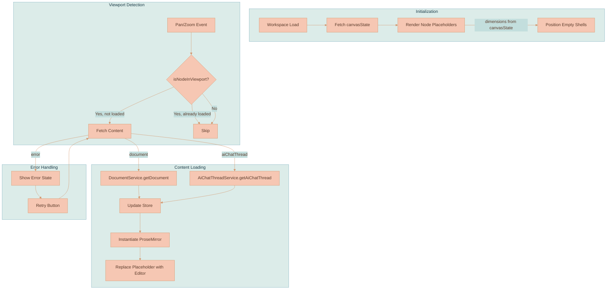

### Content Fetching Strategy

- **No debouncing** — Content is fetched immediately when node enters viewport for responsive UX
- **No unloading** — Once loaded, content remains in memory to avoid re-fetch on pan back
- **Parallel fetching** — Multiple nodes entering viewport simultaneously trigger parallel fetch requests
- **ResizeObserver** — Pane bounds are tracked for accurate visibility detection during window resizes

## AI Interaction Routing

AI chat threads use a workspace-scoped routing pattern for streaming responses:

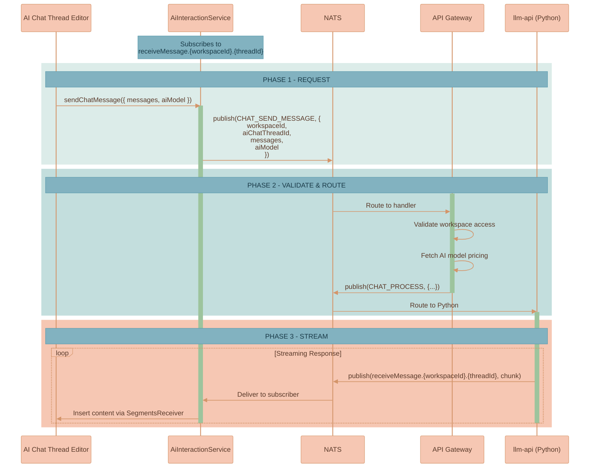

Each AI chat thread node has its own `AiInteractionService` instance, enabling concurrent AI streams across multiple threads in the same workspace.

---

## Workspace Edges

Visual connections (edges/arrows) between canvas nodes allow users to show relationships, context flows, and dependencies between workspace entities. Users can drag from a handle on one node to another to create a relationship line.

### Key Features

- **Connection handles** on each node (small circles on the sides, visible on hover)
- **Drag-to-connect** interaction using `XYHandle.onPointerDown` from `@xyflow/system`
- **Edge rendering** using ConnectorRenderer from `src/infographics/connectors/`
- **Edge selection and deletion** (click to select, Delete/Backspace to remove)
- **Edge reconnection** (drag an edge endpoint to move it to a different node, or drop in empty space to delete)
- **Persistence** of edges in `CanvasState`

### Architecture

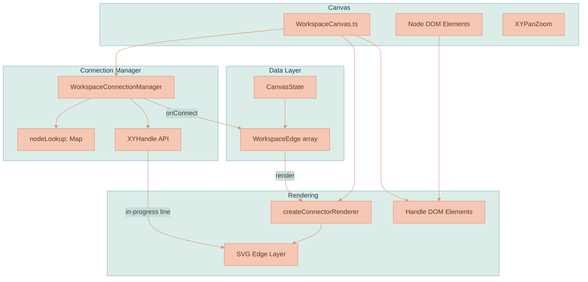

### Connection Flow

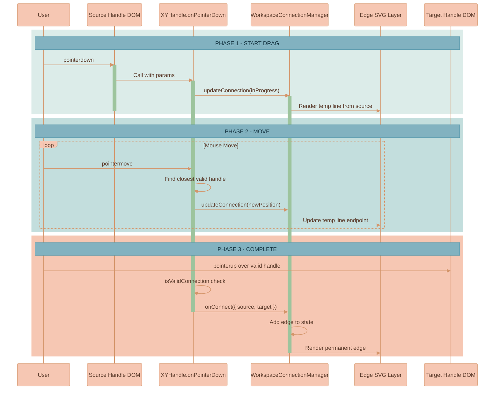

### WorkspaceConnectionManager

Lives at `src/infographics/workspace/WorkspaceConnectionManager.ts`. This is the brain of the connection system.

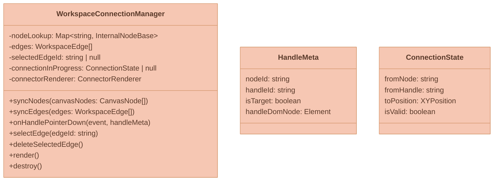

Responsibilities:
- Maintains `nodeLookup` (Map of node ID → internal node representation with handle bounds)
- Tracks in-progress connection state for rendering the temporary line
- Validates connections (no duplicates, no self-loops)
- Delegates to `XYHandle.onPointerDown` for the actual drag interaction
- Manages edge selection state

### Handle DOM Elements

Each workspace node has connection handles — small circles at the left (target) and right (source) edges:

```
┌─────────────────────────────────────────┐
│ ○                                     ○ │
│ left                               right│
│ (target)                         (source)│
│                                         │
│         Node Content                    │
│                                         │
└─────────────────────────────────────────┘
```

Handles are:
- Hidden by default, shown on node hover (CSS)
- Marked with `data-nodeid`, `data-handleid`, `data-handlepos` attributes (required by XYHandle)
- Wired with `pointerdown` listener that calls `WorkspaceConnectionManager.onHandlePointerDown`

### Edge Rendering

Edges are rendered as SVG paths using `createConnectorRenderer` from `src/infographics/connectors/`. The edge layer sits below node cards but above the canvas background.

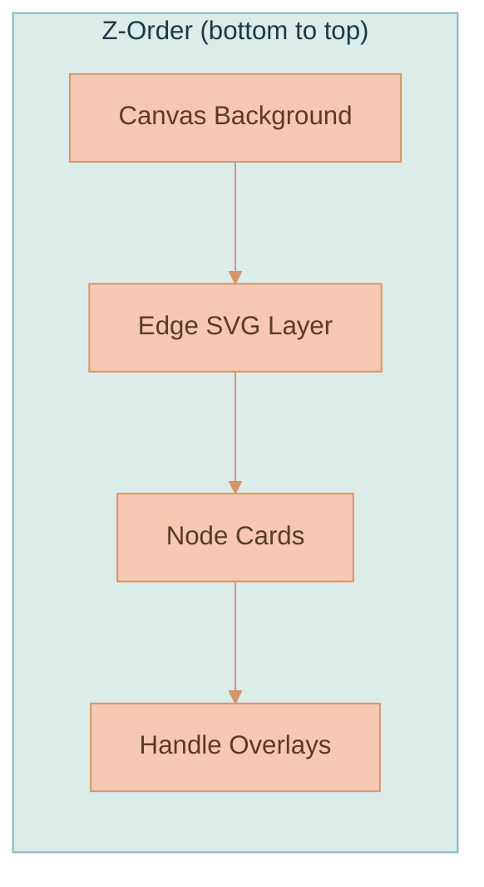

Edge styling:
- Path type: `horizontal-bezier`
- Stroke width: `2px` (3px when selected)
- Marker (arrowhead) size: `12px`
- Color: `rgba(190, 190, 200, 0.95)` (primary color when selected)

### Edge Selection and Deletion

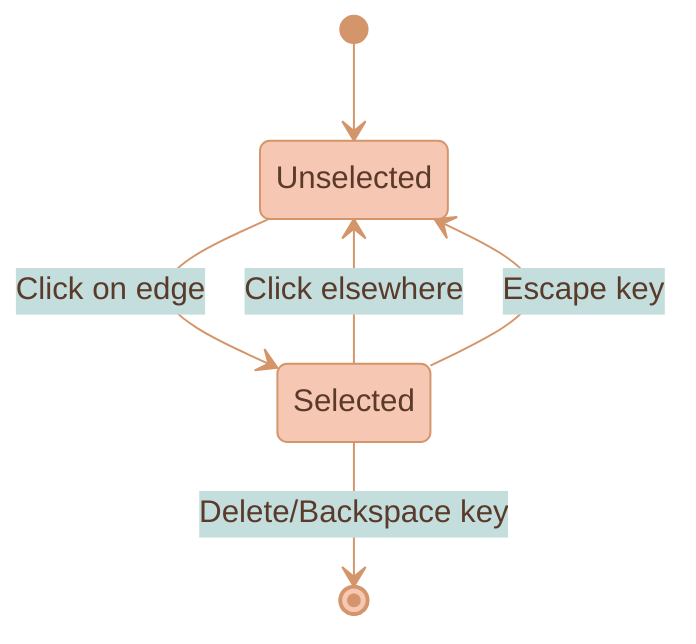

When an edge is selected, small draggable circles appear at the source and target endpoints for reconnection.

### Edge Persistence

Edge changes follow the same pattern as node changes:

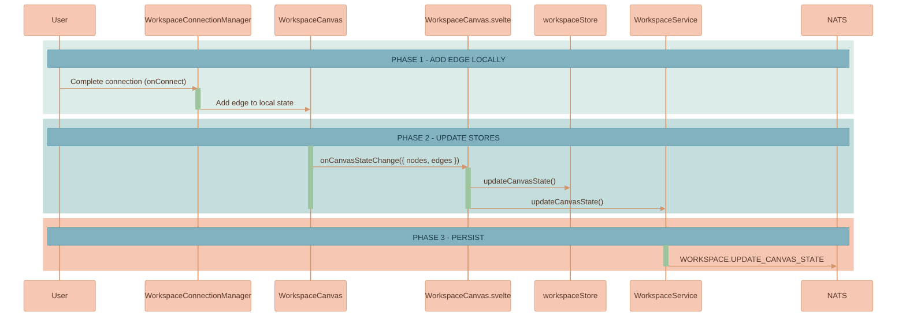

---

## AI Chat Context from Connected Nodes

When nodes are connected TO an AI chat thread (incoming edges), the AI chat automatically extracts their content and passes it to the AI model. This includes text from documents, text from other AI chat threads, and images (converted to base64). Context is extracted by walking the edge graph backwards from the AI chat node, collecting all connected content recursively.

### How It Works

1. **Edge Traversal** — When a user sends a message in an AI chat thread, `AiChatThreadService.extractConnectedContext()` finds all nodes connected via incoming edges (recursively)
2. **Content Extraction** — Documents and AI threads have their ProseMirror content parsed for text; embedded images are also extracted. Standalone image nodes are fetched and converted to base64
3. **Message Building** — `buildContextMessage()` formats the extracted context as a multimodal message with interleaved text and images
4. **API Format** — All content uses the OpenAI Responses API format (`input_text`, `input_image` blocks) as the canonical format. The `llm-api` service converts to provider-specific formats (e.g., Anthropic) as needed

### Multimodal Content Format

```typescript
// Text content block
{ type: 'input_text'; text: string }

// Image content block
{ type: 'input_image'; image_url: string; detail?: 'auto' | 'low' | 'high' }
```

### Key Files

| File | Purpose |
|------|---------|
| `services/web-ui/src/services/ai-chat-thread-service.ts` | Context extraction (`extractConnectedContext`, `buildContextMessage`) |
| `services/web-ui/src/infographics/workspace/WorkspaceCanvas.ts` | Integration point (`onAiChatSubmit` calls context extraction) |
| `services/llm-api/src/utils/attachments.py` | Attachment format conversion for LLM providers |
| `packages/lixpi/constants/ts/types.ts` | Shared multimodal types (`TextContentBlock`, `ImageContentBlock`) |

---

## AI Image Generation

This feature adds the ability to generate images directly from AI chat threads using OpenAI's `gpt-image-1` model via the Responses API. When a user asks the AI to create an image, the generated result appears directly as a canvas node positioned to the right of the AI chat thread, connected by an edge whose `sourceMessageId` links it to the specific `aiResponseMessage` that produced it. The revised prompt text is inserted as text inside the AI response message to keep the conversation readable.

Multi-turn editing is supported: users can continue refining an image within the same thread (OpenAI maintains the conversation context via `previous_response_id`), or click "Edit in New Thread" on any generated image to spawn a dedicated editing thread positioned to the right of that image on the canvas.

### How It Works

1. User enables "Image Generation" mode in an AI chat thread's settings
2. User types a prompt like "Create a logo for a coffee shop"
3. The request goes to `llm-api` which calls OpenAI with the `image_generation` tool
4. OpenAI streams back partial images (up to 3) as the generation progresses
5. Each partial creates/updates the canvas image node in real-time (progressive preview)
6. On completion, the canvas node is finalized with full metadata and an edge (including `sourceMessageId`) connects the AI response to the image
7. The revised prompt text appears inside the AI response message in the chat thread
8. Multiple generated images from the same thread stack vertically to the right with 30px gaps

### Data Flow

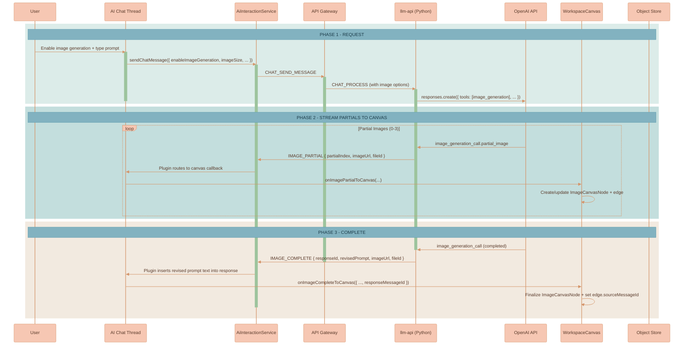

### Image Settings

When image generation is enabled, users can pick a size:

| Option | Dimensions | Use Case |
|--------|------------|----------|
| Square | 1024×1024 | Logos, icons, profile pictures |
| Landscape | 1536×1024 | Banners, headers, wide scenes |
| Portrait | 1024×1536 | Posters, phone wallpapers, tall scenes |
| Auto | Model decides | Let the AI pick based on prompt |

Quality is always set to maximum (`high`), input fidelity is `high` (preserves details when editing existing images), and content moderation is set to `low` to avoid unnecessary restrictions. Users don't need to configure these—they're hardcoded for the best possible output.

### Storage & Deduplication

Generated images are stored in NATS Object Store just like uploaded images. To avoid duplicates, the upload endpoint computes a SHA-256 hash of the image content and uses `hash-{sha256}` as the `fileId`. Before writing, it checks if that fileId already exists—if so, it skips the upload and returns the existing URL.

### Multi-Turn Image Editing

Multi-turn image editing uses a **provider-agnostic approach** by leveraging canvas edges with `sourceMessageId` to maintain precise image-to-response associations. When an image is generated:

1. The image appears as an `ImageCanvasNode` on the canvas, connected to the AI chat thread via an edge
2. The edge's `sourceMessageId` links the image to the specific `aiResponseMessage` that produced it
3. When extracting connected context for follow-up messages, `extractConnectedContext()` traverses incoming edges and includes image nodes with their `sourceMessageId` metadata
4. The LLM API fetches images from NATS Object Store via `nats-obj://` references and converts to base64 before sending to any provider

**Thread-level continuity**: All AI-generated images connected to the thread are automatically included in subsequent requests via the workspace edge system. Saying "make the background blue" works because the previous image is part of the connected context.

**Per-image editing**: Clicking "Edit in New Thread" creates a fresh AI chat thread with an edge connecting the image to the new thread. The connected image becomes part of the new thread's context via the workspace edge system.

### Canvas Integration

When the AI generates an image:

1. `IMAGE_PARTIAL` events create an `ImageCanvasNode` on the canvas, positioned to the right of the source thread
2. The `partialImageTracker` Map records the pending partial SYNCHRONOUSLY before any async work to prevent race conditions with `IMAGE_COMPLETE`
3. Progressive partial previews update the canvas node's image in real-time via direct DOM updates
4. `IMAGE_COMPLETE` finalizes the canvas node with full `generatedBy` metadata: `{ aiChatThreadId, responseId, aiModel, revisedPrompt }`
5. A `WorkspaceEdge` connects the thread to the image with `sourceMessageId` identifying the specific `aiResponseMessage` (the response node gets a unique `id` when created by `handleStreamStart`)
6. Multiple images from the same thread stack vertically with 30px gaps
7. Collision resolution runs after finalization to push apart any overlapping nodes
8. The revised prompt text is inserted as a paragraph inside the AI response message in the editor

**Editor preservation during image generation:** Adding image nodes to the canvas triggers a state persistence round-trip through the Svelte store. Normally this causes `renderNodes()` which destroys all editors. During image generation, `commitCanvasStatePreservingEditors()` is used instead — it updates the internal structure key immediately so the Svelte `$effect`'s `render()` call sees no structural change and skips the destructive `renderNodes()`. The DOM is managed manually via `appendImageNodeToDOM()`. This keeps active streaming editors alive.

When "Edit in New Thread" is clicked on a canvas image node:

1. A new AI chat thread is created and positioned at `(imageNode.x + imageNode.width + 50, imageNode.y)`
2. An edge connects the image (right) to the new thread (left)
3. The connected image is automatically included in the new thread's context via `extractConnectedContext()`
4. This forms a horizontal chain: `[Original Thread] → [Image] → [Edit Thread]`

---

## Follow-up Tasks

The following items are pending implementation:

### Handle Styling Polish

- [ ] Show handles on AI chat thread node hover (CSS selector missing `.workspace-ai-chat-thread-node:hover .workspace-handle`)
- [ ] Add hover effect on handle itself (`:hover` style)
- [ ] Add transition for smooth fade in/out

### Context Icon for AI Chat Thread Nodes

The "branch" icon at the bottom-right corner of AI chat thread cards currently uses the old `contextSelector` plugin. It needs to be refactored to work with the workspace edge system:

- [ ] Refactor icon click handler to work with workspace connection system
- [ ] Show popover listing nodes connected TO this thread (incoming edges)
- [ ] Allow quick disconnect (remove edge) from the popover
- [ ] Optionally highlight connected edges on canvas when popover is open

### Cleanup Old Code

Once the context icon is refactored:

- [ ] Delete `src/components/proseMirror/plugins/primitives/contextSelector/` folder
- [ ] Remove import from `aiChatThreadNode.ts`
- [ ] Remove SCSS import from `ai-chat-thread.scss`

### Edge Cases

- [ ] When a node with edges is deleted, connected edges should be removed too
- [ ] Verify edges update correctly during node drag

### Testing

- [ ] Create edges between different node types (document ↔ document, document ↔ AI thread, etc.)
- [ ] Test edge selection and deletion
- [ ] Test edge reconnection
- [ ] Test with pan/zoom (edges should transform correctly)
- [ ] Test persistence (reload page, edges should still be there)
- [ ] Test with many nodes and edges (performance)
