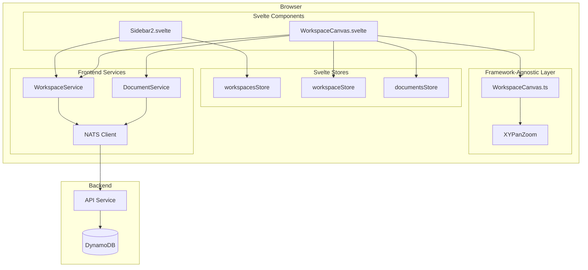
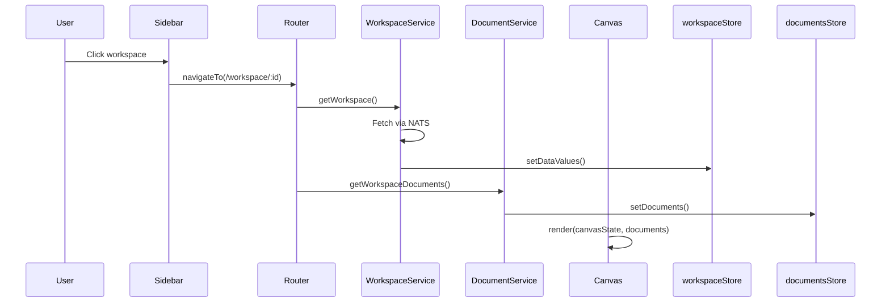
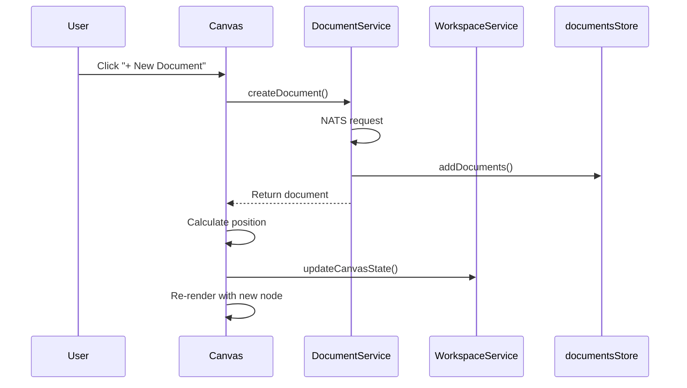
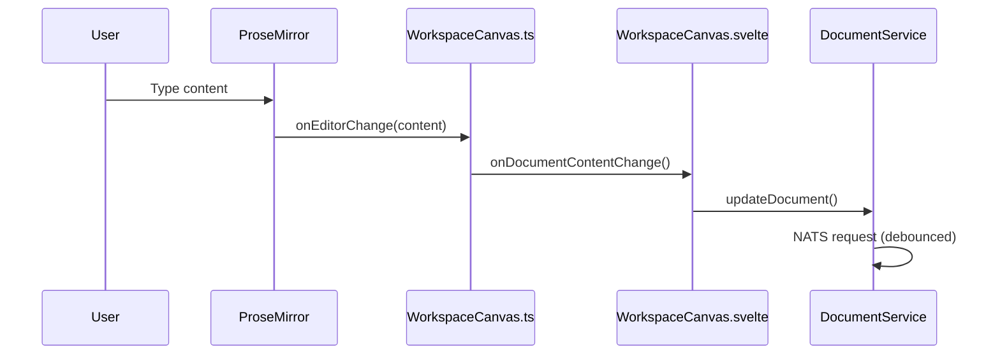
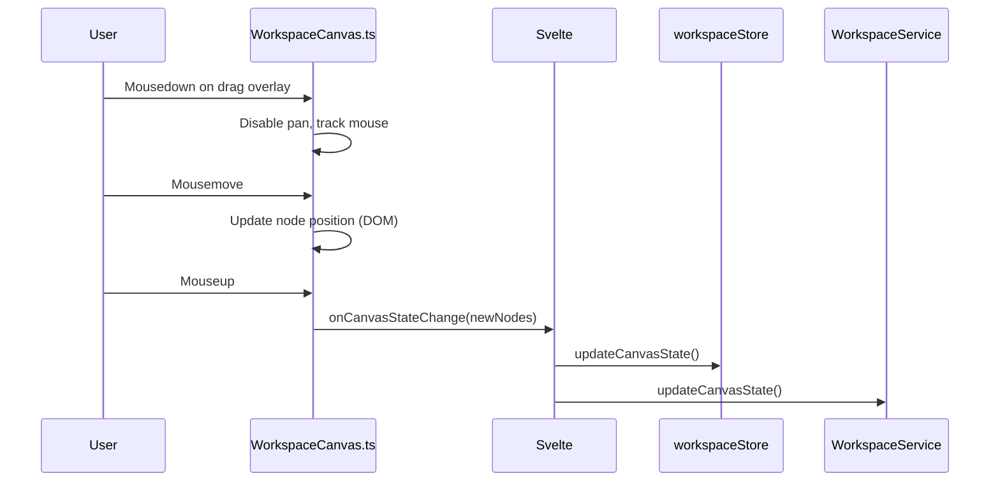
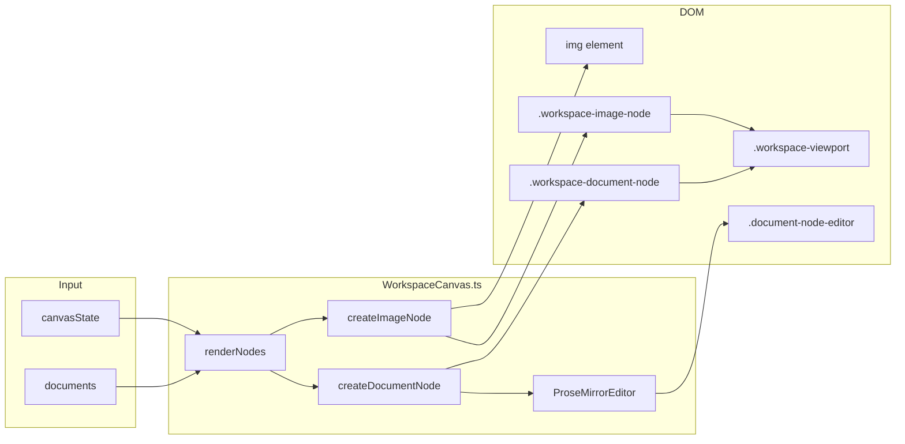
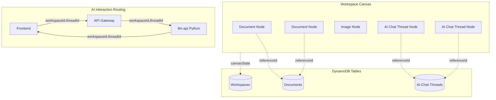
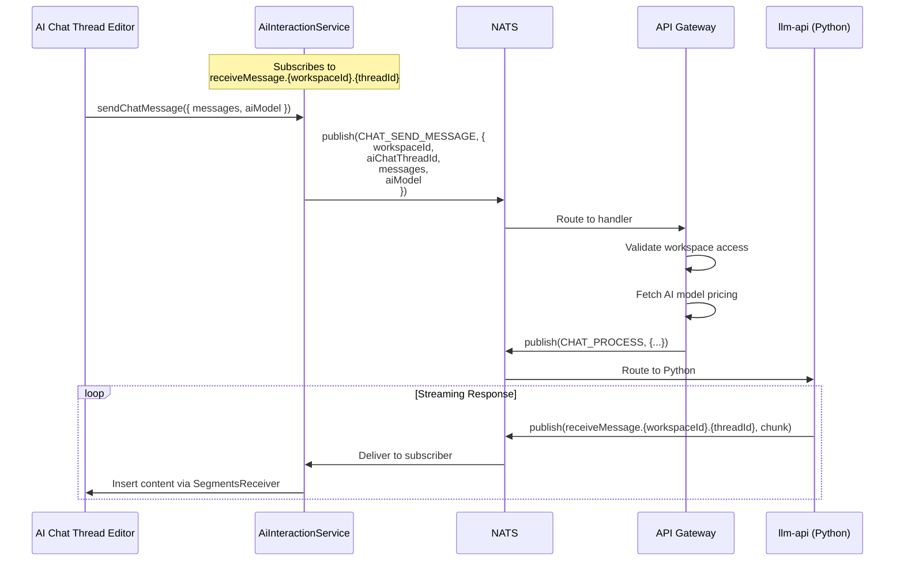
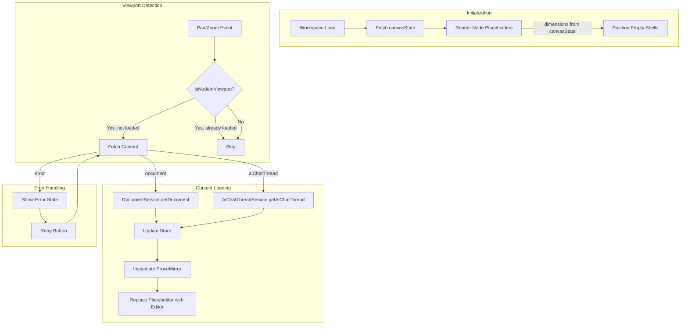

# Workspace Feature

A workspace is the primary container where users organize and edit their documents and images. Think of it as an infinite canvas where cards float, can be arranged freely, resized, and edited in place.

## Core Concepts

**Workspace** — A named container owned by a user. Has a canvas state (viewport position, zoom level, and node positions) plus references to documents and uploaded files.

**Canvas Node** — A positioned rectangle on the canvas. Can be either a document node (with ProseMirror editor) or an image node. Stores position, dimensions, and type-specific data.

**Document** — The actual text content (ProseMirror JSON). Lives separately from its canvas representation so the same document could theoretically appear in multiple workspaces.

**Image** — An uploaded image file stored in NATS Object Store. Referenced by canvas nodes and automatically deleted when removed from the canvas.

**Viewport** — The current view: x/y offset and zoom level. Persisted so users return to where they left off.

## System Architecture



## Data Model

### Workspace (Backend)

```typescript
type Workspace = {
    workspaceId: string
    name: string
    accessType: 'private' | 'shared'
    files: string[]              // Document IDs
    canvasState: CanvasState
    createdAt: number
    updatedAt: number
}
```

### CanvasState

```typescript
type CanvasState = {
    viewport: {
        x: number      // Pan offset X
        y: number      // Pan offset Y
        zoom: number   // 0.1 to 2.0
    }
    nodes: CanvasNode[]
}
```

### CanvasNode

Canvas nodes use a discriminated union based on the `type` field:

```typescript
type CanvasNodeType = 'document' | 'image'

// Document node - contains a ProseMirror editor
type DocumentCanvasNode = {
    nodeId: string
    type: 'document'
    referenceId: string    // Points to Document.documentId
    position: { x: number; y: number }
    dimensions: { width: number; height: number }
}

// Image node - displays an uploaded image
type ImageCanvasNode = {
    nodeId: string
    type: 'image'
    fileId: string         // Points to file in NATS Object Store
    workspaceId: string    // For deletion context
    src: string            // Full URL for rendering
    aspectRatio: number    // Used for aspect-ratio-locked resize
    position: { x: number; y: number }
    dimensions: { width: number; height: number }
}

type CanvasNode = DocumentCanvasNode | ImageCanvasNode
```

## User Flows

### Opening a Workspace



### Creating a Document



### Adding an Image

```mermaid
sequenceDiagram
    participant User
    participant Svelte as WorkspaceCanvas.svelte
    participant Modal as ImageUploadModal
    participant API as /api/images/:workspaceId
    participant ObjStore as NATS Object Store
    participant WSvc as WorkspaceService

    User->>Svelte: Click "+ Add Image"
    Svelte->>Modal: show()
    User->>Modal: Select/drop image file
    Modal->>API: POST file (multipart)
    API->>ObjStore: putObject(fileId, buffer)
    API-->>Modal: { fileId, url }
    Modal->>Svelte: onComplete({ fileId, src })
    Svelte->>Svelte: Load image to get aspectRatio
    Svelte->>Svelte: Create ImageCanvasNode
    Svelte->>WSvc: updateCanvasState()
    Svelte->>Svelte: Re-render with new image node

Note: after an image is uploaded the client loads it to determine the natural aspect ratio. On load the client verifies that the stored node dimensions match that ratio; if they do not match it corrects the node dimensions and persists the corrected values so stale nodes self-heal. Image resize uses a diagonal-based algorithm for smooth, aspect-locked resizing and the UI computes resize handle size/offsets dynamically so handles remain visually consistent regardless of canvas zoom.
```

### Deleting an Image

When an image node is removed from the canvas (either by user action or programmatically):

```mermaid
sequenceDiagram
    participant User
    participant Canvas as WorkspaceCanvas.ts
    participant Tracker as canvasImageLifecycle
    participant NATS as NATS Client
    participant API as API Service
    participant ObjStore as NATS Object Store

    User->>Canvas: Remove image node
    Canvas->>Canvas: commitCanvasState(newState)
    Note: committing canvas state persists corrected dimensions and triggers the image lifecycle tracker which will detect removed fileIds and call `deleteImage` to remove orphaned files from storage.
    Canvas->>Tracker: trackCanvasState(newState)
    Tracker->>Tracker: Compare previous vs current
    Tracker->>Tracker: Detect removed image
    Tracker->>NATS: DELETE_IMAGE request
    NATS->>API: Handle deletion
    API->>ObjStore: deleteObject(fileId)
    API->>API: Remove from workspace.files
```

### Editing Content



### Moving a Document



## Frontend Stores

### workspacesStore

Holds the list of workspaces shown in the sidebar. Minimal metadata only (id, name, timestamps).

```typescript
{
    meta: { loadingStatus },
    data: WorkspaceMeta[]
}
```

### workspaceStore

The currently open workspace with full canvas state.

```typescript
{
    meta: { loadingStatus, isInEdit, requiresSave },
    data: {
        workspaceId,
        name,
        canvasState,
        files,
        ...
    }
}
```

### documentsStore

Documents belonging to the current workspace.

```typescript
{
    meta: { loadingStatus },
    data: Document[]
}
```

## Backend API (NATS Subjects)

| Subject | Purpose |
|---------|---------|
| `WORKSPACE.GET_USER_WORKSPACES` | List user's workspaces |
| `WORKSPACE.GET_WORKSPACE` | Get single workspace with canvas state |
| `WORKSPACE.CREATE_WORKSPACE` | Create new workspace |
| `WORKSPACE.UPDATE_WORKSPACE` | Update name |
| `WORKSPACE.UPDATE_CANVAS_STATE` | Persist viewport and node positions |
| `WORKSPACE.DELETE_WORKSPACE` | Delete workspace |
| `WORKSPACE.GET_WORKSPACE_DOCUMENTS` | Get documents in workspace |
| `DOCUMENT.CREATE_DOCUMENT` | Create document |
| `DOCUMENT.UPDATE_DOCUMENT` | Update document content/title |
| `DOCUMENT.DELETE_DOCUMENT` | Delete document |
| `WORKSPACE_IMAGE.DELETE_IMAGE` | Delete image from Object Store |

### Image HTTP Endpoints

| Endpoint | Method | Purpose |
|----------|--------|---------|
| `/api/images/:workspaceId` | POST | Upload image (multipart/form-data) |
| `/api/images/:workspaceId/:fileId` | GET | Serve image with auth token |

## Rendering Pipeline



## Persistence Strategy

Canvas state changes are debounced (1 second) before persisting. This prevents hammering the backend during continuous pan/zoom operations.

Document content changes are handled by `DocumentService.updateDocument()` which has its own debouncing logic.

Position and dimension changes after drag/resize are persisted immediately via `onCanvasStateChange`.

## Image Lifecycle Management

Images on the canvas are tracked by `canvasImageLifecycle.ts`. When an image node is removed from the canvas state:

1. The tracker compares previous and current canvas states
2. Detects which fileIds are no longer present
3. Calls `deleteImage()` from `imageUtils.ts` to delete from storage
4. The same `deleteImage()` utility is shared with ProseMirror's `imageLifecyclePlugin`

This ensures orphaned images don't accumulate in storage.

## Future Considerations

- **Multi-user collaboration** — Real-time sync of canvas state and document content
- **Additional node types** — Embeds, connectors between nodes, sticky notes
- **Workspace templates** — Pre-arranged layouts for common use cases
- **Tags on workspaces** — Already stubbed in `WorkspaceService.addTagToWorkspace()`
- **Image metadata editing** — Alt text, titles via context menu

---

# Technical Proposal: AI Chat Thread as First-Class Canvas Node

**Status:** Planned
**Created:** December 27, 2025
**Author:** AI Agent

## Overview

This proposal details the refactoring of AI Chat Threads from embedded ProseMirror nodes within documents to first-class canvas entities. Currently, every document contains AI chat threads as the only allowed block-level content after the title. This creates a coupling between documents and AI interactions that limits flexibility.

The new architecture separates these concerns:
- **Documents** become pure rich-text containers (paragraphs, headings, images, code blocks)
- **AI Chat Threads** become independent canvas nodes with their own persistence, lifecycle, and AI interaction routing

This enables users to place dedicated AI conversation spaces anywhere on their workspace canvas, independent of documents.

## Current Architecture Problems

1. **Schema constraint** — Documents are locked to `documentTitle aiChatThread+` content model, preventing pure text documents
2. **Tight coupling** — AI interaction routing uses `documentId` even though threads have their own `threadId`
3. **Eager loading** — All document content is fetched when workspace opens, regardless of viewport visibility
4. **No independent thread persistence** — Thread state exists only within document ProseMirror JSON, cannot be queried or managed separately

## Proposed Architecture



## Data Model Changes

### New Canvas Node Type

Extend `CanvasNodeType` to include `'aiChatThread'`:

```typescript
type CanvasNodeType = 'document' | 'image' | 'aiChatThread'

type AiChatThreadCanvasNode = {
    nodeId: string
    type: 'aiChatThread'
    referenceId: string    // Points to AiChatThread.threadId
    position: { x: number; y: number }
    dimensions: { width: number; height: number }
}

type CanvasNode = DocumentCanvasNode | ImageCanvasNode | AiChatThreadCanvasNode
```

### New AiChatThread Entity

```typescript
type AiChatThread = {
    workspaceId: string    // Partition key
    threadId: string       // Sort key
    content: object        // ProseMirror JSON (single aiChatThread node)
    aiModel: string        // e.g., 'anthropic:claude-3-5-sonnet'
    status: 'active' | 'paused' | 'completed'
    createdAt: number
    updatedAt: number
}
```

### DynamoDB Table Schema

```
Table: AI-Chat-Threads-{org}-{stage}
├── Partition Key: workspaceId (S)
├── Sort Key: threadId (S)
├── LSI: createdAt
└── Attributes: content, aiModel, status, timestamps
```

## Document Schema Change

**Current:**
```javascript
content: `${documentTitleNodeType} ${aiChatThreadNodeType}+`
```

**Proposed:**
```javascript
content: `${documentTitleNodeType} block+`
```

This allows documents to contain any block-level nodes (paragraph, heading, blockquote, image, code_block) without requiring AI chat threads. The `aiChatThread` node spec remains in the schema for use by the AI Chat Thread editor variant.

## AI Interaction Routing Change

**Current routing pattern:**
```
Subject: ai.interaction.chat.receiveMessage.{documentId}
Instance key: {documentId}:{threadId}
```

**Proposed routing pattern:**
```
Subject: ai.interaction.chat.receiveMessage.{workspaceId}.{aiChatThreadId}
Instance key: {workspaceId}:{aiChatThreadId}
```

This change affects:
- Frontend `AiInteractionService` subscription
- Backend `ai-interaction-subjects.ts` handler
- Python `llm-api` response publishing



## Lazy Content Loading Architecture

Canvas nodes store dimensions in `canvasState` but content is fetched only when nodes enter the viewport. This optimizes initial workspace load and memory usage for large workspaces.



### Visibility Calculation

```typescript
function isNodeInViewport(
    node: CanvasNode,
    viewport: Viewport,
    paneRect: DOMRect
): boolean {
    const { x, y, zoom } = viewport

    // Transform node coordinates to screen space
    const screenLeft = node.position.x * zoom + x
    const screenTop = node.position.y * zoom + y
    const screenRight = screenLeft + node.dimensions.width * zoom
    const screenBottom = screenTop + node.dimensions.height * zoom

    // Check intersection with pane bounds
    return !(
        screenRight < 0 ||
        screenLeft > paneRect.width ||
        screenBottom < 0 ||
        screenTop > paneRect.height
    )
}
```

### Content Fetching Strategy

- **No debouncing** — Content is fetched immediately when node enters viewport for responsive UX
- **No unloading** — Once loaded, content remains in memory to avoid re-fetch on pan back
- **Parallel fetching** — Multiple nodes entering viewport simultaneously trigger parallel fetch requests

## Shared Loading Placeholder Primitive

Create a reusable loading placeholder component following existing primitive patterns:

```
primitives/loadingPlaceholder/
├── index.ts              # Export factory
├── pureLoadingPlaceholder.ts  # DOM creation with html template
├── loadingPlaceholder.scss    # Styles and animations
└── _loadingPlaceholder-mixins.scss  # Reusable mixins
```

**HTML Structure:**
```html
<div class="loading-placeholder">
    <span class="loader"></span>
</div>
```

**CSS (extracted from spinner.svelte):**
```scss
.loading-placeholder {
    display: flex;
    align-items: center;
    justify-content: center;
    width: 100%;
    height: 100%;
    background: rgba(255, 255, 255, 0.8);
}

.loader {
    width: 40px;
    height: 40px;
    border-radius: 50%;
    border-top: 4px solid $nightBlue;
    border-right: 4px solid transparent;
    animation: rotation 1500ms linear infinite;

    &::after {
        content: '';
        position: absolute;
        inset: 0;
        border-radius: 50%;
        border-left: 4px solid $redPink;
        border-bottom: 4px solid transparent;
        animation: rotation 500ms linear infinite reverse;
    }
}

@keyframes rotation {
    0% { transform: rotate(0deg); }
    100% { transform: rotate(360deg); }
}
```

## NATS Subjects

### New AI Chat Thread Subjects

Add to `nats-subjects.json`:

```json
{
    "AI_CHAT_THREAD_SUBJECTS": {
        "CREATE_AI_CHAT_THREAD": "aiChatThread.create",
        "GET_AI_CHAT_THREAD": "aiChatThread.get",
        "UPDATE_AI_CHAT_THREAD": "aiChatThread.update",
        "DELETE_AI_CHAT_THREAD": "aiChatThread.delete",
        "GET_WORKSPACE_AI_CHAT_THREADS": "aiChatThread.getByWorkspace"
    }
}
```

## Frontend Service and Stores

### AiChatThreadService

```typescript
class AiChatThreadService {
    async createAiChatThread({ workspaceId, aiModel }): Promise<AiChatThread>
    async getAiChatThread({ workspaceId, threadId }): Promise<AiChatThread>
    async updateAiChatThread({ workspaceId, threadId, content }): Promise<void>
    async deleteAiChatThread({ workspaceId, threadId }): Promise<void>
    async getWorkspaceAiChatThreads({ workspaceId }): Promise<AiChatThread[]>
}
```

### Stores

**aiChatThreadStore** — Current/active thread being edited
```typescript
{
    meta: { loadingStatus, requiresSave },
    data: AiChatThread | null
}
```

**aiChatThreadsStore** — Collection of threads for current workspace
```typescript
{
    meta: { loadingStatus },
    data: Map<string, AiChatThread>  // Keyed by threadId for O(1) lookup
}
```

## Backend Changes

### Model: ai-chat-thread.ts

Following `document.ts` pattern:
- `createAiChatThread()` — Insert to DynamoDB
- `getAiChatThread()` — Query by workspaceId + threadId
- `updateAiChatThread()` — Update content, aiModel, status
- `deleteAiChatThread()` — Remove from table
- `getWorkspaceAiChatThreads()` — Query all by workspaceId

### Handler: ai-chat-thread-subjects.ts

Following `document-subjects.ts` pattern:
- Validate workspace access before all operations
- Extract user from token
- Call model methods and return results

### AI Interaction Routing Update

In `ai-interaction-subjects.ts`:

**Current:**
```typescript
const { documentId, threadId } = data
const instanceKey = threadId ? `${documentId}:${threadId}` : documentId
// Response: ai.interaction.chat.receiveMessage.${documentId}
```

**Proposed:**
```typescript
const { workspaceId, aiChatThreadId } = data
const instanceKey = `${workspaceId}:${aiChatThreadId}`
// Response: ai.interaction.chat.receiveMessage.${workspaceId}.${aiChatThreadId}
```

### Python llm-api Update

In `providers/base.py`, update all publish methods:

**Current:**
```python
async def _publish_stream_chunk(self, document_id: str, text: str, thread_id: str = None):
    self.nats_client.publish(
        f"ai.interaction.chat.receiveMessage.{document_id}",
        {...}
    )
```

**Proposed:**
```python
async def _publish_stream_chunk(self, workspace_id: str, ai_chat_thread_id: str, text: str):
    self.nats_client.publish(
        f"ai.interaction.chat.receiveMessage.{workspace_id}.{ai_chat_thread_id}",
        {...}
    )
```

## File Changes Summary

### Constants Package

| File | Changes |
|------|---------|
| `packages/lixpi/constants/ts/types.ts` | Add `AiChatThread`, `AiChatThreadCanvasNode`, extend unions |
| `packages/lixpi/constants/ts/aws-resources.ts` | Add `AI_CHAT_THREADS` table constant |
| `packages/lixpi/constants/nats-subjects.json` | Add `AI_CHAT_THREAD_SUBJECTS` |

### Infrastructure

| File | Changes |
|------|---------|
| `infrastructure/pulumi/src/dynamodb.ts` | Add AI-Chat-Threads table definition |

### Backend API

| File | Changes |
|------|---------|
| `services/api/src/models/ai-chat-thread.ts` | New file: CRUD operations |
| `services/api/src/subjects/ai-chat-thread-subjects.ts` | New file: NATS handlers |
| `services/api/src/subjects/ai-interaction-subjects.ts` | Update routing pattern |
| `services/api/src/subjects/index.ts` | Export new subjects |

### Python llm-api

| File | Changes |
|------|---------|
| `services/llm-api/src/providers/base.py` | Update publish methods for new routing |
| `services/llm-api/src/NATS/subscriptions/ai_interaction_subjects.py` | Extract workspaceId + aiChatThreadId |

### Frontend Web-UI

| File | Changes |
|------|---------|
| `services/web-ui/src/components/proseMirror/components/editor.js` | Change doc content model |
| `services/web-ui/src/components/proseMirror/components/keyMap.js` | Remove AI thread shortcuts |
| `services/web-ui/src/services/ai-interaction-service.ts` | Update routing pattern |
| `services/web-ui/src/services/ai-chat-thread-service.ts` | New file: CRUD service |
| `services/web-ui/src/stores/aiChatThreadStore.ts` | New file: single thread store |
| `services/web-ui/src/stores/aiChatThreadsStore.ts` | New file: threads collection |
| `services/web-ui/src/infographics/workspace/WorkspaceCanvas.ts` | Add lazy loading, visibility detection, createAiChatThreadNode |
| `services/web-ui/src/components/WorkspaceCanvas.svelte` | Add "Add AI Chat" button |
| `services/web-ui/src/components/proseMirror/plugins/primitives/loadingPlaceholder/` | New primitive |

### Documentation

| File | Changes |
|------|---------|
| `documentation/features/WORKSPACE-FEATURE.md` | Update with new architecture |
| `services/web-ui/src/infographics/workspace/README.md` | Update rendering docs |
| `services/web-ui/src/infographics/README.md` | Update module overview |
| `services/web-ui/src/components/proseMirror/README.md` | Update schema docs |
| `services/web-ui/src/components/proseMirror/plugins/aiChatThreadPlugin/README.md` | Update plugin docs |

---

## Implementation Checklist

### Phase 1: Type System & Constants

- [ ] **1.1** Update `packages/lixpi/constants/ts/types.ts`
    - [ ] Add `AiChatThread` type with all fields
    - [ ] Add `AiChatThreadCanvasNode` type
    - [ ] Extend `CanvasNodeType` to `'document' | 'image' | 'aiChatThread'`
    - [ ] Update `CanvasNode` union type

- [ ] **1.2** Update `packages/lixpi/constants/ts/aws-resources.ts`
    - [ ] Add `AI_CHAT_THREADS: 'AI-Chat-Threads'` to `DYNAMODB_TABLES`

- [ ] **1.3** Update `packages/lixpi/constants/nats-subjects.json`
    - [ ] Add `AI_CHAT_THREAD_SUBJECTS` group
    - [ ] Add `CREATE_AI_CHAT_THREAD` subject
    - [ ] Add `GET_AI_CHAT_THREAD` subject
    - [ ] Add `UPDATE_AI_CHAT_THREAD` subject
    - [ ] Add `DELETE_AI_CHAT_THREAD` subject
    - [ ] Add `GET_WORKSPACE_AI_CHAT_THREADS` subject

### Phase 2: Infrastructure

- [ ] **2.1** Update `infrastructure/pulumi/src/dynamodb.ts`
    - [ ] Add AI-Chat-Threads table definition
    - [ ] Set `workspaceId` as partition key
    - [ ] Set `threadId` as sort key
    - [ ] Add `createdAt` LSI

### Phase 3: Backend API (TypeScript)

- [ ] **3.1** Create `services/api/src/models/ai-chat-thread.ts`
    - [ ] Implement `createAiChatThread()`
    - [ ] Implement `getAiChatThread()`
    - [ ] Implement `updateAiChatThread()`
    - [ ] Implement `deleteAiChatThread()`
    - [ ] Implement `getWorkspaceAiChatThreads()`

- [ ] **3.2** Create `services/api/src/subjects/ai-chat-thread-subjects.ts`
    - [ ] Add CREATE handler with workspace validation
    - [ ] Add GET handler with workspace validation
    - [ ] Add UPDATE handler with workspace validation
    - [ ] Add DELETE handler with workspace validation
    - [ ] Add GET_WORKSPACE handler

- [ ] **3.3** Update `services/api/src/subjects/index.ts`
    - [ ] Import and export `aiChatThreadSubjects`

- [ ] **3.4** Update `services/api/src/subjects/ai-interaction-subjects.ts`
    - [ ] Replace `documentId` with `workspaceId` + `aiChatThreadId` in payload extraction
    - [ ] Update `instanceKey` construction to `${workspaceId}:${aiChatThreadId}`
    - [ ] Update response routing to `receiveMessage.${workspaceId}.${aiChatThreadId}`
    - [ ] Update stop message routing
    - [ ] Update error routing

### Phase 4: Backend llm-api (Python)

- [ ] **4.1** Update `services/llm-api/src/NATS/subscriptions/ai_interaction_subjects.py`
    - [ ] Extract `workspace_id` from payload
    - [ ] Extract `ai_chat_thread_id` from payload
    - [ ] Update `ChatRequestData` TypedDict

- [ ] **4.2** Update `services/llm-api/src/providers/base.py`
    - [ ] Update `_publish_stream_start()` to use new routing
    - [ ] Update `_publish_stream_chunk()` to use new routing
    - [ ] Update `_publish_stream_end()` to use new routing
    - [ ] Update `_publish_error()` to use new routing
    - [ ] Update all method signatures to accept `workspace_id` + `ai_chat_thread_id`

### Phase 5: Frontend Stores & Services

- [ ] **5.1** Create `services/web-ui/src/stores/aiChatThreadStore.ts`
    - [ ] Define store structure with meta and data
    - [ ] Implement `setDataValues()`
    - [ ] Implement `setMetaValues()`
    - [ ] Implement `getData()`
    - [ ] Implement `reset()`

- [ ] **5.2** Create `services/web-ui/src/stores/aiChatThreadsStore.ts`
    - [ ] Define store with Map<threadId, AiChatThread>
    - [ ] Implement `setThreads()`
    - [ ] Implement `addThread()`
    - [ ] Implement `updateThread()`
    - [ ] Implement `removeThread()`
    - [ ] Implement `getThread()`

- [ ] **5.3** Create `services/web-ui/src/services/ai-chat-thread-service.ts`
    - [ ] Implement `createAiChatThread()` with NATS request
    - [ ] Implement `getAiChatThread()` with NATS request
    - [ ] Implement `updateAiChatThread()` with NATS request
    - [ ] Implement `deleteAiChatThread()` with NATS request
    - [ ] Implement `getWorkspaceAiChatThreads()` with NATS request

- [ ] **5.4** Update `services/web-ui/src/services/ai-interaction-service.ts`
    - [ ] Change constructor to accept `{ workspaceId, aiChatThreadId }`
    - [ ] Update `instanceKey` construction
    - [ ] Update NATS subscription to `receiveMessage.${workspaceId}.${aiChatThreadId}`
    - [ ] Update `sendChatMessage()` payload
    - [ ] Update `stopChatMessage()` payload

### Phase 6: Loading Placeholder Primitive

- [ ] **6.1** Create `services/web-ui/src/components/proseMirror/plugins/primitives/loadingPlaceholder/`
    - [ ] Create `index.ts` with factory export
    - [ ] Create `pureLoadingPlaceholder.ts` with `html` template
    - [ ] Create `loadingPlaceholder.scss` with spinner styles
    - [ ] Create `_loadingPlaceholder-mixins.scss` for theming

- [ ] **6.2** Create error state variant
    - [ ] Add error message display
    - [ ] Add retry button with callback

### Phase 7: ProseMirror Schema Changes

- [ ] **7.1** Update `services/web-ui/src/components/proseMirror/components/editor.js`
    - [ ] Change doc content model from `documentTitle aiChatThread+` to `documentTitle block+`
    - [ ] Add `documentType` parameter to constructor
    - [ ] Conditionally include `aiChatThreadPlugin` based on `documentType`

- [ ] **7.2** Update `services/web-ui/src/components/proseMirror/components/keyMap.js`
    - [ ] Add `documentType` parameter to `buildKeymap()`
    - [ ] Remove `Mod-Shift-i` binding for regular documents
    - [ ] Remove `Mod-i` binding for regular documents
    - [ ] Keep bindings for `documentType === 'aiChatThread'`

### Phase 8: Workspace Canvas Lazy Loading

- [ ] **8.1** Add visibility detection in `services/web-ui/src/infographics/workspace/WorkspaceCanvas.ts`
    - [ ] Implement `isNodeInViewport()` function
    - [ ] Add `visibleNodeIds: Set<string>` tracking
    - [ ] Add `loadedNodeIds: Set<string>` tracking
    - [ ] Hook visibility check into `onTransformChange` callback
    - [ ] Track pane bounds on resize

- [ ] **8.2** Update `createDocumentNode()` for lazy loading
    - [ ] Initially render loading placeholder with dimensions
    - [ ] Defer ProseMirror instantiation until content loaded
    - [ ] Add content fetch trigger from visibility detection
    - [ ] Replace placeholder with editor on content load
    - [ ] Show error state on fetch failure with retry

- [ ] **8.3** Implement `createAiChatThreadNode()` function
    - [ ] Create DOM structure similar to document node
    - [ ] Initially render loading placeholder
    - [ ] Instantiate `AiInteractionService` with `{ workspaceId, threadId }`
    - [ ] Instantiate ProseMirror with `documentType: 'aiChatThread'`
    - [ ] Wire up content change callbacks
    - [ ] Add to `threadEditors` Map for lifecycle management

- [ ] **8.4** Update `renderNodes()` function
    - [ ] Add case for `type === 'aiChatThread'`
    - [ ] Call `createAiChatThreadNode()` for thread nodes
    - [ ] Track thread editors separate from document editors

### Phase 9: Workspace Canvas Svelte Component

- [ ] **9.1** Update `services/web-ui/src/components/WorkspaceCanvas.svelte`
    - [ ] Add "Add AI Chat" button to toolbar
    - [ ] Implement `handleAddAiChatThread()` handler
    - [ ] Create new `AiChatThreadCanvasNode` with position
    - [ ] Call `aiChatThreadService.createAiChatThread()`
    - [ ] Update canvas state with new node
    - [ ] Pass AI chat thread data to `WorkspaceCanvas.ts`

- [ ] **9.2** Update data flow
    - [ ] Subscribe to `aiChatThreadsStore`
    - [ ] Pass threads to renderer alongside documents
    - [ ] Handle thread content updates

### Phase 10: Documentation Updates

- [ ] **10.1** Update `documentation/features/WORKSPACE-FEATURE.md`
    - [ ] Update Core Concepts section
    - [ ] Update Data Model section
    - [ ] Update diagrams
    - [ ] Mark proposal as implemented

- [ ] **10.2** Update `services/web-ui/src/infographics/workspace/README.md`
    - [ ] Add AI Chat Thread Node section
    - [ ] Document lazy loading architecture
    - [ ] Update rendering pipeline diagram

- [ ] **10.3** Update `services/web-ui/src/infographics/README.md`
    - [ ] Update module overview

- [ ] **10.4** Update `services/web-ui/src/components/proseMirror/README.md`
    - [ ] Update document schema section
    - [ ] Document document type parameter
    - [ ] Update keyboard shortcuts table

- [ ] **10.5** Update `services/web-ui/src/components/proseMirror/plugins/aiChatThreadPlugin/README.md`
    - [ ] Document usage in standalone AI chat thread context
    - [ ] Update data flow diagrams

---

## Testing Considerations

### Manual Testing Scenarios

1. **Create regular document** — Verify no AI chat thread nodes are inserted
2. **Create AI Chat Thread** — Verify new canvas node appears with chat interface
3. **AI interaction in thread** — Verify streaming responses work with new routing
4. **Pan/zoom visibility** — Verify content loads when nodes enter viewport
5. **Multiple threads** — Verify concurrent AI streams work independently
6. **Error handling** — Disconnect network and verify error state appears
7. **Persistence** — Refresh page and verify all nodes restore correctly

### Edge Cases

- Very large workspace with 50+ nodes — verify lazy loading performance
- Rapid pan across many nodes — verify no race conditions in content fetching
- Delete AI chat thread while streaming — verify cleanup
- Create thread, navigate away before save completes — verify consistency

---

## Rollback Plan

If issues are discovered post-implementation:

1. **Backend agnostic** — NATS routing changes don't require frontend coordination since backend remains agnostic to key structure
2. **Schema backward compatible** — Document schema `block+` still allows old content to render
3. **Feature flag option** — Could gate AI chat thread canvas nodes behind feature flag during testing

---

## Performance Considerations

- **Lazy loading reduces initial load** — Only fetch content for visible nodes
- **No content unloading** — Keeps loaded content in memory for smooth UX
- **Parallel fetching** — Multiple nodes entering viewport fetch concurrently
- **Minimal DOM** — Placeholder is lightweight until content loads
- **Transform-based visibility** — Simple math check per node, no IntersectionObserver overhead
