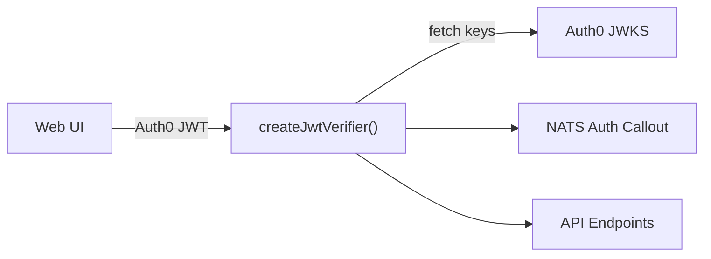
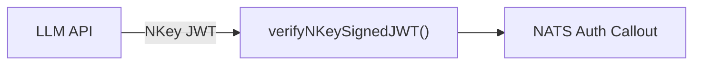
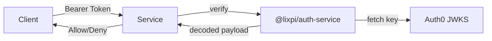
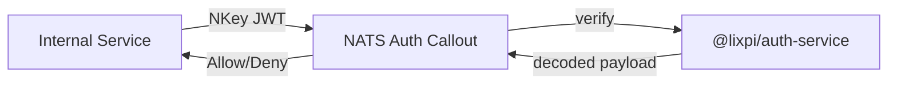

# @lixpi/auth-service

Unified authentication library for JWT and NKey token verification. Provides a single source of truth for token validation across all Lixpi services.

## Overview

This package consolidates token verification logic used by:
- **NATS Auth Callout** — validates tokens during NATS connection
- **HTTP API endpoints** — validates Bearer tokens on REST calls

### Auth0 JWT Flow (Users)



### NKey JWT Flow (Services)



## Exports

| Export | Purpose |
|--------|---------|
| `createJwtVerifier(config)` | Factory for Auth0 JWT verification (caches JWKS keys) |
| `verifyNKeySignedJWT({ token, publicKey })` | Verify Ed25519 NKey-signed JWTs |
| `createJwksClient(uri)` | Low-level JWKS client |
| `createGetKeyFunction(uri)` | Key retrieval function for `jsonwebtoken` |

## Usage

### Auth0 JWT Verification

For validating user tokens from Auth0:

```typescript
import { createJwtVerifier } from '@lixpi/auth-service'

const jwtVerifier = createJwtVerifier({
    jwksUri: 'https://your-tenant.auth0.com/.well-known/jwks.json',
    audience: 'your-api-identifier',
    issuer: 'https://your-tenant.auth0.com/',
    algorithms: ['RS256']
})

const { decoded, error } = await jwtVerifier.verify(token)
if (error) {
    console.error('Invalid token:', error)
} else {
    console.log('User ID:', decoded.sub)
}
```

### NKey JWT Verification

For validating service-to-service tokens signed with NKeys:

```typescript
import { verifyNKeySignedJWT } from '@lixpi/auth-service'

const { decoded, error } = await verifyNKeySignedJWT({
    token: serviceJwt,
    publicKey: 'UA...' // NKey public key
})

if (error) {
    console.error('Invalid service token:', error)
} else {
    console.log('Service ID:', decoded.sub)
}
```

## Verification Flow

### Auth0 JWTs (Users)



**Steps:** Fetch JWKS key (cached) → Verify RS256 signature → Check `exp`, `aud`, `iss` → Return decoded payload

### NKey JWTs (Services)



**Steps:** Decode JWT → Verify Ed25519 signature → Check `iss` matches public key → Check `exp`, `nbf` → Return decoded payload

## Types

```typescript
type JwtVerifierConfig = {
    jwksUri: string      // Auth0 JWKS endpoint
    audience: string     // Expected audience claim
    issuer: string       // Expected issuer claim
    algorithms?: string[] // Default: ['RS256']
}

type JwtVerificationResult = {
    decoded?: any   // JWT payload on success
    error?: string  // Error message on failure
}

type NKeyVerificationResult = {
    decoded?: any   // JWT payload on success
    error?: string  // Error message on failure
}

type ServiceAuthConfig = {
    publicKey: string    // NKey public key (UA...)
    userId: string       // Expected sub claim (e.g., 'svc:llm-api')
    permissions: {
        pub: { allow: string[] }
        sub: { allow: string[] }
    }
}
```

## Why This Package?

Before `@lixpi/auth-service`, token verification was duplicated:
- NATS auth callout had its own JWT verification
- API helpers had separate verification logic

This caused:
- Inconsistent validation behavior
- Duplicated JWKS caching logic
- Harder to audit security code

Now both use the same verified, tested implementation.
