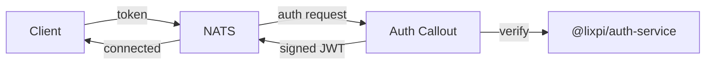

# NATS Auth Callout Service

Centralized authentication and authorization for NATS using the auth_callout mechanism. Validates all NATS connection attempts and issues short-lived user JWTs with appropriate permissions.

## Overview

NATS auth_callout delegates authentication decisions to this service. Every connection attempt is intercepted by NATS and forwarded here for verification.



**Steps:** Decrypt request → Verify token via `@lixpi/auth-service` → Build permissions → Sign user JWT → Return to NATS

## Authentication Modes

### Auth0 (Regular Users)

Web UI and API clients authenticate via Auth0 OAuth2 flow. The auth callout verifies tokens against Auth0's JWKS endpoint using `@lixpi/auth-service`.

- RS256 signature verification
- Token expiration enforced
- Permissions derived from subscription configs
- User-specific templating via `{userId}`

### NKey JWTs (Internal Services)

Services like `llm-api` authenticate using self-signed JWTs with Ed25519 NKey signatures.

**Why NKeys instead of Auth0 for services?**
- Zero external dependency for internal communication
- Cryptographic Ed25519 signatures (more secure than passwords)
- Short-lived tokens (1 hour) with auto-rotation
- No Auth0 API costs or latency

## Usage

### Initialization

```typescript
import { startNatsAuthCalloutService } from '@lixpi/nats-auth-callout-service'

await startNatsAuthCalloutService({
    natsService: natsServiceInstance,
    subscriptions: [...],  // Your NATS subscription configs
    nKeyIssuerSeed: process.env.NATS_AUTH_NKEY_ISSUER_SEED,
    xKeyIssuerSeed: process.env.NATS_AUTH_XKEY_ISSUER_SEED,
    jwtAudience: process.env.AUTH0_API_IDENTIFIER,
    jwtIssuer: `https://${process.env.AUTH0_DOMAIN}/`,
    jwksUri: `https://${process.env.AUTH0_DOMAIN}/.well-known/jwks.json`,
    natsAuthAccount: 'AUTH',
    serviceAuthConfigs: [
        {
            publicKey: process.env.NATS_LLM_SERVICE_NKEY_PUBLIC,
            userId: 'svc:llm-api',
            permissions: {
                pub: { allow: ['ai.interaction.chat.receiveMessage.*'] },
                sub: { allow: ['ai.interaction.chat.process'] }
            }
        }
    ]
})
```

### Adding a New Service

1. **Generate NKey pair:**
   ```bash
   nsc generate nkey --user
   ```
   Output: seed (`SU...`) and public key (`UA...`)

2. **Add to environment:**
   ```bash
   NATS_MY_SERVICE_NKEY_SEED=SU...
   NATS_MY_SERVICE_NKEY_PUBLIC=UA...
   ```

3. **Register in auth callout:**
   ```typescript
   serviceAuthConfigs: [
       {
           publicKey: env.NATS_MY_SERVICE_NKEY_PUBLIC,
           userId: 'svc:my-service',
           permissions: {
               pub: { allow: ['my.service.responses'] },
               sub: { allow: ['my.service.requests'] }
           }
       }
   ]
   ```

4. **Service creates JWT:**
   ```python
   # Python example (see llm-api for reference)
   jwt_payload = {
       "sub": "svc:my-service",
       "iss": public_key,  # Must match registered public key
       "iat": now,
       "exp": now + 3600
   }
   # Sign with NKey seed, send in NATS connect options
   ```

## Architecture

**Key design principle:** The auth callout is generic. It knows nothing about specific services—all service configurations are passed at initialization. Adding a service requires zero code changes to auth callout.

## Permission Resolution

For **regular users**, permissions come from subscription definitions:
```typescript
{
    subject: 'document.get',
    permissions: {
        pub: { allow: ['document.get'] },
        sub: { allow: ['document.get'] }
    }
}
```

The `{userId}` placeholder is replaced with the authenticated user's ID.

For **services**, permissions are defined in `serviceAuthConfigs`:
```typescript
{
    publicKey: 'UA...',
    userId: 'svc:llm-api',
    permissions: {
        pub: { allow: ['ai.interaction.chat.receiveMessage.*'] },
        sub: { allow: ['ai.interaction.chat.process'] }
    }
}
```

## Security

### NKey Management

- **Seeds are secrets** — store in env vars or secrets manager, never commit
- **Public keys are safe** — distributed to services that verify signatures
- **Rotation**: Update both seed and public key every 90 days or on compromise

### Monitoring

Watch for:
- Failed auth attempts from `svc:*` identities
- JWT signature verification failures
- Permission violations
- Unexpected connection sources

## Dependencies

- `@lixpi/auth-service` — JWT and NKey verification
- `@lixpi/nats-service` — NATS connection management
- `@nats-io/jwt` — NATS JWT encoding
- `@nats-io/nkeys` — Ed25519 key operations
