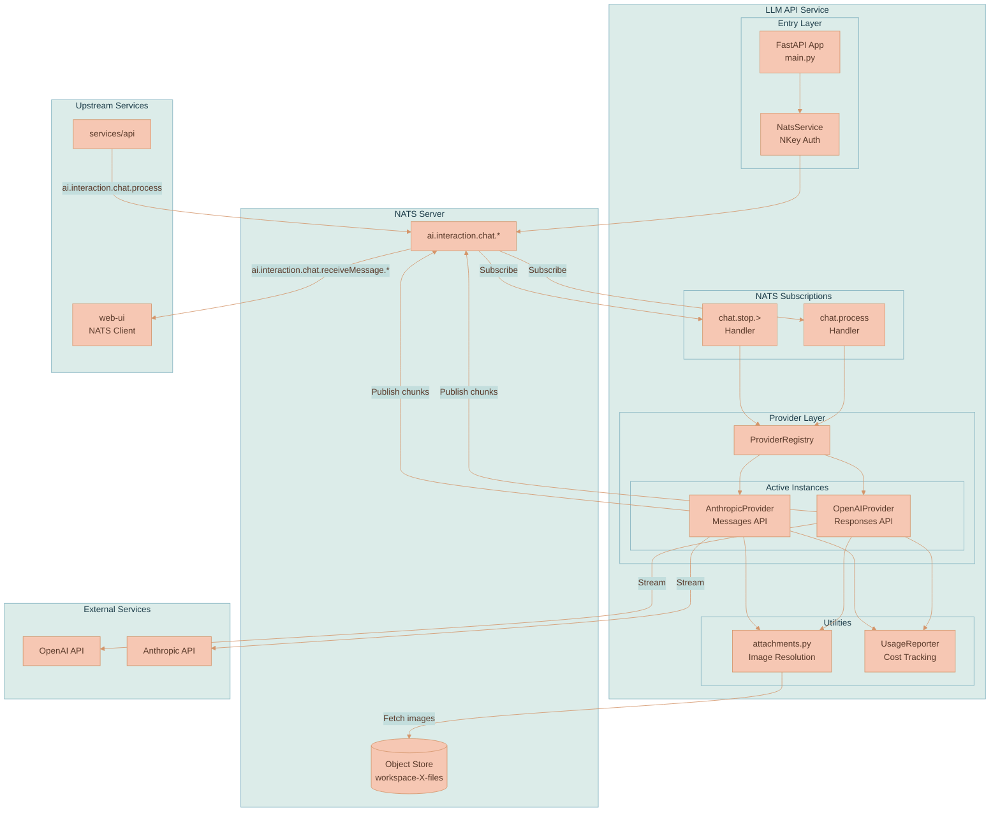
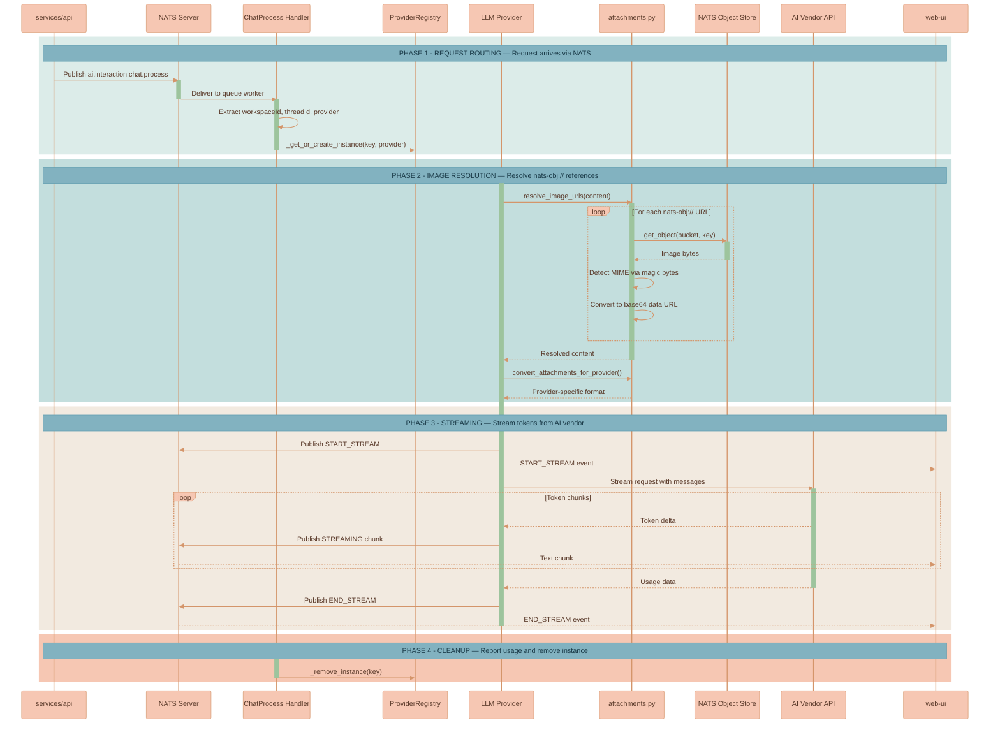
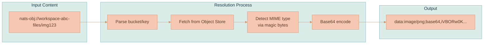

# LLM API Service

A Python-based microservice that handles AI model interactions via NATS messaging. This service orchestrates conversations with OpenAI and Anthropic models using a LangGraph-based state machine workflow, providing real-time token streaming back to clients.

## Core Concepts

**Provider** — An abstraction over an AI vendor's API. Each provider implements a LangGraph workflow with four stages: validate → stream → calculate_usage → cleanup. Currently supports OpenAI (Responses API) and Anthropic (Messages API).

**Provider Registry** — Manages provider instance lifecycle. Creates instances keyed by `{workspaceId}:{aiChatThreadId}` and removes them after request completion. Prevents memory leaks by cleaning up after each conversation turn.

**Instance Key** — A unique identifier for a conversation session: `{workspaceId}:{aiChatThreadId}`. Used to route stop requests to the correct active stream.

**Provider-Agnostic Design** — No provider-specific session IDs are used. Every request includes the full conversation history, allowing users to switch between OpenAI and Anthropic mid-conversation.

**NATS Object Store Reference** — A URL scheme (`nats-obj://bucket/key`) for referencing images stored in NATS Object Store. The service resolves these references to base64 data URLs before sending to providers.

## System Architecture



## Data Flow

### Chat Request Processing



## LangGraph Workflow

Each provider uses a LangGraph state machine with four nodes:

```mermaid
%%{init: {'theme': 'base', 'themeVariables': { 'primaryColor': '#F6C7B3', 'primaryTextColor': '#5a3a2a', 'primaryBorderColor': '#d4956a', 'secondaryColor': '#C3DEDD', 'secondaryTextColor': '#1a3a47', 'secondaryBorderColor': '#4a8a9d', 'tertiaryColor': '#DCECE9', 'tertiaryTextColor': '#1a3a47', 'tertiaryBorderColor': '#82B2C0', 'lineColor': '#d4956a', 'textColor': '#5a3a2a'}}}%%
stateDiagram-v2
    [*] --> validate_request
    validate_request --> stream_tokens
    stream_tokens --> calculate_usage
    calculate_usage --> cleanup
    cleanup --> [*]

    state validate_request {
        [*] --> CheckModel: Check model_version
        CheckModel --> CheckMessages: Check messages
        CheckMessages --> CheckIds: Check workspace_id, ai_chat_thread_id
        CheckIds --> [*]
    }

    state stream_tokens {
        [*] --> ResolveImages: resolve_image_urls()
        ResolveImages --> ConvertFormat: convert_attachments_for_provider()
        ConvertFormat --> StartStream: Publish START_STREAM
        StartStream --> StreamLoop: Call AI API
        StreamLoop --> StreamLoop: Publish chunks
        StreamLoop --> EndStream: Publish END_STREAM
        EndStream --> [*]
    }

    state calculate_usage {
        [*] --> ExtractUsage: Extract token counts
        ExtractUsage --> CalcCost: Calculate cost with pricing
        CalcCost --> Report: Report via UsageReporter
        Report --> [*]
    }

    state cleanup {
        [*] --> ResetFlags: Reset should_stop flag
        ResetFlags --> [*]
    }
```



**Workflow State (`ProviderState`)** — A TypedDict containing:

| Field | Type | Description |
|-------|------|-------------|
| `messages` | `list` | Full conversation history |
| `ai_model_meta_info` | `dict` | Model config and pricing |
| `event_meta` | `dict` | User/org metadata for billing |
| `workspace_id` | `str` | Workspace identifier |
| `ai_chat_thread_id` | `str` | Thread identifier |
| `provider` | `str` | "OpenAI" or "Anthropic" |
| `model_version` | `str` | Specific model (e.g., "gpt-4.1") |
| `stream_active` | `bool` | Whether streaming is in progress |
| `usage` | `dict` | Token counts after completion |
| `error` | `str` | Error message if failed |

## Image Handling

### NATS Object Store References

Messages from the client may include images via the `nats-obj://` URL scheme:

```
nats-obj://workspace-{workspaceId}-files/{fileId}
```

This references an image stored in NATS Object Store. The `attachments.py` module resolves these to base64 data URLs:



### MIME Type Detection

Magic bytes are used to detect image format:

| Format | Magic Bytes | MIME Type |
|--------|-------------|-----------|
| JPEG | `\xff\xd8` | `image/jpeg` |
| PNG | `\x89PNG\r\n\x1a\n` | `image/png` |
| GIF | `GIF8` | `image/gif` |
| WebP | `RIFF....WEBP` | `image/webp` |

### Provider-Specific Formats

After resolution, `convert_attachments_for_provider()` transforms content blocks:

**OpenAI (Responses API format):**
```json
{
    "type": "input_image",
    "image_url": "data:image/png;base64,...",
    "detail": "auto"
}
```

**Anthropic (Messages API format):**
```json
{
    "type": "image",
    "source": {
        "type": "base64",
        "media_type": "image/png",
        "data": "iVBORw0K..."
    }
}
```

## NATS Subjects

### Subscriptions

| Subject | Queue | Description |
|---------|-------|-------------|
| `ai.interaction.chat.process` | `llm-workers` | Process chat requests |
| `ai.interaction.chat.stop.>` | — | Stop active streams |

### Publications

| Subject Pattern | Description |
|-----------------|-------------|
| `ai.interaction.chat.receiveMessage.{workspaceId}.{threadId}` | Stream chunks to clients |
| `ai.interaction.chat.error.{instanceKey}` | Error notifications |

### Message Types

**Stream Events:**

```typescript
type StreamStatus =
    | 'START_STREAM'   // Streaming begins
    | 'STREAMING'      // Text chunk
    | 'END_STREAM'     // Streaming complete
    | 'ERROR'          // Error occurred
    | 'IMAGE_PARTIAL'  // Partial image during generation
    | 'IMAGE_COMPLETE' // Final generated image
```

**Stream Chunk Payload:**
```json
{
    "content": {
        "text": "Hello",
        "status": "STREAMING",
        "aiProvider": "OpenAI"
    },
    "aiChatThreadId": "thread-123"
}
```

## Circuit Breaker

The service implements a circuit breaker pattern with a 20-minute timeout (`LLM_TIMEOUT_SECONDS`). If a request exceeds this duration, it's automatically cancelled:

```python
await asyncio.wait_for(
    self.app.ainvoke(state),
    timeout=settings.LLM_TIMEOUT_SECONDS
)
```

This prevents runaway requests from consuming resources indefinitely.

## File Structure

```
src/
├── main.py                         # FastAPI app, NATS lifespan
├── config.py                       # Environment settings
├── NATS/
│   └── subscriptions/
│       └── ai_interaction_subjects.py  # NATS handlers
├── providers/
│   ├── base.py                     # BaseLLMProvider (LangGraph workflow)
│   ├── registry.py                 # ProviderRegistry
│   ├── openai/
│   │   └── provider.py             # OpenAI Responses API
│   └── anthropic/
│       └── provider.py             # Anthropic Messages API
├── services/
│   └── usage_reporter.py           # Cost tracking
├── utils/
│   └── attachments.py              # Image resolution & conversion
└── prompts/
    ├── __init__.py                 # Prompt loading
    ├── system.txt                  # System prompt
    └── anthropic_code_block_hack.txt  # Anthropic-specific formatting
```

## Environment Variables

| Variable | Required | Default | Description |
|----------|----------|---------|-------------|
| `NATS_SERVERS` | Yes | — | NATS server URLs (comma-separated) |
| `NATS_NKEY_SEED` | Yes | — | NKey seed for service authentication |
| `OPENAI_API_KEY` | No | — | OpenAI API key |
| `ANTHROPIC_API_KEY` | No | — | Anthropic API key |
| `LLM_TIMEOUT_SECONDS` | No | 1200 | Circuit breaker timeout |
| `LOG_LEVEL` | No | INFO | Logging level |

## Security Model

This service runs in an isolated NATS account (`LLM_SERVICE`) with limited permissions:

- **Cannot** access DynamoDB directly
- **Cannot** receive messages from web-ui clients
- **Can only** subscribe to internal subjects from `services/api`
- **Can only** publish to response subjects for streaming
- **Can** access NATS Object Store for image resolution (JetStream permissions)

Required JetStream permissions:
- `$JS.API.>` — JetStream API access
- `$JS.FC.>` — Flow control
- `$JS.ACK.>` — Acknowledgments
- `_INBOX.>` — Request-reply inbox

## Development

```bash
# Install dependencies with uv
uv pip install -r pyproject.toml

# Run locally
python src/main.py

# Run with Docker
docker build -t lixpi/llm-api .
docker run -p 8000:8000 --env-file .env lixpi/llm-api
```

## Health Check

FastAPI exposes a `/health` endpoint for container orchestration:

```bash
curl http://localhost:8000/health
# {"status": "ok"}
```
