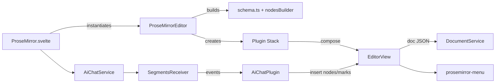
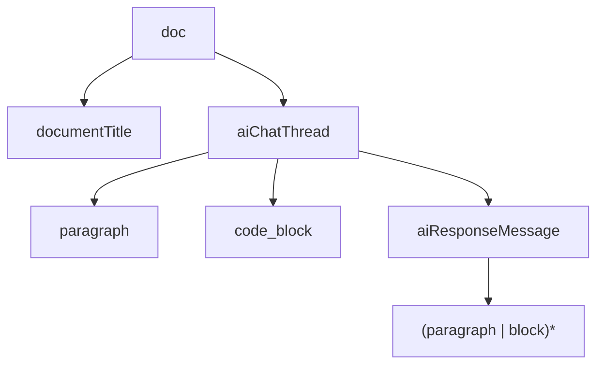
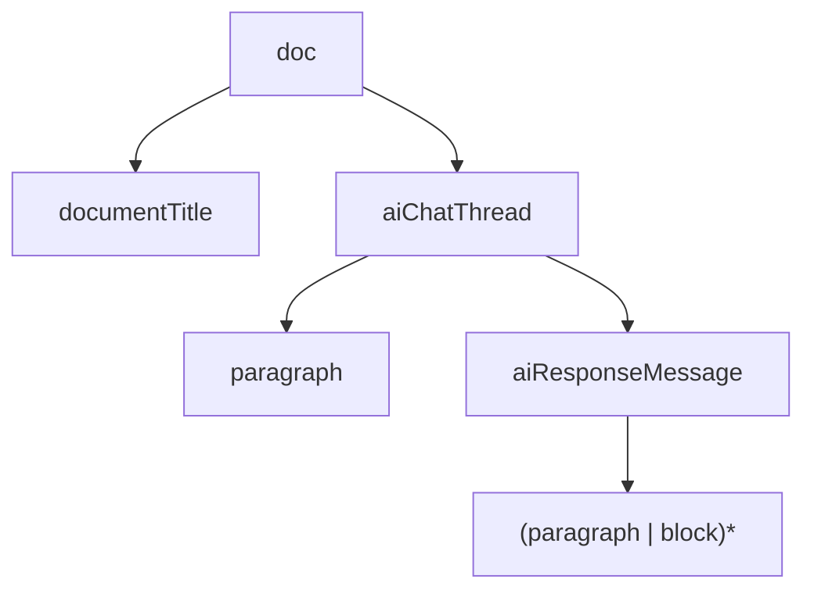
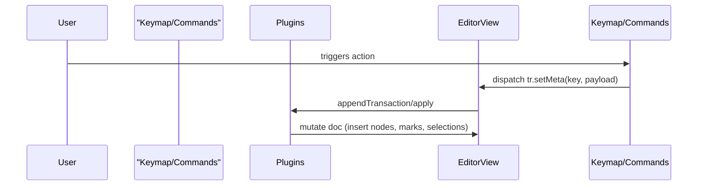
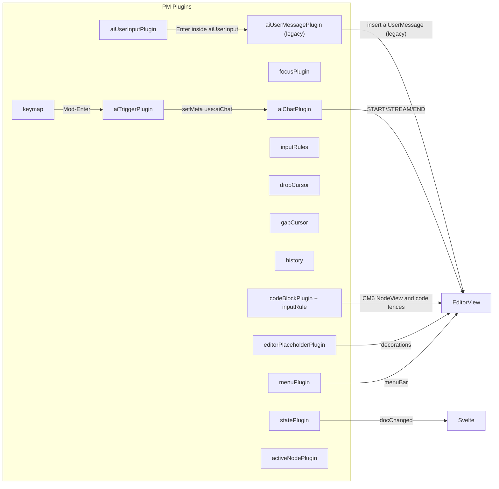
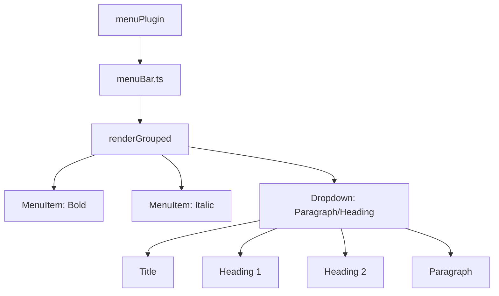
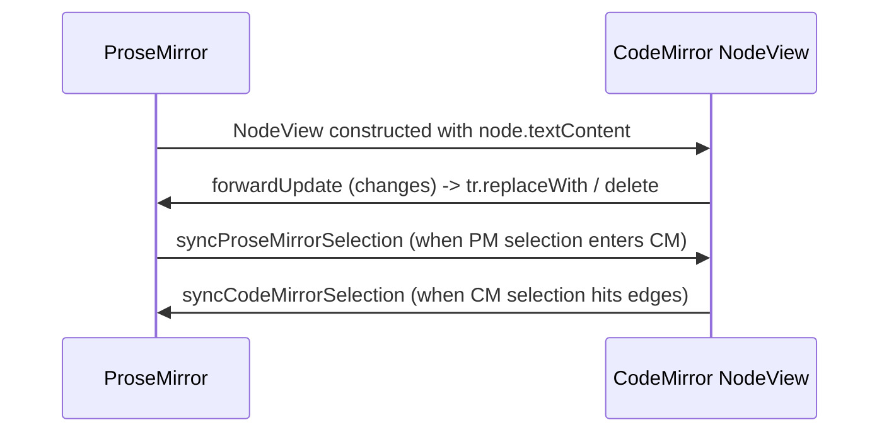
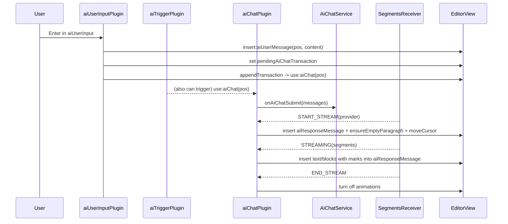
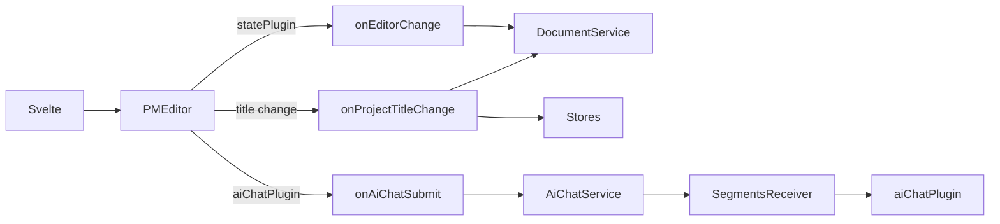

# ProseMirror UI Knowledge Base

This document is the canonical, deep-dive reference for the ProseMirror-based editor powering complex UI in this project. It explains schema composition, custom nodes and node views, plugins, input rules, keymaps, the top menu, and the AI chat pipeline with streaming. It’s written for engineers and AI agents to reason about the system and extend it safely.


## High-level overview

- The Svelte component `ProseMirror.svelte` owns editor lifecycle and data synchronization to app stores and services.
- `components/editor.js` constructs a ProseMirror Schema by extending a base schema with custom nodes, and wires all editor plugins.
- A rich plugin stack handles state propagation, AI triggers, streaming insertion, placeholder/menus, CodeMirror code blocks, and UX behaviors.
- Transaction meta flags (e.g., `use:aiChat`, `insert:<nodeType>`) are the core intra-plugin signaling mechanism.




## Schema and custom nodes

Base schema is defined in `components/schema.ts` (extended CommonMark-like schema, adds `strikethrough` mark) and then extended via `nodesBuilder` in `components/editor.js` by injecting custom nodes before `paragraph`. The document always begins with a title and then a single chat thread container:

- doc content: `documentTitle aiChatThread`
- `nodesBuilder` merges `customNodes/index.js` specs in a defined order.

Custom nodes (in `customNodes/`):

- `documentTitleNode` (`documentTitle`): h1 title, non-selectable, defining.
- `aiUserInputNode` (`aiUserInput`, deprecated): a block container for user's AI prompt and inline control buttons (Stop, Regenerate, Close). Marked for removal; kept for backward compatibility in old documents.
- `aiChatThreadNode` (`aiChatThread`): the single chat container that holds the conversation. Current content expression: `(paragraph | code_block | aiResponseMessage | dropdown)+`. New code does not insert `aiUserMessage` here.
- `aiResponseMessageNode` (`aiResponseMessage`): assistant message with provider avatar, animation controls, and a contentDOM placeholder; `aiResponseMessageNodeView` manages Claude animation frames using node attrs (`isInitialRenderAnimation`, `isReceivingAnimation`, `currentFrame`). Content expression: `(paragraph | block)*` so it can start empty and be filled by streaming.
- `aiUserMessageNode` (`aiUserMessage`, legacy): styled bubble with user avatar; kept for backward compatibility in old documents. New flows do not create this node.
- `code_block` override (`codeBlockNode`): prosemirror spec extended with `theme` attr and DOM `data-theme`. Rendering and interaction are delegated to a CodeMirror 6 node view (plugin).
- `taskRowNode` exists but currently a placeholder without DOM hooks; kept for future Svelte component rendering.



Notes
- Groups: Custom nodes belong to `block` and integrate seamlessly with base block nodes.
- NodeViews: `aiResponseMessageNodeView` is exposed from `customNodes/index.js` and plugged-in by `aiChatPlugin`; `aiUserMessageNodeView` remains for legacy docs but is not used in new flows; `code_block` node view is provided by the codeBlock plugin; `dropdown` node view is provided by the dropdown primitive plugin.



Notes
- Groups: Custom nodes belong to `block` and integrate seamlessly with base block nodes.
- NodeViews: `aiResponseMessageNodeView` is exposed from `customNodes/index.js` and plugged-in by `aiChatPlugin`; `aiUserMessageNodeView` remains for legacy docs but is not used in new flows; `code_block` node view is provided by the codeBlock plugin.


## Editor construction (`components/editor.js`)

- Creates `Schema` with `nodesBuilder(schema, customNodes)` and base `marks`.
- Initializes `EditorView` with:
  - Initial doc from either JSON (`initialVal`) or parsing `content` element.
  - Plugin list (order matters):
    - `statePlugin`: bubbles doc JSON changes to Svelte and emits project title changes.
    - `focusPlugin`: tracks focus and toggles editable state.
    - `menuPlugin`: top toolbar (formatting, paragraph/heading dropdown, links, images, etc.).
    - `buildInputRules`: smart quotes, ellipsis, em-dash, blockquote/lists/heading; code fence rule is handled by codeBlock plugin.
    - `keymap(buildKeymap)`, `keymap(baseKeymap)`: custom shortcuts including a special Mod-A behavior and standard PM bindings.
    - `dropCursor`, `gapCursor`, `history` standard UX.
    - AI stack: `createAiChatPlugin`, `createAiUserInputPlugin`, `aiTriggerPlugin`.
    - `editorPlaceholderPlugin`: placeholders for empty title and first paragraph.
    - `createCodeBlockPlugin` + `codeBlockInputRule`: CodeMirror integration and ``` fences.
    - `activeNodePlugin`: tracks the current node type and attrs.


## Transaction meta signaling: contract

Meta flags are string keys placed on transactions and observed by `appendTransaction` or `apply` in plugins.

- `insert:<nodeType>`: request a node insertion by type-specific plugin.
  - Example: `insert:aiUserInput` from `commands.js`.
- `insert:${nodeTypes.aiUserMessageNodeType}`: aiUserInput plugin emits this to materialize a user message block using the captured content.
- `use:aiChat` with `{pos}`: triggers AI chat flow in `aiChatPlugin` starting at position `pos`.
- `insertCodeBlock` (via code fence input rule): instructs codeBlock plugin to replace the current paragraph with a code_block.




## Plugins (behavioral map)



### statePlugin (`plugins/statePlugin.js`)
- Emits full doc JSON on any doc-changing transaction unless `skipDispatch` is set.
- Detects first child (title) text change and calls `documentTitleChangeCallback` to sync stores/services.

### focusPlugin (`plugins/focusPlugin.js`)
- Listens to DOM focus/blur and sets plugin meta. Callback toggles `editable` prop based on `isDisabled`.

### editorPlaceholderPlugin (`plugins/editorPlaceholderPlugin.js`)
- Decorates empty `documentTitle` with `data-placeholder: options.titlePlaceholder`.
- Decorates the first empty paragraph only when it’s the sole block after the title.

### activeNodePlugin (`plugins/activeNodePlugin.js`)
- Tracks `{ nodeType, nodeAttrs }` of the parent of current selection for UI state, styling, or debugging.


## Menus and toolbar

Implemented using a vendored version of `prosemirror-menu` adapted in TypeScript under `components/prosemirror-menu/`. Our wrapper `components/menu.js` builds items.

- `menuBar.ts` wraps editor DOM with a `.ProseMirror-menubar` and renders content from `renderGrouped`.
- `menu.ts` provides `MenuItem`, `Dropdown`, and helpers (plus icons). We added:
  - `getIcon` to render SVG strings.
  - `blockTypeItem` with `activeContext` support (e.g., highlight Header level).
- `menu.js` exports `menuPlugin(schema)` that calls `menuBar({ content: buildMenu(schema).fullMenu })`.
- Dropdown heading switcher has a dynamic label from `getActiveLabel(state)` to show “Regular text”, “Title”, “Heading N”, or “Code Block”.

Menu items include:
- Undo/Redo, Bold, Italic, Inline code, Code Block, Blockquote, Link (prompt), Image (prompt), Paragraph/Headings (1..4).




## Keymap and input rules

- `components/keyMap.js` binds:
  - Mod-Z/Shift-Mod-Z/Mod-Y for undo/redo, Backspace undoInputRule.
  - Navigation: Alt-ArrowUp/Down join siblings, Mod-[ lift, Escape select parent.
  - Custom Mod-A: inside `documentTitle` selects title content; elsewhere selects content after title only.
  - Mark toggles: Mod-B/Mod-I/Mod-`.
  - List bindings: Shift-Ctrl-8/9, Enter split list item, Mod-[ / Mod-] outdent/indent.
  - Block type bindings: Shift-Ctrl-0 paragraph, Shift-Ctrl-\\ code_block, Shift-Ctrl-(1..6) headings.
  - Mod-_ to insert horizontal rule.

- `components/inputRules.js` includes smart quotes, ellipsis, em-dash, blockquote, ordered/bullet lists, heading `#` levels.
- Code fences ``` are handled by `plugins/codeBlockPlugin.js`’s `codeBlockInputRule(schema)` replacing the current paragraph with a `code_block` and ensuring an empty line after.


## Code blocks with CodeMirror 6 (`plugins/codeBlockPlugin.js`)

- Provides a NodeView `CodeBlockView` wrapping a CM6 editor, supporting:
  - Theme via `node.attrs.theme` (defaults to gruvboxLight/dark mapping inside plugin).
  - Selection synchronization PM↔CM6:
    - `syncProseMirrorSelection`: if PM selection enters CM, mirror it inside CM.
    - `syncCodeMirrorSelection`: if CM selection hits boundaries, move PM selection before/after the node.
    - Global “Select All” behavior spans PM doc and all CM instances.
  - Keymap inside CM6: Mod-A (select all across doc), Mod-Enter exit code (exitCode), undo/redo fallthrough to PM.
  - `forwardUpdate`: writes CM doc edits into PM transaction using `changes.iterChanges`.
- Decorations: draws selection highlights across code blocks when PM selection intersects CM ranges.
- Input rule `codeBlockInputRule(schema)`: converts ``` line to code_block and inserts an empty paragraph after.




## Svelte component rendering (optional)

The generic `createSvelteComponentRendererPlugin` in `plugins/svelteComponentRenderer/` lets you mount a Svelte component as a NodeView for any node type. It provides a simple contract:

- Plugin factory: `createSvelteComponentRendererPlugin(SvelteComponent, nodeName, defaultAttrs)`
- In `appendTransaction`, listens for `insert:<nodeName>` meta to create and insert the node at the current selection.
- NodeView: uses `SvelteComponentRenderer.create(node, Component, node.attrs)` to mount into a DOM wrapper and stores the component instance on `node._svelteComponent` for cleanup.

Usage pattern
- Define a NodeSpec for `nodeName` in `customNodes`.
- Register the plugin in `createPlugins(...)`.
- Dispatch `tr.setMeta(
  `insert:<nodeName>`, attrs
)` to insert a component-backed node at the selection.

Note: The editor currently ships with the TaskRow Svelte renderer commented out in `components/editor.js`. It can be re-enabled by providing the actual component and desired default attrs.


## AI interactions and streaming

### aiTriggerPlugin (`plugins/aiTriggerPlugin.js`)
- Captures Mod+Enter. Dispatches tr with `setMeta('use:aiChat', {pos})`.

### aiUserInputPlugin (`plugins/aiUserInputPlugin.js`)
- NodeView for `aiUserInput`: renders content area plus control buttons.
- Enter (no Shift) inside `aiUserInput`:
  1) Replace current `aiUserInput` with a fresh empty one; set selection inside it.
  2) Emit `insert:aiUserMessage` with captured content at original position.
  3) Set plugin meta `pendingAiChatTransaction: true` and remember insertion position.
  4) In `appendTransaction`, when `pending...` is seen, emit `use:aiChat` with stored pos and clear the flag.
- Backticks handling: typing/pasting ``` inside aiUserInput converts to `code_block`.

### aiUserMessagePlugin (`plugins/aiUserMessagePlugin.js`) — legacy
- On `insert:aiUserMessage`, creates a user message node at `pos` (content provided).
- Kept for backward compatibility; new chat thread flow does not use this plugin or node.

### aiChatPlugin (`plugins/aiChatPlugin.js`)
- On `use:aiChat`, transforms the current thread into a compact messages array: groups blocks by role (assistant when node type is `aiResponseMessage`, else user) and reduces adjacent same-role blocks.
- Calls the provided callback with the transformed messages (Svelte wires it to `AiChatService`).
- Subscribes to an external `SegmentsReceiver` stream:
  - START_STREAM: inserts an empty `aiResponseMessage` (no inner paragraph) with animation flags and provider; ensures exactly one empty paragraph immediately after and moves the cursor into it.
  - STREAMING: for each segment:
    - Applies marks from `segment.styles` -> strong/em/strikethrough/code.
    - Inserts block structure for `header`, `paragraph`, or `codeBlock` segments; otherwise appends text with marks.
    - Maintains an “end of aiResponse node” pointer to insert at correct positions. If the node is missing (timing), it creates it with the same rules as START_STREAM.
  - END_STREAM: clears animation flags on the `aiResponseMessage` node.




## Commands

- `components/commands.js` exports `useAiInput(state, dispatch)` which dispatches `insert:aiUserInput` to materialize an input box at the selection.


## Svelte integration (`ProseMirror.svelte`)

- Instantiates `ProseMirrorEditor` with initial doc JSON and three callbacks:
  - `onEditorChange(json)`: debounced save via `DocumentService.updateDocument` and store flags.
  - `onProjectTitleChange(title)`: immediate title sync to stores and persistence.
  - `onAiChatSubmit(messages)`: forwards to `AiChatService.sendMessage` (which feeds `SegmentsReceiver`).
- Manages teardown on unmount and re-creation when document metadata changes.
- Renders a model selector UI and keeps a sticky menubar via CSS.




## Menu UX specifics

- Dropdown label reflects current block context:
  - `paragraph` → “Regular text”
  - `heading[level=1]` → “Title”
  - `heading[level>1]` → “Heading N-1”
  - `code_block` → “Code Block”
- `blockTypeItem` uses `activeContext` to add `ProseMirror-menu-current-active` class to the active entry.
- Icons are inline SVG strings; `getIcon` injects them into a `.ProseMirror-icon` container.


## Styling hooks (non-exhaustive)

- Menubar: `.ProseMirror-menubar`, `.ProseMirror-menu`, `.ProseMirror-menuitem`, `.ProseMirror-menu-dropdown[...]`.
- AI nodes: `.ai-user-input-wrapper`, `.ai-user-input`, `.ai-user-message(-decorator)`, `.ai-response-message(-wrapper)`, `.user-avatar`, `.node-render-animation`, `.node-receiving-animation`.
- Code blocks: `.code-block-wrapper`; selection decorations apply `inline.selected` class.
- Placeholders: `.empty-node-placeholder[data-placeholder]` is applied as a node decoration.


## Developer recipes

- Insert a new block node via meta:
  - Dispatch `tr.setMeta('insert:<yourNodeType>', attrs)` and handle it in a plugin’s `appendTransaction` to create and place the node.
- Extend the menubar:
  - Add a `MenuItem` or `Dropdown` in `components/menu.js`’s `buildMenuItems` and include in `fullMenu`.
- Add a NodeView:
  - Provide a function in `customNodes/index.js` and add it in a plugin under `props.nodeViews[<nodeType>]`.
- React to Mod+Enter differently:
  - Update `aiTriggerPlugin` or add a key to `buildKeymap`.
- Add a new AI streaming style:
  - Extend `aiChatPlugin` style mapping (`segment.styles` → PM marks) or add block handlers for new segment types.


## Edge cases and invariants

- Document shape: The first node is always `documentTitle`, followed by a single `aiChatThread`.
- aiResponse streaming insertion locates the most recent `aiResponseMessage` and calculates `endOfNodePos`. Only one empty paragraph is kept immediately after it, and the cursor is moved there on creation.
- Multiple parallel streams are not supported (assumes one active stream per thread).
- CodeMirror selection sync: Avoid infinite loops by guarding with `this.updating` and focus checks; keep `forwardUpdate` fast.
- Mod-A behavior intentionally excludes the title from “select all” when cursor isn’t in the title; consider that in bulk ops.
- `aiUserMessage` is deprecated in new flows and not allowed inside the `aiChatThread` by schema.


## Deprecated code (for reference only)

- `plugins/DEPRECATED_DUMPSTER/` contains historical attempts: `aiIconPlugin.js`, `aiSuggestPlugin_old_version_with_.ai_decorator.js`, `editor_old_style_swap_content.js`. These demonstrate decoration widgets and earlier AI suggestion mechanics. Do not re-enable.


## File map

- Svelte: `ProseMirror.svelte`
- Editor driver: `components/editor.js`
- Schema base: `components/schema.ts`
- Menus: `components/menu.js`, `components/prosemirror-menu/*`
- Keymap & rules: `components/keyMap.js`, `components/inputRules.js`, `components/prompt.js`, `components/commands.js`
- Custom nodes: `customNodes/*` and `customNodes/index.js`
- Plugins: `plugins/*.js` (active), `plugins/svelteComponentRenderer/*` (component NodeView helper), and `plugins/DEPRECATED_DUMPSTER/*` (inactive)


## Quick glossary

- NodeSpec: declarative description of doc structure and DOM serialization.
- NodeView: imperative DOM wrapper around a node for complex behavior (e.g., CodeMirror, animated avatars).
- Decoration: visual augmentation not stored in the document (placeholders, selection indicators across NodeViews).
- Transaction meta: side channel for signaling actions between UI, keymap, and plugins.


## Extensibility checklist

- Define your NodeSpec in `customNodes` and export via `customNodes/index.js`.
- Ensure `nodesBuilder` order places the node appropriately (before `paragraph` for blocks that must be early).
- If needed, add a NodeView via a plugin’s `props.nodeViews`.
- Define input rules and key bindings if your node needs text-based triggers.
- Add a menu entry if user-facing.
- If your feature flows through AI, produce/consume transaction meta consistently and consider streaming updates.

## Current Feature in Progress

**Feature**: Single AI Chat Thread Document Structure

**What we're building**: Instead of having a document with multiple paragraphs and blocks, we're changing it so the entire document content lives inside one AI chat thread container. This makes the whole document feel like one continuous AI conversation space.

**The goal**:
- Document starts with a title, then everything else goes inside a single chat thread
- Users can type directly in the thread (with placeholder text when empty)
- Thread has controls like Pause and Close buttons in a header
- The thread can contain any content - paragraphs, code blocks, nested threads, etc.

**What we've done**:
- Changed the document structure to always have exactly one thread container
- Made sure users can click inside and start typing immediately
- Added placeholder text that shows when the thread is empty
- Thread controls work without breaking the typing experience
- Organized the CSS properly in separate files
- Updated `aiChatThread` schema to `(aiResponseMessage | paragraph)+` so assistant messages are structured and `aiUserMessage` is excluded from new content
- Updated `aiResponseMessage` schema to `(paragraph | block)*` to start empty during START_STREAM
- START_STREAM now creates an empty `aiResponseMessage`, ensures exactly one trailing empty paragraph, and moves the cursor there
- STREAMING fallback creates the node with the same rules if missing, then appends content safely
- Fixed regressions: removed redundant inner paragraph in responses, eliminated double trailing paragraphs, restored cursor placement after responses

**Current state**: Working — AI responses render inside `aiChatThread` as `aiResponseMessage`, exactly one paragraph follows, and the cursor moves there. Typing and placeholders behave as expected. `aiUserMessage` remains for legacy docs only.

## Tracking current progress

**Session Goal**: Create single AI chat thread document structure

**Changes made in order**:

1. **CSS Fix** - User reported wrong CSS change (font-family instead of padding)
   - Restored padding on AI message classes
   - Removed incorrect font-family addition

2. **CSS Organization** - User requested modular structure
   - Created `scss/custom-nodes/ai-chat-thread.scss`
   - Moved thread styles out of main ProseMirror.scss
   - Added clean import

3. **README Documentation** - User asked to track progress
   - Added "Tracking current progress" section

4. **Schema Change** - User wanted single thread container for all content
   - Changed doc structure from `documentTitle (paragraph | block)+`
   - To `documentTitle aiChatThread`
   - All content now lives inside the thread

5. **Cursor/Placeholder Issues** - User couldn't type in thread, no placeholder
   - Fixed aiChatThread node flags (isolating/defining = false)
   - Updated placeholder plugin to detect empty paragraph inside thread
   - Added CSS for placeholder visibility with trailing break

6. **NodeView Problems** - Thread controls vs typing conflicts
   - Temporarily disabled NodeView to test core functionality
   - Re-enabled with proper focus handling and click events
   - Added mousedown preventDefault for buttons

7. **Schema Validation** - Empty document creation failed
   - Changed thread content from `block+` (required) to `block*` (optional)
   - Allows ProseMirror to create empty threads automatically

8. **Enter Key Bug** - Pressing Enter created code blocks instead of paragraphs
   - Fixed by changing thread content from `block*` to `paragraph+`
   - Now threads must contain paragraphs, forcing proper Enter behavior
   - Removed hacky keydown handler - let ProseMirror handle it naturally

9. **Schema Alignment** - Structure assistant messages inside thread
   - Changed `aiChatThread` content to `(aiResponseMessage | paragraph)+`
   - Deprecated `aiUserMessage` in new code; legacy nodes still supported outside current flow
10. **aiResponseMessage Spec** - Allow empty shell for streaming
  - Changed content to `(paragraph | block)*`
  - NodeView animations unchanged
11. **Streaming Insertion Fixes** - Eliminate glitches
  - START_STREAM creates empty `aiResponseMessage`, ensures exactly one trailing empty paragraph, moves cursor there
  - STREAMING fallback mirrors START_STREAM if node missing; then appends content safely
  - Fixed double-paragraph issue and removed inner empty paragraph regression

**Current state**: Working — single-thread chat with structured assistant messages, stable streaming, and correct cursor/paragraph behavior.

---
This knowledge base is hand-audited against the current codebase (see paths above) and aims to be stable, specific, and actionable for future development.