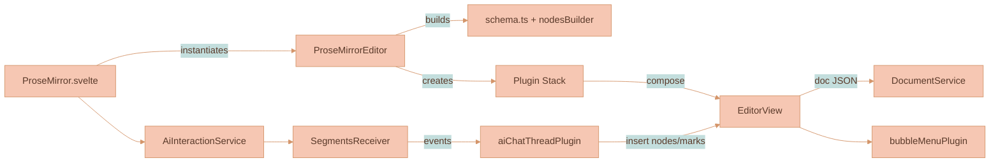
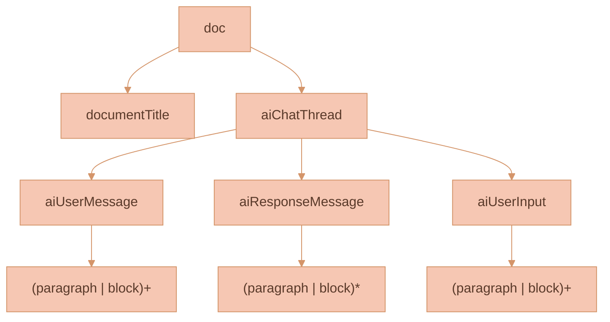
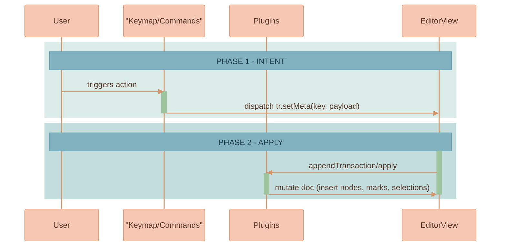
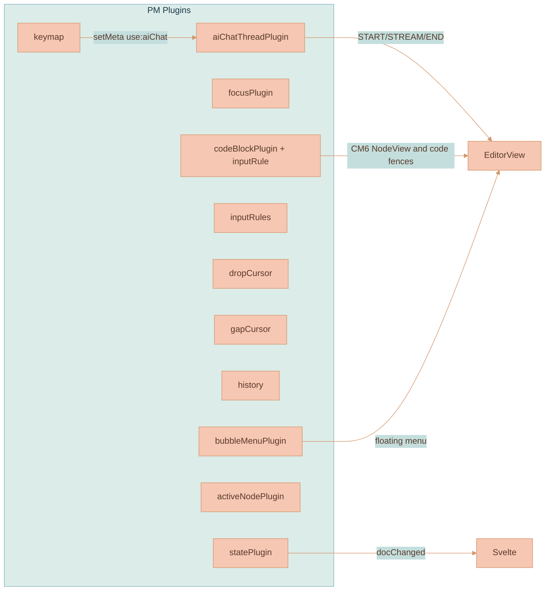
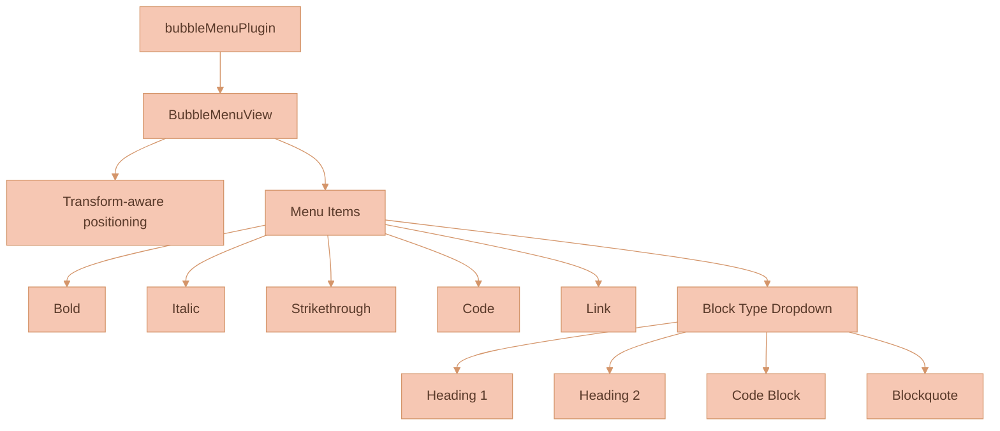
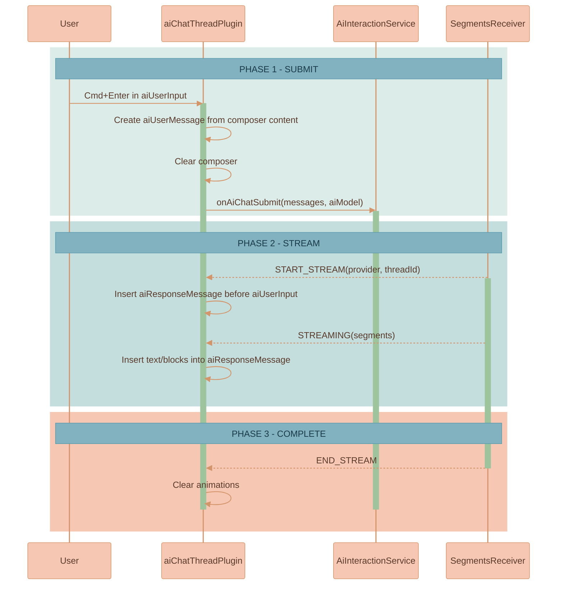
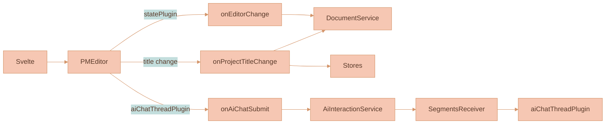

# ProseMirror UI Knowledge Base

This document is the canonical, deep-dive reference for the ProseMirror-based editor powering complex UI in this project. It explains schema composition, custom nodes and node views, plugins, input rules, keymaps, the top menu, and the AI chat pipeline with streaming. It's written for engineers and AI agents to reason about the system and extend it safely.


## High-level overview

- The Svelte component `ProseMirror.svelte` owns editor lifecycle and data synchronization to app stores and services.
- `components/editor.js` constructs a ProseMirror Schema by extending a base schema with custom nodes, and wires all editor plugins.
- A rich plugin stack handles state propagation, AI triggers, streaming insertion, placeholder/menus, CodeMirror code blocks, and UX behaviors.
- Transaction meta flags (e.g., `use:aiChat`, `insert:<nodeType>`) are the core intra-plugin signaling mechanism.




## Schema and custom nodes

Base schema is defined in `components/schema.ts` (extended CommonMark-like schema, adds `strikethrough` mark) and then extended via `nodesBuilder` in `components/editor.js`.

We have two editor modes with different document shapes:

- Regular documents (`documentType: 'document'`)
  - doc content: `documentTitle block+`
- AI chat threads (`documentType: 'aiChatThread'`)
  - doc content: `documentTitle aiChatThread+`

`nodesBuilder` does two important things:

- Adds *new* custom nodes before `paragraph` (so they behave like normal block nodes).
- Updates *existing* base nodes (e.g. `code_block`) **in place** to preserve the base schema order. This avoids ProseMirror picking `code_block` as the “default block” when leaving the title.

Custom nodes are intentionally split by responsibility:

- Base custom nodes (always present via `customNodes/index.js`):
  - `documentTitleNode` (`documentTitle`): h1 title, non-selectable, defining.
  - `code_block` override (`codeBlockNode`): extends the base `code_block` with attrs (e.g. theme) used by the CodeMirror NodeView.
  - `taskRowNode`: placeholder for future Svelte-backed rendering.

- AI chat nodes (only present in `documentType: 'aiChatThread'` via `plugins/aiChatThreadPlugin/`):
  - `aiChatThreadNode` (`aiChatThread`): conversation container. Content expression: `(aiUserMessage | aiResponseMessage)* aiUserInput`.
  - `aiUserMessageNode` (`aiUserMessage`): sent user message bubble. Content: `(paragraph | block)+`. Attributes: `id, createdAt`.
  - `aiUserInputNode` (`aiUserInput`): sticky composer at the end of the thread. Content: `(paragraph | block)+`.
  - `aiResponseMessageNode` (`aiResponseMessage`): assistant message. Content: `(paragraph | block)*` so it can start empty and be filled by streaming.



Notes
- Groups: Custom nodes belong to `block` and integrate seamlessly with base block nodes.
- NodeViews: AI chat thread NodeViews live inside `plugins/aiChatThreadPlugin/`. `code_block` node view is provided by the codeBlock plugin.


## Editor construction (`components/editor.js`)

- Creates a `Schema` based on `documentType`:
  - Regular documents use only base `customNodes`.
  - AI chat threads extend base `customNodes` with AI chat node specs from `aiChatThreadPlugin`.
- Initializes `EditorView` with:
  - Initial doc via `createInitialDocument(...)`:
    - Regular docs: parse from `initialVal` JSON or DOM `content`.
    - AI chat threads: parse JSON if valid, otherwise create a schema-valid doc using `createAndFill()` and the provided `threadId`.
  - Plugin list (order matters):
    - `statePlugin`, `focusPlugin`, `bubbleMenuPlugin`, `linkTooltipPlugin`, `slashCommandsMenuPlugin`
    - `imageLifecyclePlugin`, `imageSelectionPlugin`
    - `buildInputRules`, `keymap(buildKeymap)`, `keymap(baseKeymap)`, `dropCursor`, `gapCursor`, `history`
    - `createCodeBlockPlugin` + `codeBlockInputRule` (CodeMirror integration and ``` fences)
    - `activeNodePlugin`
    - AI stack (AI chat threads only): `createAiChatThreadPlugin`


## Transaction meta signaling: contract

Meta flags are string keys placed on transactions and observed by `appendTransaction` or `apply` in plugins.

- `insert:<nodeType>`: request a node insertion by a type-specific plugin (only if some plugin actually handles it).
  - Example: `insert:aiChatThread` when creating a new thread node on the canvas.
- `use:aiChat` with `{ threadId, nodePos }`: triggers AI chat flow in `aiChatThreadPlugin` for a specific thread.
- `stop:aiChat` with `{ threadId }`: stops streaming for a specific thread.
- `insertCodeBlock` (via code fence input rule): instructs codeBlock plugin to replace the current paragraph with a code_block.




## Plugins (behavioral map)



### statePlugin (`plugins/statePlugin.js`)
- Emits full doc JSON on any doc-changing transaction unless `skipDispatch` is set.
- Detects first child (title) text change and calls `documentTitleChangeCallback` to sync stores/services.

### focusPlugin (`plugins/focusPlugin.js`)
- Listens to DOM focus/blur and sets plugin meta. Callback toggles `editable` prop based on `isDisabled`.

### activeNodePlugin (`plugins/activeNodePlugin.js`)
- Tracks `{ nodeType, nodeAttrs }` of the parent of current selection for UI state, styling, or debugging.


## Bubble Menu (`plugins/bubbleMenuPlugin/`)

A floating selection-based formatting menu with transform-aware positioning. Appears when text is selected and provides quick access to formatting commands.

### Features
- **Inline marks**: Bold, Italic, Strikethrough, Code
- **Link editing**: Inline URL input (not a modal)
- **Block formatting**: Headings (1-4), Code Block, Blockquote via dropdown
- **Mobile-first**: Touch-friendly with larger tap targets
- **Transform-aware positioning**: Works correctly inside zoomed/panned canvas viewports

### Architecture
- `bubbleMenuPlugin.ts` - Main plugin with `BubbleMenuView` class
- `bubbleMenuItems.ts` - Menu item definitions and command handlers
- `bubbleMenu.scss` - Mobile-first styles using project color system
- `index.ts` - Public exports




- `components/keyMap.js` binds:
  - Mod-Z/Shift-Mod-Z/Mod-Y for undo/redo, Backspace undoInputRule.
  - Navigation: Alt-ArrowUp/Down join siblings, Mod-[ lift, Escape select parent.
  - Custom Mod-A: inside `documentTitle` selects title content; elsewhere selects content after title only.
  - Mark toggles: Mod-B/Mod-I/Mod-`.
  - List bindings: Shift-Ctrl-8/9, Enter split list item, Mod-[ / Mod-] outdent/indent.
  - Block type bindings: Shift-Ctrl-0 paragraph, Shift-Ctrl-\\ code_block, Shift-Ctrl-(1..6) headings.
  - Mod-_ to insert horizontal rule.

- `components/inputRules.js` includes smart quotes, ellipsis, em-dash, blockquote, ordered/bullet lists, heading `#` levels.
- Code fences ``` are handled by `plugins/codeBlockPlugin.js`’s `codeBlockInputRule(schema)` replacing the current paragraph with a `code_block` and ensuring an empty line after.


## Code blocks with CodeMirror 6 (`plugins/codeBlockPlugin.js`)

- Provides a NodeView `CodeBlockView` wrapping a CM6 editor, supporting:
  - Theme via `node.attrs.theme` (defaults to gruvboxLight/dark mapping inside plugin).
  - Selection synchronization PM↔CM6:
    - `syncProseMirrorSelection`: if PM selection enters CM, mirror it inside CM.
    - `syncCodeMirrorSelection`: if CM selection hits boundaries, move PM selection before/after the node.
    - Global “Select All” behavior spans PM doc and all CM instances.
  - Keymap inside CM6: Mod-A (select all across doc), Mod-Enter exit code (exitCode), undo/redo fallthrough to PM.
  - `forwardUpdate`: writes CM doc edits into PM transaction using `changes.iterChanges`.
- Decorations: draws selection highlights across code blocks when PM selection intersects CM ranges.
- Input rule `codeBlockInputRule(schema)`: converts ``` line to code_block and inserts an empty paragraph after.

```mermaid
%%{init: {'theme': 'base', 'themeVariables': { 'noteBkgColor': '#82B2C0', 'noteTextColor': '#1a3a47', 'noteBorderColor': '#5a9aad', 'actorBkg': '#F6C7B3', 'actorBorder': '#d4956a', 'actorTextColor': '#5a3a2a', 'actorLineColor': '#d4956a', 'signalColor': '#d4956a', 'signalTextColor': '#5a3a2a', 'labelBoxBkgColor': '#F6C7B3', 'labelBoxBorderColor': '#d4956a', 'labelTextColor': '#5a3a2a', 'loopTextColor': '#5a3a2a', 'activationBorderColor': '#9DC49D', 'activationBkgColor': '#9DC49D', 'sequenceNumberColor': '#5a3a2a'}}}%%
sequenceDiagram
  participant PM as ProseMirror
  participant CM as CodeMirror NodeView
  %% ═══════════════════════════════════════════════════════════════
  %% PHASE 1: INIT
  %% ═══════════════════════════════════════════════════════════════
  rect rgb(220, 236, 233)
      Note over PM, CM: PHASE 1 - INIT
      PM->>CM: NodeView constructed with node.textContent
      activate CM
  end
  %% ═══════════════════════════════════════════════════════════════
  %% PHASE 2: SYNC EDITS
  %% ═══════════════════════════════════════════════════════════════
  rect rgb(195, 222, 221)
      Note over PM, CM: PHASE 2 - SYNC EDITS
      CM->>PM: forwardUpdate (changes) -> tr.replaceWith / delete
      activate PM
      deactivate PM
  end
  %% ═══════════════════════════════════════════════════════════════
  %% PHASE 3: SELECTION MIRRORING
  %% ═══════════════════════════════════════════════════════════════
  rect rgb(246, 199, 179)
      Note over PM, CM: PHASE 3 - SELECTION MIRRORING
      PM->>CM: syncProseMirrorSelection (when PM selection enters CM)
      CM->>PM: syncCodeMirrorSelection (when CM selection hits edges)
      deactivate CM
  end
  end
```


## Svelte component rendering (optional)

The generic `createSvelteComponentRendererPlugin` in `plugins/svelteComponentRenderer/` lets you mount a Svelte component as a NodeView for any node type. It provides a simple contract:

- Plugin factory: `createSvelteComponentRendererPlugin(SvelteComponent, nodeName, defaultAttrs)`
- In `appendTransaction`, listens for `insert:<nodeName>` meta to create and insert the node at the current selection.
- NodeView: uses `SvelteComponentRenderer.create(node, Component, node.attrs)` to mount into a DOM wrapper and stores the component instance on `node._svelteComponent` for cleanup.

Usage pattern
- Define a NodeSpec for `nodeName` in `customNodes`.
- Register the plugin in `createPlugins(...)`.
- Dispatch `tr.setMeta(
  `insert:<nodeName>`, attrs
)` to insert a component-backed node at the selection.

Note: The editor currently ships with the TaskRow Svelte renderer commented out in `components/editor.js`. It can be re-enabled by providing the actual component and desired default attrs.


## AI interactions and streaming

### aiChatThreadPlugin (`plugins/aiChatThreadPlugin/`)

The main plugin orchestrating AI chat functionality. All AI chat logic is consolidated here.

**Schema nodes managed by this plugin:**
- `aiChatThread` - Container with content: `(aiUserMessage | aiResponseMessage)* aiUserInput`
- `aiUserInput` - Sticky composer at the end of the thread with controls (model selector, image toggle, submit button)
- `aiUserMessage` - Sent user message bubble with `id` and `createdAt` attributes
- `aiResponseMessage` - AI response with provider avatar and streaming animations

**Message submission flow:**
1. User types in `aiUserInput` composer and presses Cmd/Ctrl+Enter or clicks submit
2. Plugin extracts composer content, creates an `aiUserMessage` node before the composer
3. Clears the composer content
4. Dispatches `USE_AI_CHAT_META` with messages, threadId, and model info
5. Plugin calls `onAiChatSubmit` callback with the message array

**Streaming response handling:**
- Subscribes to `SegmentsReceiver.subscribeToeceiveSegment()` for streaming events
- START_STREAM: inserts empty `aiResponseMessage` before `aiUserInput` with animation flags
- STREAMING: inserts text/blocks into the response node, handles marks and block types
- END_STREAM: clears animation flags, finalizes response

See `plugins/aiChatThreadPlugin/README.md` for complete documentation.




## Commands

- `components/commands.js` exports helpers for programmatic document manipulation.


## Svelte integration (`ProseMirror.svelte`)

- Instantiates `ProseMirrorEditor` with initial doc JSON and callbacks:
  - `onEditorChange(json)`: debounced save via `DocumentService.updateDocument` and store flags.
  - `onProjectTitleChange(title)`: immediate title sync to stores and persistence.
  - `onAiChatSubmit(messages, aiModel)`: forwards to `AiInteractionService.sendChatMessage` (which feeds `SegmentsReceiver`).
  - `onAiChatStop()`: stops active AI streaming.
- Manages teardown on unmount and re-creation when document metadata changes.




## Bubble Menu UX specifics

- Block type dropdown label reflects current block context:
  - `paragraph` → "Text"
  - `heading[level]` → "Heading N"
  - `code_block` → "Code"
  - `blockquote` → "Quote"
- Active marks and block types are highlighted with `.is-active` class.
- Icons are inline SVG strings from `svgIcons/index.ts`.


## Styling hooks (non-exhaustive)

- Bubble menu: `.bubble-menu`, `.bubble-menu-content`, `.bubble-menu-button`, `.bubble-menu-dropdown`, `.bubble-menu-separator`.
- AI nodes: `.ai-chat-thread-wrapper`, `.ai-user-input-wrapper`, `.ai-user-input-content`, `.ai-user-message-wrapper`, `.ai-response-message(-wrapper)`, `.user-avatar`, `.node-render-animation`, `.node-receiving-animation`.
- Code blocks: `.code-block-wrapper`; selection decorations apply `inline.selected` class.
- Placeholders: `.empty-node-placeholder[data-placeholder]` is applied as a node decoration.


## Developer recipes

- Insert a new block node via meta:
  - Dispatch `tr.setMeta('insert:<yourNodeType>', attrs)` and handle it in a plugin's `appendTransaction` to create and place the node.
- Extend the bubble menu:
  - Add a new item in `plugins/bubbleMenuPlugin/bubbleMenuItems.ts` and include it in `buildMenu()`.
- Add a NodeView:
  - Provide a function in `customNodes/index.js` and add it in a plugin under `props.nodeViews[<nodeType>]`.
- React to Mod+Enter differently:
  - Update `buildKeymap` or the `aiChatThreadPlugin` meta handling.
- Add a new AI streaming style:
  - Extend `aiChatThreadPlugin` style mapping (`segment.styles` → PM marks) or add block handlers for new segment types.


## Edge cases and invariants

- Regular document shape: The first node is always `documentTitle`, followed by one or more `block` nodes.
- AI chat thread shape: The first node is always `documentTitle`, followed by one or more `aiChatThread` nodes.
- Thread shape: `aiChatThread` content is `(aiUserMessage | aiResponseMessage)* aiUserInput`. The `aiUserInput` composer is always the last child.
- aiResponse streaming insertion locates the most recent `aiResponseMessage` within the target thread (identified by `threadId`) and calculates `endOfNodePos`. Only one empty paragraph is kept immediately after it, and the cursor is moved there on creation.
- **Multiple concurrent streams ARE supported**: Each thread can have independent AI streaming via `threadId` parameter. The plugin maintains a `Set<string>` of active `receivingThreadIds` to track concurrent streams across different threads.
- CodeMirror selection sync: Avoid infinite loops by guarding with `this.updating` and focus checks; keep `forwardUpdate` fast.
- Mod-A behavior intentionally excludes the title from "select all" when cursor isn't in the title; consider that in bulk ops.
- Fresh AI chat thread documents are created using ProseMirror's `createAndFill()` to satisfy the schema content expression and to attach the correct `threadId`.


## Deprecated code (for reference only)

- `plugins/DEPRECATED_DUMPSTER/` contains historical attempts: `aiIconPlugin.js`, `aiSuggestPlugin_old_version_with_.ai_decorator.js`, `editor_old_style_swap_content.js`. These demonstrate decoration widgets and earlier AI suggestion mechanics. Do not re-enable.


## File map

- Svelte: `ProseMirror.svelte`
- Editor driver: `components/editor.js`
- Schema base: `components/schema.ts`
- Bubble menu: `plugins/bubbleMenuPlugin/*`
- Keymap & rules: `components/keyMap.js`, `components/inputRules.js`, `components/prompt.js`, `components/commands.js`
- Custom nodes: `customNodes/*` and `customNodes/index.js`
- Plugins: `plugins/*.js` (active), `plugins/svelteComponentRenderer/*` (component NodeView helper), and `plugins/DEPRECATED_DUMPSTER/*` (inactive)


## Quick glossary

- NodeSpec: declarative description of doc structure and DOM serialization.
- NodeView: imperative DOM wrapper around a node for complex behavior (e.g., CodeMirror, animated avatars).
- Decoration: visual augmentation not stored in the document (placeholders, selection indicators across NodeViews).
- Transaction meta: side channel for signaling actions between UI, keymap, and plugins.


## Extensibility checklist

- Define your NodeSpec in `customNodes` and export via `customNodes/index.js`.
- Ensure `nodesBuilder` order places the node appropriately (before `paragraph` for blocks that must be early).
- If needed, add a NodeView via a plugin’s `props.nodeViews`.
- Define input rules and key bindings if your node needs text-based triggers.
- Add a menu entry if user-facing.
- If your feature flows through AI, produce/consume transaction meta consistently and consider streaming updates.

## Current Architecture Summary

**AI Chat Thread Document Structure**

The document structure uses a single AI chat thread container:
- Document starts with a title (`documentTitle`), then contains an `aiChatThread` node
- Thread content expression: `(aiUserMessage | aiResponseMessage)* aiUserInput`
- `aiUserInput` is a sticky composer that's always the last child of the thread
- `aiUserMessage` nodes represent sent user messages (created when user submits from composer)
- `aiResponseMessage` nodes contain AI responses (created during streaming)

**Key design decisions**:
- Fresh documents are created using ProseMirror's `createAndFill()` which auto-populates required nodes based on schema
- The editor accepts a `threadId` parameter to ensure the `aiChatThread` node has the correct ID for streaming routing
- Streaming events (START_STREAM, STREAMING, END_STREAM) are scoped by `threadId` for multi-thread support
- Controls (model selector, image toggle, submit button) live in the `aiUserInput` NodeView, outside the document schema

---
This knowledge base is hand-audited against the current codebase (see paths above) and aims to be stable, specific, and actionable for future development.