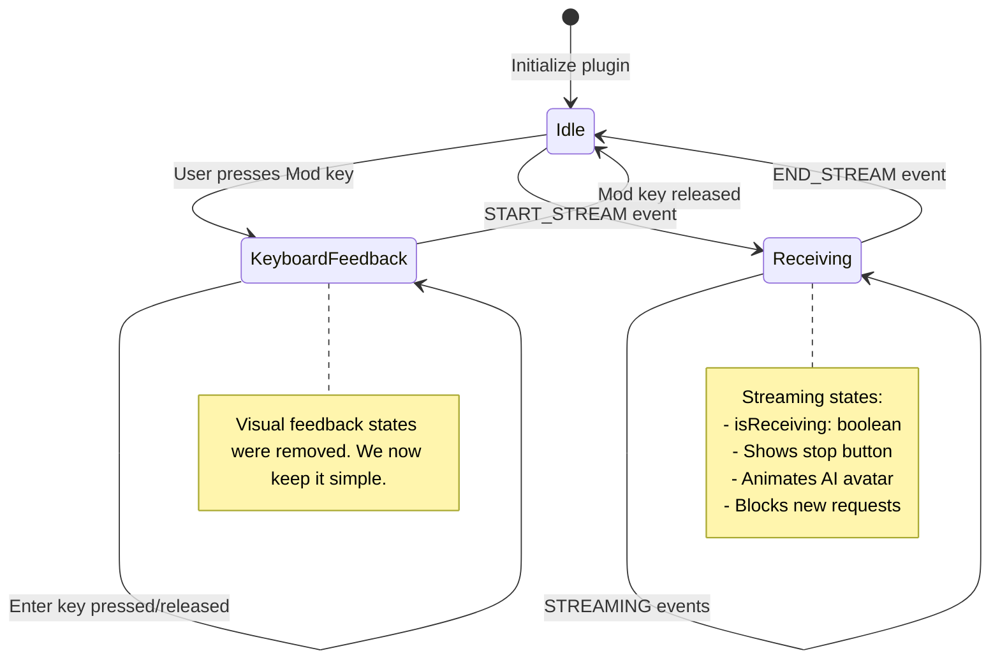
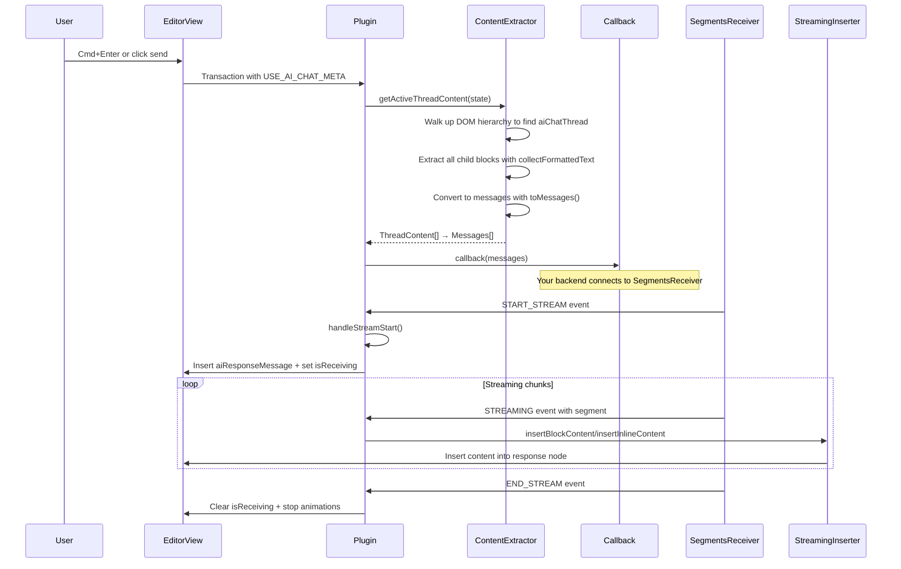
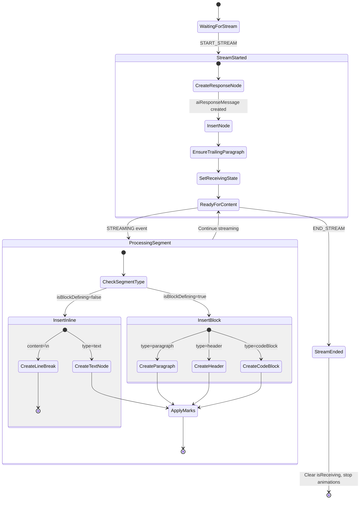
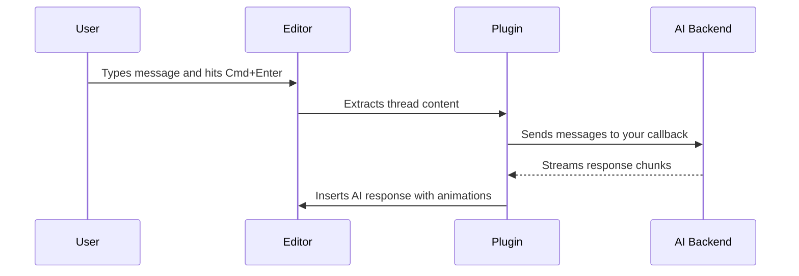

# AI Chat Thread Plugin

Adds ChatGPT-style conversations directly inside ProseMirror documents. Users can type messages, hit Cmd+Enter (or Ctrl+Enter on Windows), and get AI responses streamed back in real-time.

This README reflects the current implementation, including dropdowns (AI model selector and thread context selector) that exist outside the document schema as UI controls.

## What it does

This plugin lets you embed chat threads anywhere in a document. Each thread can contain:
- Regular paragraphs (user messages)
- Code blocks (for sharing code)
- AI responses (streamed from your backend)

When a user hits Cmd+Enter or clicks the send button, the plugin:
1. Grabs all the content from the current thread
2. Calls your callback function with the messages
3. Shows streaming AI responses as they come in
4. Handles all the animations and visual feedback

Perfect for documentation with interactive examples, notebooks with AI assistance, or any app where you want conversational AI embedded in rich text.

## Technical Architecture

The plugin follows a modular architecture where each node type encapsulates its own UI and behavior using declarative DOM templates:

```mermaid
graph TD
    A[AiChatThreadPluginClass] --> B[KeyboardHandler]
    A --> C[ContentExtractor]
    A --> D[PositionFinder]
    A --> E[StreamingInserter]
    A --> F[DecorationSystem]

    N1[aiChatThreadNode.ts] --> NV1[aiChatThreadNodeView]
    N2[aiResponseMessageNode.ts] --> NV2[aiResponseMessageNodeView]

    DT[domTemplates.ts] --> DTB[DOMTemplateBuilder]
    DTB --> HF[html function]

    NV1 --> HF
    NV2 --> HF

    NV1 --> UI1[html`Thread Boundary`]
    NV1 --> UI2[html`Submit Button`]

    NV2 --> UI4[html`Provider Avatar`]
    NV2 --> UI5[html`Message Wrapper`]
    NV2 --> UI6[html`Boundary Strip`]

    A --> N1
    A --> N2

    C --> C1[collectFormattedText]
    C --> C2[getActiveThreadContent]
    C --> C3[toMessages]

    D --> D1[findThreadInsertionPoint]
    D --> D2[findResponseNode]

    E --> E1[insertBlockContent]
    E --> E2[insertInlineContent]

    F --> F1[PlaceholderDecorations]
    F --> F2[KeyboardFeedbackDecorations]
    F --> F3[BoundaryDecorations]
```



**Key Design Principles:**
- **Self-contained nodes:** Each node type exports both spec AND NodeView (handles boundary indicator, focus, and per-thread dropdown controls)
- **Declarative UI:** All DOM creation uses `html` template literals instead of verbose `createElement` chains
- **Shared utilities:** `domTemplates.ts` provides consistent DOM building across all ProseMirror components
- **Performance-focused:** htm/mini gives zero-runtime overhead with direct DOM element creation
- **Clean separation:** Plugin orchestrates business logic while NodeViews handle UI via templates

### Plugin State Machine



## Data Flow & Content Extraction



### Schema Nodes

**`aiChatThread`** - Container for entire conversation
- Content: `(paragraph | code_block | aiResponseMessage)+`
- Attributes:
  - `threadId: string | null` - Unique identifier for the thread
  - `status: 'active'|'paused'|'completed'` - Thread lifecycle state
  - `aiModel: string` - Selected AI model (e.g., "Anthropic:claude-3-5-sonnet")
  - `threadContext: string` - Context scope ('Thread' or 'Document')
  - `isCollapsed: boolean` - Whether thread content is visually hidden (default: false)
- DOM: `div.ai-chat-thread-wrapper[data-thread-id][data-status][data-ai-model][data-thread-context][data-is-collapsed]`

**`aiResponseMessage`** - Individual AI responses
- Content: `(paragraph | block)*` (empty allowed for streaming shell)
- Attributes: `id, style, isInitialRenderAnimation, isReceivingAnimation, aiProvider, currentFrame`
- DOM: `div.ai-response-message[data-ai-provider]`
- Empty shells render a horizontal spinner placeholder so the layout keeps height while the first tokens stream in.

## DOM Template System

We use `htm` for declarative DOM in NodeViews. The shared helper lives at `../../components/domTemplates.ts`. Keep plugin-specific snippets here; generic patterns live in `../README.md` (see “Templating & NodeViews”).

More generic patterns and folder layout guidance: `../README.md`.

Quick taste, this is how buttons are built now:

```ts
import { html } from '../../components/domTemplates.ts'

const button = html`
  <div className="ai-submit-button" onclick=${handleClick}>
    <span className="send-icon" innerHTML=${sendIcon}></span>
  </div>
`
```

### AI Model & Context Selector Dropdowns

The thread NodeView includes two dropdowns for configuring the AI conversation:

1. **AI Model Selector** - Choose which AI model to use (GPT-4, Claude, etc.)
2. **Thread Context Selector** - Choose context scope (workspace, document, etc.)

Both dropdowns are **UI controls outside the document schema**:
- **Not part of the document schema** - Zero NodeSpec involvement, never serialized
- **Rendered directly to controls container** - No transactions, no decorations needed
- **State managed via singleton** - `infoBubbleStateManager` handles open/close coordination
- **Created by DOM factory** - `createPureDropdown()` from `primitives/dropdown`
- **Reusable primitive** - Same dropdown used across different plugins

The NodeView simply:
1. Calls `createPureDropdown()` with configuration (options, onSelect callback, theme)
2. Appends the returned `dom` element to `controlsContainer`
3. Calls `update()` when thread attributes change
4. Calls `destroy()` in NodeView cleanup
5. Uses `ignoreMutation()` to prevent NodeView recreation when dropdown opens/closes

**Why outside the schema?** Previously dropdowns were document nodes, causing flicker (rendered in contentDOM, then relocated), complex state management via decorations, and unnecessary involvement in document transactions. Keeping them outside the schema means they render instantly in the correct location with simple, direct state management.

## Quick setup

```typescript
import { createAiChatThreadPlugin, aiChatThreadNodeSpec, aiResponseMessageNodeSpec } from './aiChatThreadPlugin'

// Add to your schema
const schema = new Schema({
  nodes: {
    doc: { content: 'block+' },
    paragraph: paragraphSpec,
    aiChatThread: aiChatThreadNodeSpec,
    aiResponseMessage: aiResponseMessageNodeSpec
  }
})

// Create the plugin
const plugin = createAiChatThreadPlugin(
  async (messages) => {
    // Your AI streaming setup here
    console.log('Sending to AI:', messages)
    // Trigger your streaming implementation
    // Plugin will listen for SegmentsReceiver events automatically
  },
  { titlePlaceholder: 'Document title...', paragraphPlaceholder: 'Type your message...' }
)

// Add to editor
const view = new EditorView(document.querySelector('#editor'), {
  state: EditorState.create({ schema, plugins: [plugin] })
})
```

## Streaming Protocol

The plugin subscribes to `SegmentsReceiver.subscribeToeceiveSegment()` and expects streaming events with:
- **status**: START_STREAM, STREAMING, or END_STREAM
- **aiProvider**: Which AI service is responding (Anthropic, OpenAI, etc.)
- **threadId**: Identifies which thread this stream belongs to (enables concurrent streams)
- **segment**: Contains the actual content (text, styles, type, block/inline flag, header level)

### Streaming Lifecycle



**Content Type Handlers:**
- `paragraph` - Creates paragraph node with text and marks
- `header` - Creates heading node with specified level (1-6)
- `codeBlock` - Creates code_block node
- `text` - Inserts text with styling marks
- `linebreak` - Inserts hard_break or new paragraph

## User experience



Users see:
- A floating "send" button that appears on hover
- Keyboard shortcuts (Cmd/Ctrl + Enter) with visual feedback
- Thread boundaries when hovering (shows conversation scope)
- **Collapsible threads**: A collapse toggle icon (eye slash) appears on hover next to the boundary indicator
  - Click the toggle icon to collapse/expand thread content with iOS-style feedback animation
  - Collapsed threads hide content visually but still receive AI streaming updates
  - Icon color changes based on state: lighter when expanded, darker when collapsed
  - Smooth color transitions during collapse/expand actions
  - This maintains document integrity while providing a clean UI for managing long conversations
- Different avatars for different AI providers
- Smooth animations as responses stream in
- A "stop" button while AI is responding (currently TODO)

## Collapsible Threads

Threads can be collapsed to hide their content while preserving the ability to receive streaming updates.

### How It Works

**State Management:**
- The `isCollapsed` boolean attribute is stored directly on the `aiChatThread` node
- A separate collapse toggle icon (eye slash) appears on hover next to the boundary indicator
- Clicking the toggle icon dispatches a transaction with `toggleCollapse` meta
- The plugin's `appendTransaction` handler updates the node's `isCollapsed` attribute
- Decorations apply a `collapsed` CSS class to the wrapper based on the attribute value

**Visual Behavior:**
- Collapse toggle icon appears only when hovering over the thread boundary area
- Icon color indicates state: lighter (`lighten($nightBlue, 30%)`) when expanded, darker (`$nightBlue`) when collapsed
- Click triggers iOS-style feedback animation with smooth color transitions
- CSS `display: none` hides `.ai-chat-thread-content` when wrapper has `collapsed` class
- Controls hidden when collapsed for cleaner UI
- The boundary indicator shows info dropdown on click (separate from collapse functionality)

**Click Feedback Animation:**
The toggle icon uses a reusable SCSS mixin for iOS-style tactile feedback with smooth color transitions and subtle scale animation.

**Critical Design Choice:**
The `contentDOM` stays in the DOM tree even when collapsed. This ensures:
1. **Streaming continues**: ProseMirror can insert AI response nodes into collapsed threads
2. **No document corruption**: The document structure remains consistent
3. **Fast toggle**: Expanding/collapsing is just a CSS change, no DOM reconstruction

**Implementation Flow:**
User clicks toggle icon → transaction updates node attribute → decorations apply CSS class → content hidden but remains in DOM for streaming.

This pattern follows our decoration-first approach: visual states come from classes via decorations, not by manipulating the document structure.

## Files in this plugin

- `aiChatThreadNode.ts` - Thread container node (self-contained):
  - Exports node schema AND its NodeView implementation
  - Uses `html` template literals for clean UI creation
  - Creates boundary indicator with info dropdown (click-triggered)
  - Creates collapse toggle icon (eye slash) that appears on hover next to boundary indicator
  - Handles click events for collapse/expand with iOS-style animation feedback
  - Creates submit button and **dropdown UI controls**
  - `createAiModelSelectorDropdown()` and `createThreadContextDropdown()` use `createPureDropdown()` primitive
  - Dropdowns appended directly to controlsContainer (not inserted via transactions)
  - `ignoreMutation()` prevents NodeView recreation when dropdowns open/close
  - Handles hover events and focus management for non-dropdown elements

- `aiResponseMessageNode.ts` - AI response node (self-contained):
  - Exports node schema AND its NodeView implementation
  - Uses `html` template literals for structured DOM creation
  - Provider-specific avatars (Claude, GPT) with animations
  - Streaming animation states (receiving/idle)
  - Boundary strip decoration

- `aiChatThreadPlugin.ts` - Main orchestration logic:
  - Plugin state and lifecycle management
  - Content extraction and message conversion
  - Streaming event handling and DOM insertion
  - Decoration system (placeholders, boundaries)
  - No UI rendering - delegates to node-specific NodeViews and primitive components

- `aiChatThreadPluginConstants.ts` - Shared `PluginKey` to avoid identity mismatch and circular imports between NodeView and plugin. Import this key in both places and call `AI_CHAT_THREAD_PLUGIN_KEY.getState(view.state)` when needed.

- `../primitives/dropdown/` - Dropdown primitive (outside document schema):
  - `pureDropdown.ts` - Factory function creating dropdowns with {dom, update, destroy} API
  - Uses `infoBubble` primitive for state management
  - `index.ts` - Clean exports
  - Zero ProseMirror dependencies - framework-agnostic pure DOM
  - Used by aiChatThreadNode for AI model and context selectors
  - See `primitives/dropdown/README.md` for full documentation

- `../../components/domTemplates.ts` - **NEW** Shared DOM template utilities:
  - TypeScript class-based `DOMTemplateBuilder` with proper typing
  - `html` template function using htm/mini for zero-overhead DOM creation
  - Handles events, styles, data attributes, innerHTML
  - Available across all ProseMirror components, not just this plugin

- `ai-chat-thread.scss` - All the styling and animations
- `index.ts` - Exports everything

**Architecture Note:** Each node type is a complete unit with its own UI built using declarative `html` templates. The plugin focuses on coordination and business logic without mixing UI concerns. The shared `domTemplates.ts` provides clean, performant DOM creation across the entire ProseMirror ecosystem.

## Core Helper Classes

### ContentExtractor
Handles thread content analysis and message conversion:

```typescript
class ContentExtractor {
  // Recursively extracts text while preserving code block formatting
  static collectFormattedText(node: PMNode): string

  // Simple text extraction fallback
  static collectText(node: PMNode): string

  // Finds active thread by walking up DOM hierarchy from cursor
  static getActiveThreadContent(state: EditorState): ThreadContent[]

  // Converts thread blocks to AI messages, merging consecutive roles
  static toMessages(items: ThreadContent[]): Array<{ role: string; content: string }>
}
```

**Message Conversion Logic:**
1. Walk each top-level block in the thread
2. Extract formatted text (preserves newlines, wraps code_block in ```)
3. Determine role: `aiResponseMessage` → `assistant`, everything else → `user`
4. Merge consecutive blocks with same role
5. Return clean message array for AI API

### PositionFinder
Document position utilities for content insertion:

```typescript
class PositionFinder {
  // Finds where to insert new aiResponseMessage in active thread
  static findThreadInsertionPoint(state: EditorState): {
    insertPos: number
    trailingEmptyParagraphPos: number | null
  } | null

  // Locates current streaming response node for content insertion
  static findResponseNode(state: EditorState): {
    found: boolean
    endOfNodePos?: number
    childCount?: number
  }
}
```

### StreamingInserter
Handles real-time content insertion during AI streaming:

```typescript
class StreamingInserter {
  // Inserts block-level content (headers, paragraphs, code blocks)
  static insertBlockContent(
    tr: Transaction,
    type: string,
    content: string,
    level: number | undefined,
    marks: any[] | null,
    endOfNodePos: number,
    childCount: number
  ): void

  // Inserts inline content (text, marks, line breaks)
  static insertInlineContent(
    tr: Transaction,
    type: string,
    content: string,
    marks: any[] | null,
    endOfNodePos: number
  ): void
}
```

### Plugin State Management

The plugin maintains state for:
- **receivingThreadIds**: Set of thread IDs currently receiving AI responses (supports concurrent streams)
- **Code block parsing**: Backtick buffer and code block tracking
- **Decorations**: Placeholders, boundaries, and visual feedback
- **hoveredThreadId**: Which thread boundary is currently visible

**Transaction Metadata** signals actions between components:
- `setReceiving` - Toggle streaming state for specific thread
- `hoverThread` - Thread boundary hover
- `USE_AI_CHAT_META` - Trigger chat submission with thread context (threadId + nodePos)
- `STOP_AI_CHAT_META` - Stop AI streaming for specific thread
- `INSERT_THREAD_META` - Insert new thread

## NodeViews & UI Components

### Thread NodeView (Template-Based)
Creates the interactive thread container using declarative templates:

```typescript
// Thread boundary with clean template syntax
return html`
  <div
    className="ai-thread-boundary-indicator"
    onmouseenter=${handleEnter}
    onmouseleave=${handleLeave}
  >
    <div className="ai-thread-boundary-icon" innerHTML=${chatThreadBoundariesInfoIcon}></div>
    ${createThreadInfoDropdown()}
  </div>
`

// Submit button with multiple states
return html`
  <div className="ai-submit-button" onclick=${handleClick}>
    <div className="button-default">
      <span className="send-icon" innerHTML=${sendIcon}></span>
    </div>
    <div className="button-hover">
      <span className="send-icon" innerHTML=${sendIcon}></span>
    </div>
    <div className="button-receiving">
      <span className="stop-icon" innerHTML=${pauseIcon}></span>
    </div>
  </div>
`
```

**Behavior:**
- Auto-generates `threadId` if missing via `setNodeMarkup`
- Focuses editor and positions cursor on mousedown
- Hover events dispatch `hoverThread` metadata
- Click handlers for send/stop functionality
- **NEW:** All UI created via `html` templates for 70% less code and better readability

### Response NodeView (Template-Based)
Renders AI responses using structured templates:

```typescript
// Main wrapper created declaratively in one statement
const parentWrapper = html`
  <div className="ai-response-message-wrapper">
    <div className="ai-response-message">
      <div className="user-avatar assistant-${node.attrs.aiProvider.toLowerCase()}"></div>
      <div className="ai-response-message-boundaries-indicator"></div>
      <div className="ai-response-message-content"></div>
    </div>
  </div>
`

// Get DOM references for dynamic updates
const userAvatarContainer = parentWrapper.querySelector('.user-avatar')
const responseMessageContent = parentWrapper.querySelector('.ai-response-message-content')
```

**Anthropic Animation System:**
- 8-frame sprite animation at 90ms intervals
- Updates `currentFrame` attribute via `setNodeMarkup`
- SVG viewBox manipulation: `0 ${frame * 100} 100 100`
- Automatic cleanup on destroy
- **NEW:** Initial DOM structure from templates, dynamic updates via querySelector references

## Decoration System

The plugin applies multiple independent decoration layers:

### 1. Placeholder Decorations
```typescript
// Document title placeholder
if (node.type.name === documentTitleNodeType && node.content.size === 0) {
  decorations.push(Decoration.node(pos, pos + node.nodeSize, {
    class: 'empty-node-placeholder',
    'data-placeholder': this.placeholderOptions.titlePlaceholder
  }))
}

// Thread paragraph placeholder (single empty paragraph only)
if (node.type.name === aiChatThreadNodeType && node.childCount === 1) {
  const firstChild = node.firstChild
  if (firstChild?.type.name === 'paragraph' && firstChild.content.size === 0) {
    // Apply placeholder decoration
  }
}
```

### 2. Thread Boundary Decorations
```typescript
// Shows boundary line only for hovered thread
if (node.type.name === 'aiChatThread' &&
    pluginState.hoveredThreadId === node.attrs.threadId) {
  decorations.push(Decoration.node(pos, pos + node.nodeSize, {
    class: 'thread-boundary-visible'
  }))
}
```

### 3. Dropdown Open Decorations
**Note:** Dropdown decorations are now handled by the dropdown primitive plugin (`services/web-ui/src/components/proseMirror/plugins/primitives/dropdown/dropdownPlugin.ts`), not by aiChatThreadPlugin.

## Styling hooks (short version)

SCSS lives in `ai-chat-thread.scss`. Relevant classes:
- `.ai-chat-thread-wrapper` — container
- `.ai-thread-boundary-indicator` / `-line` — boundary UI
- `.ai-response-message-wrapper` — response layout

State classes applied via decorations: `.receiving`, `.thread-boundary-visible`. No giant CSS dumps here — check the SCSS if you need details.

## Implementation Details & Edge Cases

### Thread Selection Algorithm

`ContentExtractor.getActiveThreadContent()` walks up the document tree from the cursor position to find the containing thread, then extracts all child blocks.

**Critical:** Cursor must be inside a thread for extraction to work. Plugin silently does nothing if cursor is outside all threads.

### Response Node Targeting

`PositionFinder.findResponseNode()` locates the AI response node to stream content into:
- When **threadId provided**: searches only within that specific thread's container
- When **threadId omitted**: searches globally across entire document
- **Priority scoring**: isReceiving > isInitialRender > any response (newest wins ties)

**Concurrent Stream Support:** The optional `threadId` parameter enables multiple concurrent AI streams in different threads without interference. Each thread's responses are isolated and independently managed.

### Content Formatting Rules
1. **Code blocks** - Wrapped in triple backticks when sent to AI
2. **Hard breaks** - Converted to `\n` in message content
3. **Role merging** - Consecutive blocks with same role merged with `\n` separator
4. **Empty blocks** - Filtered out (no text content)

### Threading & Async Gotchas

**Thread ID Generation:** Auto-generates unique IDs using timestamp + random string, dispatched async to avoid initialization conflicts.

**Animation State Management:** Anthropic responses use 8-frame sprite animation at 90ms intervals, updating node attrs via `setNodeMarkup` to trigger re-renders.

### Implemented Features
- ✅ **Multiple concurrent streams** - Each thread can have independent AI streaming via `threadId` scoping
- ✅ **Stop streaming** - Stop button functionality implemented with `STOP_AI_CHAT_META`
- ✅ **Thread isolation** - Responses correctly routed to their originating thread

### Unimplemented Features
- **Retry failed streams** - No error handling for failed segments
- **Stream resume** - No persistence if browser refreshes mid-stream

<!-- Removed noisy change logs. This README stays focused on how to use the plugin, not its history. -->

## Extending it

Want more content types? Add cases to `StreamingInserter.insertBlockContent()`:

```typescript
case 'blockquote': {
  const textNode = tr.doc.type.schema.text(content)
  const quoteNode = tr.doc.type.schema.nodes.blockquote.createAndFill(null, textNode)
  tr.insert(insertPos, quoteNode)
  break
}
```

Want different AI providers? Add them to `aiResponseMessageNodeView()`:

```typescript
case 'Cohere':
  userAvatarContainer.innerHTML = cohereIcon
  break
```

Want to use templates in other ProseMirror components?

```typescript
import { html } from '../../components/domTemplates.ts'

const myNodeView = html`
  <div className="my-component" onclick=${handleClick}>
    <span innerHTML=${myIcon}></span>
    ${childElements}
  </div>
`
```

The styling system uses SCSS variables like `$steelBlue` and `$redPink`. Check `ProseMirrorMixings.scss` for the full list.

## Operational notes for future contributors

- **Dropdown rendering**: All dropdown UI, state, and events are handled by the dropdown primitive component in `services/web-ui/src/components/proseMirror/plugins/primitives/dropdown/`. Do NOT put dropdown layout/rendering logic in aiChatThreadNode.
- The dropdown primitive follows the plugin state + decorations pattern. Never store UI state in NodeViews.
- Never import the plugin module inside NodeViews; import only the shared `PluginKey` from `aiChatThreadPluginConstants.ts` and read state via `getState(view.state)`.
- When subscribing to external stores (Svelte), keep references to DOM nodes and update textContent/innerHTML. Unsubscribe in `destroy()` and remove global listeners like `document.click`.

## Debug mode

Set `IS_RECEIVING_TEMP_DEBUG_STATE = true` at the top of the plugin to keep the "receiving" state active so you can inspect the CSS without needing to trigger actual AI responses.

---

That's the plugin! It's pretty complex but handles a lot of edge cases around cursor positioning, content extraction, and smooth streaming UX. The hardest part is usually getting the streaming events from your AI backend wired up correctly.