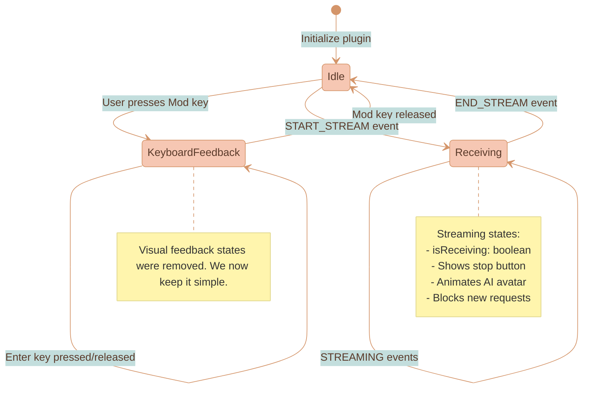
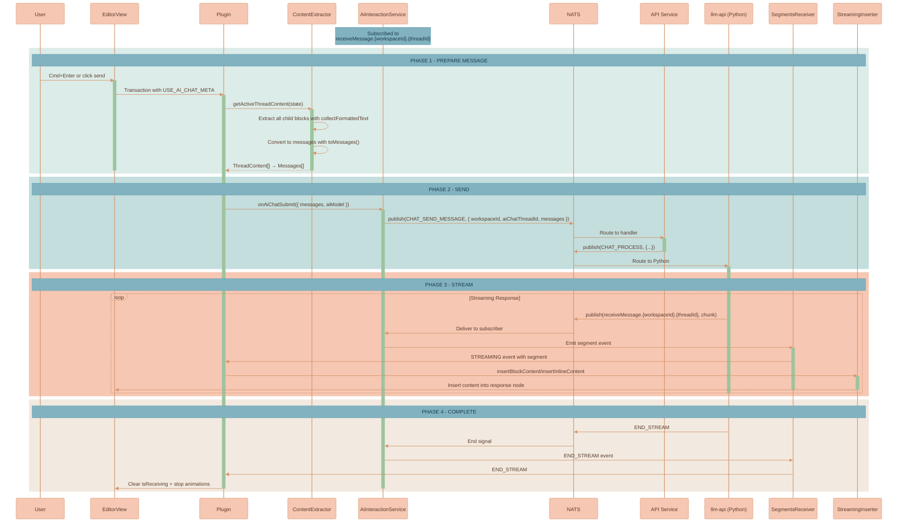
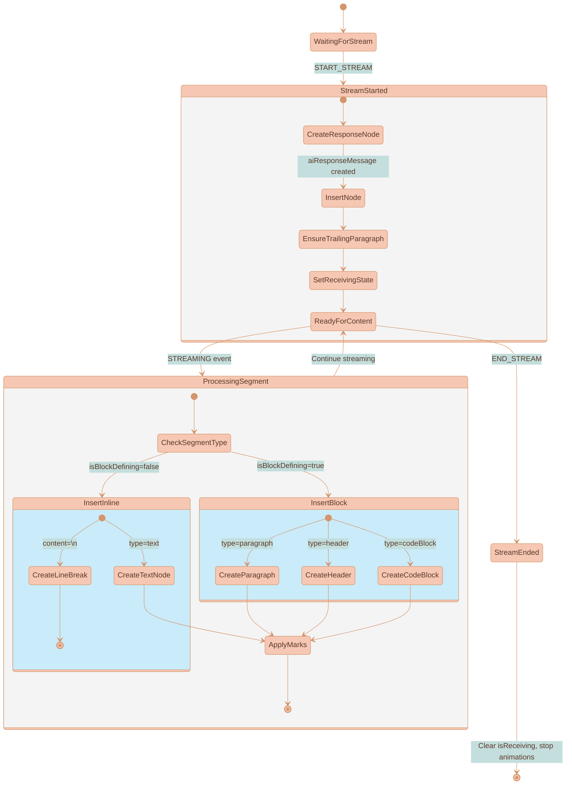
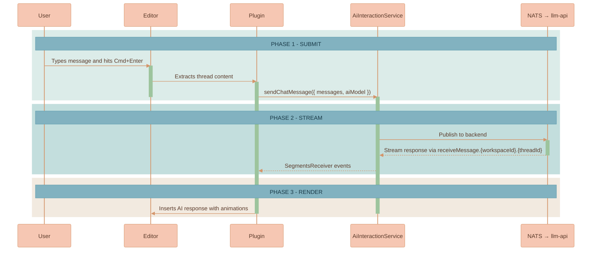

# AI Chat Thread Plugin

Provides the ProseMirror editor experience for AI chat threads on the workspace canvas. Each AI chat thread is a **standalone canvas node** with its own editor instance, AI service connection, and persistence. Users type messages, hit Cmd+Enter (or Ctrl+Enter on Windows), and get AI responses streamed back in real-time.

This README reflects the current implementation where AI chat threads are first-class canvas nodes (not embedded in documents).

## What it does

This plugin powers the editor inside AI chat thread canvas nodes. Each thread can contain:
- Regular paragraphs (user messages)
- Code blocks (for sharing code)
- AI responses (streamed from your backend)

When a user hits Cmd+Enter or clicks the send button, the plugin:
1. Grabs all the content from the current thread
2. Calls your callback function with the messages
3. Shows streaming AI responses as they come in
4. Handles all the animations and visual feedback

AI chat threads live as independent canvas nodes alongside documents and images. Each thread has its own `AiInteractionService` instance for streaming, with routing based on `workspaceId` + `threadId`.

## Technical Architecture

The plugin follows a modular architecture where each node type encapsulates its own UI and behavior using declarative DOM templates:

```mermaid
%%{init: {'theme': 'base', 'themeVariables': { 'primaryColor': '#F6C7B3', 'primaryTextColor': '#5a3a2a', 'primaryBorderColor': '#d4956a', 'secondaryColor': '#C3DEDD', 'secondaryTextColor': '#1a3a47', 'secondaryBorderColor': '#4a8a9d', 'tertiaryColor': '#DCECE9', 'tertiaryTextColor': '#1a3a47', 'tertiaryBorderColor': '#82B2C0', 'lineColor': '#d4956a', 'textColor': '#5a3a2a'}}}%%
graph TD
    A[AiChatThreadPluginClass] --> B[KeyboardHandler]
    A --> C[ContentExtractor]
    A --> D[PositionFinder]
    A --> E[StreamingInserter]
    A --> F[DecorationSystem]

    N1[aiChatThreadNode.ts] --> NV1[aiChatThreadNodeView]
    N2[aiResponseMessageNode.ts] --> NV2[aiResponseMessageNodeView]

    DT[domTemplates.ts] --> DTB[DOMTemplateBuilder]
    DTB --> HF[html function]

    NV1 --> HF
    NV2 --> HF

    NV1 --> UI1[html`Thread Boundary`]
    NV1 --> UI2[html`Submit Button`]

    NV2 --> UI4[html`Provider Avatar`]
    NV2 --> UI5[html`Message Wrapper`]
    NV2 --> UI6[html`Boundary Strip`]

    A --> N1
    A --> N2

    C --> C1[collectFormattedText]
    C --> C2[getActiveThreadContent]
    C --> C3[toMessages]

    D --> D1[findThreadInsertionPoint]
    D --> D2[findResponseNode]

    E --> E1[insertBlockContent]
    E --> E2[insertInlineContent]

    F --> F1[PlaceholderDecorations]
    F --> F2[KeyboardFeedbackDecorations]
    F --> F3[BoundaryDecorations]
```



**Key Design Principles:**
- **Self-contained nodes:** Each node type exports both spec AND NodeView (handles boundary indicator, focus, and per-thread dropdown controls)
- **Declarative UI:** All DOM creation uses `html` template literals instead of verbose `createElement` chains
- **Shared utilities:** `domTemplates.ts` provides consistent DOM building across all ProseMirror components
- **Performance-focused:** htm/mini gives zero-runtime overhead with direct DOM element creation
- **Clean separation:** Plugin orchestrates business logic while NodeViews handle UI via templates

### Plugin State Machine



## Data Flow & Content Extraction



### Schema Nodes

**`aiChatThread`** - Container for entire conversation
- Content: `(aiUserMessage | aiResponseMessage)+` (pure conversation log, no inline composer)
- Attributes:
  - `threadId: string | null` - Unique identifier for the thread
  - `status: 'active'|'paused'|'completed'` - Thread lifecycle state
  - `aiModel: string` - Selected AI model (e.g., "Anthropic:claude-3-5-sonnet")
- DOM: `div.ai-chat-thread-wrapper[data-thread-id][data-status][data-ai-model]`
- **Note:** User input is handled by the separate `aiPromptInputPlugin` which renders as a floating canvas element below the selected node. See `aiPromptInputPlugin/` for details.

**`aiUserMessage`** - Sent user message bubble
- Content: `(paragraph | block)+`
- Attributes: `id, createdAt`
- DOM: `div.ai-user-message`

**`aiUserInput`** - **DEPRECATED / LEGACY ONLY** — Previously the sticky composer at the end of the thread. Now replaced by the separate `aiPromptInputPlugin` which renders as a floating canvas element.
- The node type spec is kept in the schema for legacy content migration — old thread documents that still contain `aiUserInput` will have it silently stripped in `appendTransaction`.
- New threads no longer include `aiUserInput` in their content.

**`aiResponseMessage`** - Individual AI responses
- Content: `(paragraph | block)*` (empty allowed for streaming shell)
- Attributes: `id, style, isInitialRenderAnimation, isReceivingAnimation, aiProvider, currentFrame`
- DOM: `div.ai-response-message[data-ai-provider]`
- Empty shells render a horizontal spinner placeholder so the layout keeps height while the first tokens stream in.

**`aiGeneratedImage`** - AI-generated images (from DALL-E, etc.)
- Content: Empty (atom node)
- Attributes:
  - `imageData: string` - Image URL or base64 data
  - `fileId: string` - Server-side file reference
  - `workspaceId: string` - Workspace containing the image (for NATS object store access)
  - `revisedPrompt: string` - The revised prompt used by the AI
  - `responseId: string` - Response ID for tracking
  - `aiModel: string` - Model that generated the image
  - `isPartial: boolean` - True while image is still generating
  - `width: string | null` - Width percentage (e.g., "50%")
  - `alignment: 'left' | 'center' | 'right'` - Image alignment
  - `textWrap: 'none' | 'left' | 'right'` - Text wrap mode
- DOM: Rendered via `imageSelectionPlugin`'s `ImageNodeView` (NOT the legacy `aiGeneratedImageNodeView`)
- **IMPORTANT:** The NodeView is registered in `imageSelectionPlugin`, not here. This enables bubble menu integration with alignment/wrap controls.
- **CANVAS-BASED IMAGE GENERATION:** New AI-generated images are placed directly on the workspace canvas as `ImageCanvasNode` elements instead of inline in the chat. The plugin delegates image events to `WorkspaceCanvas.ts` via `onImagePartialToCanvas` / `onImageCompleteToCanvas` callbacks. A `WorkspaceEdge` with `sourceMessageId` connects the image to the specific `aiResponseMessage` that produced it. The revised prompt text is inserted as a paragraph in the AI response message.
- **MULTI-MODAL CONTEXT:** Connected canvas images are included in AI requests via the workspace edge system (`ai-chat-thread-service.ts` → `extractConnectedContext()`). Legacy inline `aiGeneratedImage` nodes in older threads are still extracted via `ContentExtractor.collectContentWithImages()` for backwards compatibility.

## DOM Template System

We use `htm` for declarative DOM in NodeViews. The shared helper lives at `$src/utils/domTemplates.ts`. Keep plugin-specific snippets here; generic patterns live in `$src/components/proseMirror/plugins/README.md` (see "Templating & NodeViews").

More generic patterns and folder layout guidance: `$src/components/proseMirror/plugins/README.md`.

Quick taste, this is how buttons are built now:

```ts
import { html } from '$src/utils/domTemplates.ts'

const button = html`
  <div className="ai-submit-button" onclick=${handleClick}>
    <span className="send-icon" innerHTML=${sendIcon}></span>
  </div>
`
```

### Composer Controls

The composer controls (AI model selector, image toggle, submit/stop button) have been **extracted into generic reusable factories** in `primitives/aiControls/`. They are now used by the separate `aiPromptInputPlugin` NodeView.

The thread plugin no longer renders any composer controls — it is purely a conversation log renderer and streaming orchestrator.

See `$src/components/proseMirror/plugins/aiPromptInputPlugin/` for the floating input implementation and `$src/components/proseMirror/plugins/primitives/aiControls/` for the reusable control factories.

## Quick setup

AI chat thread editors are created by `WorkspaceCanvas.ts` when rendering thread canvas nodes:

```typescript
// Each AI chat thread canvas node gets its own editor and service
const aiService = new AiInteractionService({
    workspaceId,
    aiChatThreadId: node.referenceId
})

const editor = new ProseMirrorEditor({
    editorMountElement: editorContainer,
    initialVal: thread.content,
    documentType: 'aiChatThread',  // Enables AI chat thread schema
    threadId: node.referenceId,    // Required for fresh document creation with correct threadId
    onAiChatSubmit: ({ messages, aiModel }) => {
        aiService.sendChatMessage({ messages, aiModel })
    },
    onAiChatStop: () => {
        aiService.stopChatMessage()
    }
})
```

The `documentType: 'aiChatThread'` parameter configures the schema and keybindings for AI chat context. The `threadId` parameter is used when creating fresh documents (via `createAndFill()`) to ensure the `aiChatThread` node has the correct `threadId` attribute for streaming routing.

## Streaming Protocol

The plugin subscribes to `SegmentsReceiver.subscribeToeceiveSegment()` and expects streaming events with:
- **status**: START_STREAM, STREAMING, or END_STREAM
- **aiProvider**: Which AI service is responding (Anthropic, OpenAI, etc.)
- **threadId**: Identifies which thread this stream belongs to (enables concurrent streams)
- **segment**: Contains the actual content (text, styles, type, block/inline flag, header level)

### Streaming Lifecycle



**Content Type Handlers:**
- `paragraph` - Creates paragraph node with text and marks
- `header` - Creates heading node with specified level (1-6)
- `codeBlock` - Creates code_block node
- `text` - Inserts text with styling marks
- `linebreak` - Inserts hard_break or new paragraph

## User experience



Users see:
- A floating "send" button that appears on hover
- Keyboard shortcuts (Cmd/Ctrl + Enter) with visual feedback
- Different avatars for different AI providers
- Smooth animations as responses stream in
- A "stop" button while AI is responding (currently TODO)

## Files in this plugin

- `aiChatThreadNode.ts` - Thread container node (self-contained):
  - Exports node schema AND its NodeView implementation
  - Content expression: `(aiUserMessage | aiResponseMessage)* aiUserInput`
  - Uses `html` template literals for clean UI creation
  - Handles hover events and focus management

- `aiUserInputNode.ts` - Sticky composer node (self-contained):
  - Exports node schema AND its NodeView implementation
  - Always the last child of `aiChatThread`
  - Content: `(paragraph | block)+` for rich-text input
  - NodeView renders controls (model selector, image toggle, submit/stop) alongside `contentDOM`
  - `createAiModelSelectorDropdown()` uses `createPureDropdown()` primitive
  - Dropdowns appended directly to controlsContainer (not inserted via transactions)
  - `ignoreMutation()` prevents NodeView recreation when controls are manipulated

- `aiUserMessageNode.ts` - Sent user message node (self-contained):
  - Exports node schema AND its NodeView implementation
  - Content: `(paragraph | block)+`
  - Attributes: `id, createdAt` for message identification
  - Rendered as a styled chat bubble (right-aligned)
  - Created when user submits content from the composer

- `aiResponseMessageNode.ts` - AI response node (self-contained):
  - Exports node schema AND its NodeView implementation
  - Uses `html` template literals for structured DOM creation
  - Provider-specific avatars (Claude, GPT) with animations
  - Streaming animation states (receiving/idle)
  - Boundary strip decoration

- `aiGeneratedImageNode.ts` - AI-generated image node and canvas callback system:
  - Exports ProseMirror node spec for `aiGeneratedImage` (atom node)
  - Manages global `AiGeneratedImageCallbacks` via `setAiGeneratedImageCallbacks()` / `getAiGeneratedImageCallbacks()`
  - Callbacks include `onImagePartialToCanvas`, `onImageCompleteToCanvas`, `onAddToCanvas`, `onEditInNewThread`
  - `WorkspaceCanvas.ts` registers these callbacks to receive image events from the plugin
  - The plugin calls `getAiGeneratedImageCallbacks()` during streaming to delegate image placement to the canvas

- `aiChatThreadPlugin.ts` - Main orchestration logic:
  - Plugin state and lifecycle management
  - Content extraction and message conversion
  - Streaming event handling and DOM insertion
  - Image generation delegates to canvas via `getAiGeneratedImageCallbacks()` (partial previews and final images appear as canvas nodes, not inline)
  - Decoration system (placeholders, boundaries)
  - No UI rendering - delegates to node-specific NodeViews and primitive components

- `aiChatThreadControls.ts` - UI control factories:
  - `createAiModelSelectorDropdown()` - AI model picker dropdown
  - `createImageGenerationToggle()` - Image generation on/off toggle
  - `createAiSubmitButton()` - Submit/stop button

- `aiChatThreadPluginConstants.ts` - Shared `PluginKey` to avoid identity mismatch and circular imports between NodeView and plugin. Import this key in both places and call `AI_CHAT_THREAD_PLUGIN_KEY.getState(view.state)` when needed.

- `$src/components/proseMirror/plugins/primitives/dropdown/` - Dropdown primitive (outside document schema):
  - `pureDropdown.ts` - Factory function creating dropdowns with {dom, update, destroy} API
  - Uses `infoBubble` primitive for state management
  - `index.ts` - Clean exports
  - Zero ProseMirror dependencies - framework-agnostic pure DOM
  - Used by aiUserInputNode for AI model selector
  - See `primitives/dropdown/README.md` for full documentation

- `$src/utils/domTemplates.ts` - Shared DOM template utilities:
  - TypeScript class-based `DOMTemplateBuilder` with proper typing
  - `html` template function using htm/mini for zero-overhead DOM creation
  - Handles events, styles, data attributes, innerHTML
  - Available across all components, not just ProseMirror plugins

- `ai-chat-thread.scss` - All the styling and animations
- `index.ts` - Exports everything

**Architecture Note:** Each node type is a complete unit with its own UI built using declarative `html` templates. The plugin focuses on coordination and business logic without mixing UI concerns. The shared `domTemplates.ts` provides clean, performant DOM creation across the entire ProseMirror ecosystem.

## Core Helper Classes

### ContentExtractor
Handles thread content analysis and message conversion with multi-modal support:

```typescript
class ContentExtractor {
  // Recursively extracts text while preserving code block formatting
  static collectFormattedText(node: PMNode): string

  // Extracts text AND image references from a message block
  static collectContentWithImages(node: PMNode): { text: string; images: ImageReference[] }

  // Simple text extraction fallback
  static collectText(node: PMNode): string

  // Finds active thread by walking up DOM hierarchy from cursor
  static getActiveThreadContent(state: EditorState): ThreadContent[]

  // Builds NATS object store URL for image reference
  static buildImageUrl(ref: ImageReference): string

  // Converts thread blocks to AI messages (multi-modal format when images present)
  static toMessages(items: ThreadContent[]): Message[]
}
```

**Message Conversion Logic:**
1. Walk each top-level block in the thread (excluding `aiUserInput` composer)
2. Extract formatted text AND AI-generated image references (with `fileId` and `workspaceId`)
3. Determine role: `aiResponseMessage` → `assistant`, `aiUserMessage` → `user`
4. Merge consecutive text-only blocks with same role
5. For messages with images, return multi-modal content format:
   - Text parts: `{ type: 'text', text: '...' }`
   - Image parts: `{ type: 'image_url', image_url: { url: 'nats-obj://workspace-{workspaceId}-files/{fileId}' } }`
6. Return message array ready for any LLM provider (provider-agnostic)

**Dual Image Context Paths:**
- **Canvas edges (primary):** New AI-generated images live as `ImageCanvasNode` on the canvas, connected via `WorkspaceEdge` with `sourceMessageId`. The `ai-chat-thread-service.ts` → `extractConnectedContext()` traverses these edges and includes connected images in AI requests.
- **Inline nodes (legacy/backwards compat):** Older threads may still contain inline `aiGeneratedImage` ProseMirror nodes. `collectContentWithImages()` extracts these as `nats-obj://` references. Both paths produce the same provider-agnostic format for the LLM API.

### PositionFinder
Document position utilities for content insertion:

```typescript
class PositionFinder {
  // Finds where to insert new aiResponseMessage in active thread
  static findThreadInsertionPoint(state: EditorState): {
    insertPos: number
    trailingEmptyParagraphPos: number | null
  } | null

  // Locates current streaming response node for content insertion
  static findResponseNode(state: EditorState): {
    found: boolean
    endOfNodePos?: number
    childCount?: number
  }
}
```

### StreamingInserter
Handles real-time content insertion during AI streaming:

```typescript
class StreamingInserter {
  // Inserts block-level content (headers, paragraphs, code blocks)
  static insertBlockContent(
    tr: Transaction,
    type: string,
    content: string,
    level: number | undefined,
    marks: any[] | null,
    endOfNodePos: number,
    childCount: number
  ): void

  // Inserts inline content (text, marks, line breaks)
  static insertInlineContent(
    tr: Transaction,
    type: string,
    content: string,
    marks: any[] | null,
    endOfNodePos: number
  ): void
}
```

### Plugin State Management

The plugin maintains state for:
- **receivingThreadIds**: Set of thread IDs currently receiving AI responses (supports concurrent streams)
- **Code block parsing**: Backtick buffer and code block tracking
- **Decorations**: Placeholders, boundaries, and visual feedback
- **hoveredThreadId**: Which thread boundary is currently visible

**Transaction Metadata** signals actions between components:
- `setReceiving` - Toggle streaming state for specific thread
- `hoverThread` - Thread boundary hover
- `USE_AI_CHAT_META` - Trigger chat submission with thread context (threadId + nodePos)
- `STOP_AI_CHAT_META` - Stop AI streaming for specific thread
- `INSERT_THREAD_META` - Insert new thread

## NodeViews & UI Components

### Thread NodeView (Template-Based)
Creates the interactive thread container using declarative templates:

```typescript
// Thread boundary with clean template syntax
return html`
  <div
    className="ai-thread-boundary-indicator"
    onmouseenter=${handleEnter}
    onmouseleave=${handleLeave}
  >
    <div className="ai-thread-boundary-icon" innerHTML=${chatThreadBoundariesInfoIcon}></div>
    ${createThreadInfoDropdown()}
  </div>
`

// Submit button with multiple states
return html`
  <div className="ai-submit-button" onclick=${handleClick}>
    <div className="button-default">
      <span className="send-icon" innerHTML=${sendIcon}></span>
    </div>
    <div className="button-hover">
      <span className="send-icon" innerHTML=${sendIcon}></span>
    </div>
    <div className="button-receiving">
      <span className="stop-icon" innerHTML=${pauseIcon}></span>
    </div>
  </div>
`
```

**Behavior:**
- Auto-generates `threadId` if missing via `setNodeMarkup`
- Focuses editor and positions cursor on mousedown
- Hover events dispatch `hoverThread` metadata
- Click handlers for send/stop functionality
- **NEW:** All UI created via `html` templates for 70% less code and better readability

### Response NodeView (Template-Based)
Renders AI responses using structured templates:

```typescript
// Main wrapper created declaratively in one statement
const parentWrapper = html`
  <div className="ai-response-message-wrapper">
    <div className="ai-response-message">
      <div className="user-avatar assistant-${node.attrs.aiProvider.toLowerCase()}"></div>
      <div className="ai-response-message-content"></div>
    </div>
  </div>
`

// Get DOM references for dynamic updates
const userAvatarContainer = parentWrapper.querySelector('.user-avatar')
const responseMessageContent = parentWrapper.querySelector('.ai-response-message-content')

// Response message content is styled as a white chat bubble with a left-side tail
```

**Anthropic Animation System:**
- 8-frame sprite animation at 90ms intervals
- Updates `currentFrame` attribute via `setNodeMarkup`
- SVG viewBox manipulation: `0 ${frame * 100} 100 100`
- Automatic cleanup on destroy
- **NEW:** Initial DOM structure from templates, dynamic updates via querySelector references

## Decoration System

The plugin applies multiple independent decoration layers:

### 1. Placeholder Decorations
```typescript
// Document title placeholder
if (node.type.name === documentTitleNodeType && node.content.size === 0) {
  decorations.push(Decoration.node(pos, pos + node.nodeSize, {
    class: 'empty-node-placeholder',
    'data-placeholder': this.placeholderOptions.titlePlaceholder
  }))
}

// Thread paragraph placeholder (single empty paragraph only)
if (node.type.name === aiChatThreadNodeType && node.childCount === 1) {
  const firstChild = node.firstChild
  if (firstChild?.type.name === 'paragraph' && firstChild.content.size === 0) {
    // Apply placeholder decoration
  }
}
```

### 2. Thread Boundary Decorations
```typescript
// Shows boundary line only for hovered thread
if (node.type.name === 'aiChatThread' &&
    pluginState.hoveredThreadId === node.attrs.threadId) {
  decorations.push(Decoration.node(pos, pos + node.nodeSize, {
    class: 'thread-boundary-visible'
  }))
}
```

### 3. Dropdown Open Decorations
**Note:** Dropdown decorations are now handled by the dropdown primitive plugin (`services/web-ui/src/components/proseMirror/plugins/primitives/dropdown/dropdownPlugin.ts`), not by aiChatThreadPlugin.

## Styling hooks (short version)

SCSS lives in `ai-chat-thread.scss`. Relevant classes:
- `.ai-chat-thread-wrapper` — container
- `.ai-thread-boundary-indicator` / `-line` — boundary UI
- `.ai-response-message-wrapper` — response layout

State classes applied via decorations: `.receiving`, `.thread-boundary-visible`. No giant CSS dumps here — check the SCSS if you need details.

## Implementation Details & Edge Cases

### Thread Selection Algorithm

`ContentExtractor.getActiveThreadContent()` walks up the document tree from the cursor position to find the containing thread, then extracts all child blocks.

**Critical:** Cursor must be inside a thread for extraction to work. Plugin silently does nothing if cursor is outside all threads.

### Response Node Targeting

`PositionFinder.findResponseNode()` locates the AI response node to stream content into:
- When **threadId provided**: searches only within that specific thread's container
- When **threadId omitted**: searches globally across entire document
- **Priority scoring**: isReceiving > isInitialRender > any response (newest wins ties)

**Concurrent Stream Support:** The optional `threadId` parameter enables multiple concurrent AI streams in different threads without interference. Each thread's responses are isolated and independently managed.

### Content Formatting Rules
1. **Code blocks** - Wrapped in triple backticks when sent to AI
2. **Hard breaks** - Converted to `\n` in message content
3. **Role merging** - Consecutive blocks with same role merged with `\n` separator
4. **Empty blocks** - Filtered out (no text content)

### Threading & Async Gotchas

**Thread ID Generation:** Auto-generates unique IDs using timestamp + random string, dispatched async to avoid initialization conflicts.

**Animation State Management:** Anthropic responses use 8-frame sprite animation at 90ms intervals, updating node attrs via `setNodeMarkup` to trigger re-renders.

### Implemented Features
- ✅ **Multiple concurrent streams** - Each thread can have independent AI streaming via `threadId` scoping
- ✅ **Stop streaming** - Stop button functionality implemented with `STOP_AI_CHAT_META`
- ✅ **Thread isolation** - Responses correctly routed to their originating thread

### Unimplemented Features
- **Retry failed streams** - No error handling for failed segments
- **Stream resume** - No persistence if browser refreshes mid-stream

<!-- Removed noisy change logs. This README stays focused on how to use the plugin, not its history. -->

## Extending it

Want more content types? Add cases to `StreamingInserter.insertBlockContent()`:

```typescript
case 'blockquote': {
  const textNode = tr.doc.type.schema.text(content)
  const quoteNode = tr.doc.type.schema.nodes.blockquote.createAndFill(null, textNode)
  tr.insert(insertPos, quoteNode)
  break
}
```

Want different AI providers? Add them to `aiResponseMessageNodeView()`:

```typescript
case 'Cohere':
  userAvatarContainer.innerHTML = cohereIcon
  break
```

Want to use templates in other ProseMirror components?

```typescript
import { html } from '$src/utils/domTemplates.ts'

const myNodeView = html`
  <div className="my-component" onclick=${handleClick}>
    <span innerHTML=${myIcon}></span>
    ${childElements}
  </div>
`
```

The styling system uses SCSS variables like `$steelBlue` and `$redPink`. Check `ProseMirrorMixings.scss` for the full list.

## Operational notes for future contributors

- **Dropdown rendering**: All dropdown UI, state, and events are handled by the dropdown primitive component in `services/web-ui/src/components/proseMirror/plugins/primitives/dropdown/`. Do NOT put dropdown layout/rendering logic in aiChatThreadNode.
- The dropdown primitive follows the plugin state + decorations pattern. Never store UI state in NodeViews.
- Never import the plugin module inside NodeViews; import only the shared `PluginKey` from `aiChatThreadPluginConstants.ts` and read state via `getState(view.state)`.
- When subscribing to external stores (Svelte), keep references to DOM nodes and update textContent/innerHTML. Unsubscribe in `destroy()` and remove global listeners like `document.click`.

## Debug mode

Set `IS_RECEIVING_TEMP_DEBUG_STATE = true` at the top of the plugin to keep the "receiving" state active so you can inspect the CSS without needing to trigger actual AI responses.

---

That's the plugin! It powers the editor experience for AI chat thread canvas nodes, handling content extraction, streaming responses, and the interactive UI. The `AiInteractionService` handles all NATS communication using the `workspaceId + threadId` routing pattern.