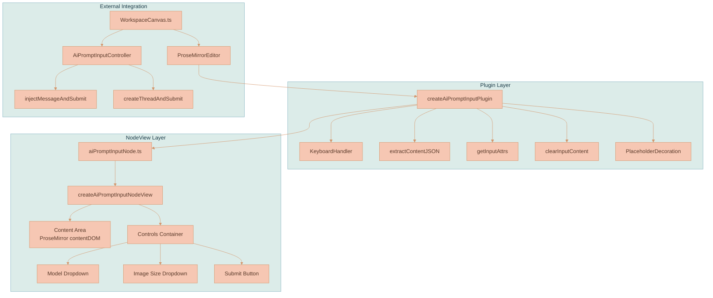
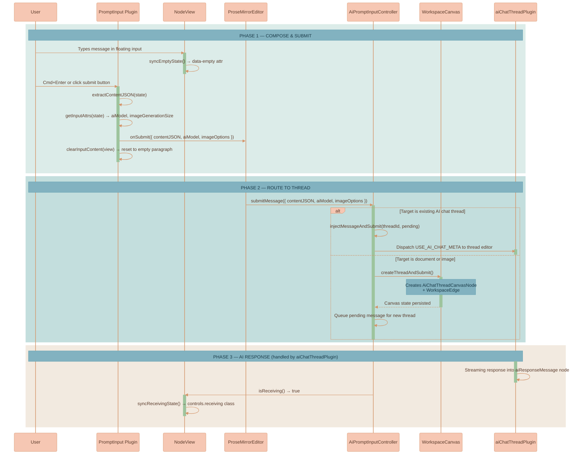

# AI Prompt Input Plugin

Provides the floating ProseMirror editor used for composing and sending messages to AI chat threads (or any canvas node) on the workspace. This is a **separate, standalone editor** with its own `documentType: 'aiPromptInput'`, independent from the `aiChatThreadPlugin`. It renders as a floating element below whichever canvas node is currently selected.

## What it does

This plugin powers the floating input field that appears below canvas nodes. It provides:
- A rich-text ProseMirror editor for composing messages
- An AI model selector dropdown
- An image generation size dropdown
- A submit/stop button
- Placeholder text when the input is empty
- Keyboard shortcut support (Cmd/Ctrl + Enter to submit)

When a user types a message and submits:
1. The plugin extracts the content as JSON from the `aiPromptInput` node
2. Reads the `aiModel` and `imageGenerationSize` attributes
3. Calls the `onSubmit` callback with `{ contentJSON, aiModel, imageOptions }`
4. Clears the input content and resets the cursor

The plugin does **not** handle AI streaming, message routing, or thread management — that is the responsibility of the `AiPromptInputController` service and the `aiChatThreadPlugin`.

## Technical Architecture



**Key Design Principles:**
- **Minimal schema:** The document consists of a single `aiPromptInput` node — no title, no conversation history
- **Decoupled from threads:** The plugin only handles input composition and extraction, never touches thread state or streaming
- **Adapter pattern:** NodeView controls bridge ProseMirror node attrs (`aiModel`, `imageGenerationSize`) to UI controls via getter/setter adapters
- **Factory injection:** UI controls (dropdowns, buttons) are injected via factory functions, keeping the plugin framework-agnostic
- **Polling for external state:** Receiving state is synced via a 200ms polling interval since it's owned by external services, not plugin state

## Data Flow



### Schema Node

**`aiPromptInput`** — Floating composer for sending messages to any canvas node
- Content: `(paragraph | block)+`
- Group: `block`
- Draggable: `false`
- Selectable: `false`
- Isolating: `true` (prevents cursor from escaping)
- Attributes:
  - `aiModel: string` (default `''`) — Selected AI model (e.g., `"Anthropic:claude-3-5-sonnet"`)
  - `imageGenerationSize: string` (default `'auto'`) — Image generation size (e.g., `"512x512"`)
- DOM: `div.ai-prompt-input-wrapper[data-ai-model][data-image-generation-size]`
- Content hole: `0` (ProseMirror renders editable content inside)

The document schema for `documentType: 'aiPromptInput'` is:
```
doc → aiPromptInput
```

No title node, no other blocks — just the single input node.

## NodeView

The `createAiPromptInputNodeView` factory returns a ProseMirror NodeView with this DOM structure:

```
div.ai-prompt-input-wrapper [data-empty="true"|"false"]
├── div.ai-prompt-input-content        ← contentDOM (editable)
└── div.ai-prompt-input-controls
    ├── [Model Dropdown]               ← injected via createModelDropdown()
    ├── [Image Size Dropdown]          ← injected via createImageSizeDropdown()
    └── [Submit Button]                ← injected via createSubmitButton()
```

### Control Adapters

The NodeView uses an adapter pattern to bridge ProseMirror node attributes with UI controls. Each control receives getter/setter functions that read/write `aiModel` and `imageGenerationSize` via `setNodeMarkup` transactions:

```typescript
const modelControls: AiModelControls = {
    getCurrentAiModel: () => getNodeAttr(view, getPos, 'aiModel'),
    setAiModel: (aiModel) => setNodeAttr(view, getPos, 'aiModel', aiModel),
}
```

This keeps the controls stateless — the ProseMirror document is the single source of truth.

### State Synchronization

- **Empty state:** `data-empty` attribute on the wrapper toggles placeholder visibility via SCSS. Updated on every `update()` call.
- **Receiving state:** The `receiving` CSS class on `.ai-prompt-input-controls` is polled every 200ms via `options.isReceiving()`. This external state comes from `AiPromptInputController.isReceiving()` which tracks which thread IDs are currently streaming.

### NodeView Lifecycle

- **`ignoreMutation()`** — Returns `true` for mutations inside the controls container, preventing ProseMirror from recreating the NodeView when dropdowns or buttons change.
- **`stopEvent()`** — Returns `true` for events targeting the controls container, preventing ProseMirror from stealing focus/clicks from dropdowns and buttons.
- **`update()`** — Accepts updates only for `aiPromptInput` nodes. Syncs empty state, receiving state, and calls `update()` on both dropdowns.
- **`destroy()`** — Clears the receiving poll interval and calls `destroy()` on dropdowns.

## Plugin Internals

### Helper Functions

**`extractContentJSON(state)`** — Walks the document to find the `aiPromptInput` node, returns its children as a JSON array. Returns `null` if the node isn't found or has no text content.

**`getInputAttrs(state)`** — Reads `aiModel` and `imageGenerationSize` attributes from the `aiPromptInput` node.

**`clearInputContent(view)`** — Replaces all content inside the `aiPromptInput` node with a single empty paragraph and positions the cursor at the start.

**`KeyboardHandler.isModEnter(event)`** — Returns `true` when Cmd+Enter (macOS) or Ctrl+Enter (Windows/Linux) is pressed.

### Plugin Configuration

```typescript
createAiPromptInputPlugin({
    onSubmit: (data) => { /* { contentJSON, aiModel, imageOptions } */ },
    onStop: () => { /* stop streaming */ },
    isReceiving: () => boolean,
    createModelDropdown: (controls, dropdownId) => ({ dom, update, destroy }),
    createImageSizeDropdown: (controls, dropdownId) => ({ dom, update, destroy }),
    createSubmitButton: (controls) => HTMLElement,
    placeholderText: 'Talk to me...',
})
```

### Transaction Meta Signals

The plugin supports meta-driven submit/stop via `appendTransaction`:
- **`submit:aiPrompt`** (`SUBMIT_AI_PROMPT_META`) — Triggers content extraction and `onSubmit` callback when set on a transaction.
- **`stop:aiPrompt`** (`STOP_AI_PROMPT_META`) — Triggers the `onStop` callback.

These metas allow external code to programmatically submit or stop without simulating keyboard events.

### Decoration System

A single decoration layer: **placeholder decoration**. When the `aiPromptInput` node has no text content, a `Decoration.node` is applied with:
- Class: `empty-node-placeholder`
- Attribute: `data-placeholder` set to the configured `placeholderText`

SCSS renders the placeholder via `::before` pseudo-element using `content: attr(data-placeholder)`.

## Integration with WorkspaceCanvas

The workspace creates two types of floating input editors:

### Single Floating Input (for document/image nodes)
When a user selects a document or image canvas node, a single shared floating input appears below it. On submit, the `AiPromptInputController` auto-creates a new AI chat thread canvas node, positions it to the right of the target node (with a `WorkspaceEdge` connection), and queues the message for delivery once the thread editor mounts.

### Per-Thread Floating Inputs (for AI chat thread nodes)
Each AI chat thread canvas node gets its own dedicated floating input. On submit, the `AiPromptInputController` injects the user message directly into the thread's ProseMirror editor and dispatches `USE_AI_CHAT_META` to trigger the AI request.

Both types:
- Use `documentType: 'aiPromptInput'` for the `ProseMirrorEditor`
- Receive the same control factories (`createGenericAiModelDropdown`, `createGenericImageSizeDropdown`, `createGenericSubmitButton`) from `primitives/aiControls/`
- Render inside a `.ai-prompt-input-floating` container with optional shifting gradient background (controlled by `webUiSettings.useShiftingGradientBackgroundOnAiUserInputNode`)

## Styling

SCSS lives in `ai-prompt-input.scss`. Key class hierarchy:

```
.ai-prompt-input-floating            ← absolute-positioned floating container
├── .shifting-gradient-canvas         ← optional gradient background
└── .floating-input-editor            ← editor mount point
    └── .ai-prompt-input-wrapper      ← NodeView root (white glassmorphism card)
        ├── .ai-prompt-input-content  ← editable content area (flex: 1)
        └── .ai-prompt-input-controls ← controls bar (flex-end)
            ├── .dropdown-menu-tag-pill-wrapper  ← model/size dropdowns
            └── .ai-submit-button     ← submit/stop button (32px circle)
                ├── .button-default   ← send icon (normal state)
                ├── .button-hover     ← send icon (hover state)
                └── .button-receiving ← stop icon (streaming state)
```

**State-driven styling:**
- `[data-empty="true"]` — Shows placeholder pseudo-element, dims controls
- `[data-empty="false"]` — Fills submit icon with `$nightBlue`, active dropdown text
- `.receiving` on controls — Swaps send icon for stop icon, shows receiving animation

**Visual Details:**
- White glassmorphism card: `rgba(255, 255, 255, 0.9)` with `backdrop-filter: blur(10px)`
- 4px margin creates a visible gradient "border" between the card and the floating container
- Content area: 250px max-height with overflow-y scroll
- Submit button: 32px circle with 3-layer state system (default → hover → receiving)
- Dropdown positioning: `.info-bubble-wrapper.static-position` overrides InfoBubble's fixed positioning for canvas-embedded dropdowns

## Files in this plugin

- **`aiPromptInputNode.ts`** — Node spec and NodeView factory:
  - Exports `aiPromptInputNodeType`, `aiPromptInputNodeSpec`, `createAiPromptInputNodeView`
  - NodeView builds DOM with content area + controls bar
  - Adapter pattern bridges node attrs to UI control getter/setters
  - Polling-based receiving state sync (200ms interval)

- **`aiPromptInputPlugin.ts`** — Plugin orchestration:
  - Exports `createAiPromptInputPlugin`
  - Keyboard handler (Cmd/Ctrl + Enter)
  - Content extraction, attribute reading, and input clearing
  - Placeholder decoration system
  - Meta-driven submit/stop via `appendTransaction`
  - Wires NodeView to plugin via `editorViewRef`

- **`aiPromptInputPluginConstants.ts`** — Shared `PluginKey` and meta constants:
  - `AI_PROMPT_INPUT_PLUGIN_KEY` — Unique plugin key
  - `SUBMIT_AI_PROMPT_META` — `'submit:aiPrompt'`
  - `STOP_AI_PROMPT_META` — `'stop:aiPrompt'`

- **`ai-prompt-input.scss`** — All styling for the floating input and its contents

- **`index.ts`** — Barrel exports for all public APIs

- **`aiPromptInputPlugin.test.ts`** — Comprehensive test suite covering:
  - Node spec (content expression, attributes, parseDOM/toDOM)
  - NodeView (DOM structure, empty state, stopEvent, ignoreMutation, update, destroy)
  - Control adapters (ProseMirror attr read/write)
  - Plugin (creation, placeholder decorations, keyboard shortcuts, image options, meta handling)
  - SCSS visual expectations (class hierarchy, sizing, proportions)
  - Receiving state synchronization

## Related Components

- **`$src/services/ai-prompt-input-controller.ts`** — `AiPromptInputController` class that routes submitted messages to the correct thread. Handles target tracking, thread auto-creation, pending message queuing, and receiving state.
- **`$src/components/proseMirror/plugins/primitives/aiControls/`** — Factory functions for the reusable UI controls (model dropdown, image size dropdown, submit button).
- **`$src/components/proseMirror/plugins/aiChatThreadPlugin/`** — The thread plugin that handles AI streaming, response insertion, and conversation rendering. Receives messages from this plugin via `USE_AI_CHAT_META`.
- **`$src/infographics/workspace/WorkspaceCanvas.ts`** — Creates and positions the floating input editors, manages the `AiPromptInputController` lifecycle.
- **`$src/components/proseMirror/components/editor.js`** — `ProseMirrorEditor` class that instantiates the plugin with `documentType: 'aiPromptInput'`.
