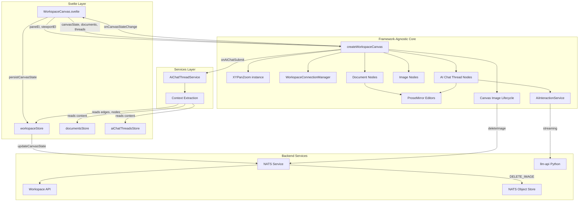
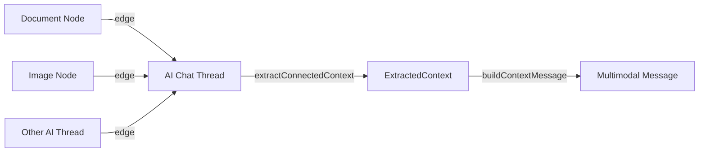
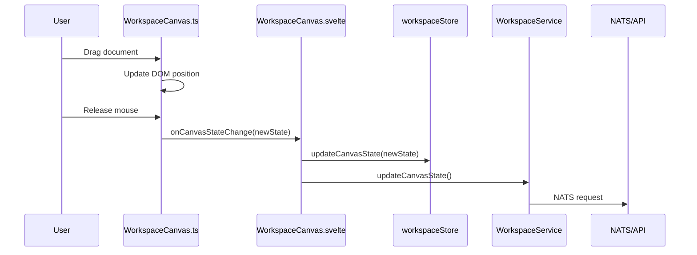

# Workspace Canvas

This module renders the main workspace view—a zoomable, pannable canvas where documents, images, and AI chat threads appear as draggable, resizable cards.

## What It Does

When you open a workspace, you see a canvas. On that canvas are nodes (documents, images, or AI chat threads). You can:

- **Pan** the canvas by clicking and dragging empty space (or two-finger scroll on trackpad)
- **Zoom** with pinch gestures or Ctrl+scroll
- **Drag** nodes by grabbing the overlay (top bar for documents/threads, anywhere for images)
- **Resize** nodes from any corner (images preserve aspect ratio)
- **Edit** document content directly—ProseMirror editors are embedded in document cards
- **Chat with AI** in AI chat thread nodes—each thread maintains its own conversation context
- **Add images** via the toolbar button which opens an upload modal
- **Add AI Chats** via the toolbar button which creates a new AI chat thread
- **Connect nodes** by dragging from a handle OR by dragging a node close to an AI Chat Thread ("Proximity Connect")
- **Provide AI context** by connecting documents/images to an AI chat thread—connected content is automatically sent to the AI
- **Use the floating prompt input** to send prompts to the currently selected node; for non-thread nodes, the input appears on selection and hides on deselect
- **Select edges** by clicking the connector line
- **Delete edges** using Delete/Backspace (when an edge is selected), or by dragging an endpoint to empty space
- **Reconnect edges** by dragging the endpoint handles that appear when an edge is selected
- **Reposition edge anchor points** by selecting an edge and dragging the circular handles vertically along the node's side

All of this happens without the Svelte component knowing the details. It just passes DOM refs and gets callbacks when things change.

## Node Types

### Document Nodes
- Contain embedded ProseMirror editors with `documentType: 'document'`
- Have a drag overlay at the top (20px)
- Free resize (no aspect ratio constraint)
- Support block-level content (paragraphs, headings, lists, etc.)

### Image Nodes
- Display uploaded images from workspace storage
- Have a full-area drag overlay
- Resize preserves aspect ratio (stored when image is uploaded)
- Automatically deleted from storage when removed from canvas

### AI Chat Thread Nodes
- Contain embedded ProseMirror editors with `documentType: 'aiChatThread'`
- Have a drag overlay at the top (20px)
- Free resize (no aspect ratio constraint)
- Display an animated 4-color gradient background on the canvas for visual separation
- Each thread has its own `AiInteractionService` instance for AI messaging
- Support streaming AI responses with real-time token parsing
- Content is persisted separately from documents in the AI-Chat-Threads table
- Automatically extract context from connected nodes (documents, images, other threads) when sending messages
- Each AI chat thread node always has its own floating prompt input visible below it, regardless of selection state; these per-thread inputs automatically target the correct thread and follow the node during drag and resize
- A **vertical rail** element spans the full height of the thread node, the gap, and the floating input. It is a sibling element in the viewport (not nested inside the thread node) tracked via the `threadRails` Map. The rail serves three purposes:
    - **Visual boundary** — a gradient line rendered via `::before` pseudo-element, using the same `linear-gradient(135deg, …)` as model selector dropdown highlights, themed with `aiChatThreadRailGradient` and `aiChatThreadRailWidth` in `webUiThemeSettings.ts`
    - **Drag handle** — clicking and dragging the rail moves both the thread node and its floating input (reuses `handleDragStart`)
    - **Connection proxy** — all connector line left-side anchors are shifted to the rail position via `railOffset` in `WorkspaceConnectionManager`, so edges visually connect to the rail rather than the node edge. The anchor Y range spans the full rail height (thread + gap + floating input) via `railHeights`, so connectors slide from the very top to the very bottom of the rail
    - The horizontal offset from the node edge is configurable via `aiChatThreadRailOffset` in `webUiThemeSettings.ts` (default 5px)
- **AI-generated images** can appear in two modes controlled by `renderNodeConnectorLineFromAiResponseMessageToTheGeneratedMediaItem` in `webUiSettings.ts`:
    - **Anchored mode** (default, setting = `false`): Images are separate canvas nodes that visually overlap the right side of the AI chat thread node. Width is constrained to roughly 68% of the thread width, and each image is continuously re-aligned to the target response bubble as streamed text changes message proportions. The image moves with the thread during drag, and can be detached by dragging its center outside the thread bounds. Thread height grows only when the image extends below the thread bottom. Collision detection excludes anchored image/thread pairs. Messages below an anchored image are pushed down via `applyAnchoredImageSpacing()` which sets `marginBottom` on the response message wrapper; this requires `ignoreMutation()` in the NodeViews (`aiResponseMessageNode`, `aiChatThreadNode`) to return `true` for style attribute mutations so ProseMirror's MutationObserver doesn't wipe the externally-set styles. **On page refresh**, the in-memory `anchoredImageManager` is re-derived from `ImageCanvasNode.generatedBy` metadata persisted in the canvas state — `renderNodes()` scans all image nodes with `generatedBy`, matches them to their source thread via `generatedBy.aiChatThreadId`, and re-registers them as anchored.
  - **Connector line mode** (setting = `true`): Images appear as separate canvas nodes positioned to the right of the thread, connected by an edge with `sourceMessageId` tracking which `aiResponseMessage` produced the image.
  - In both modes, progressive partial previews update the canvas node in real-time during generation, and the revised prompt text is inserted as text inside the AI response message.

## Architecture



## How It Works

### Initialization

1. Svelte mounts and binds `paneEl` and `viewportEl` refs
2. `createWorkspaceCanvas()` is called with these refs plus initial data
3. XYPanZoom attaches to the pane for viewport control
4. Document nodes are created as DOM elements and appended to viewport

### Viewport Transform

The viewport element uses CSS transforms for pan/zoom:

```
transform: translate(${x}px, ${y}px) scale(${zoom})
```

XYPanZoom fires `onTransformChange` on every pan/zoom. We update the CSS and notify Svelte via `onViewportChange`. The Svelte layer debounces and persists to backend.

### Document Nodes

Each canvas node becomes a `div.workspace-document-node` with:

```
┌─────────────────────────────────────────┐
│ .document-drag-overlay (20px, cursor:move)
├─────────────────────────────────────────┤
│                                         │
│  .document-node-editor                  │
│  (ProseMirror lives here)               │
│                                         │
└─────────────────────────────────────────┘
  ↖ resize     resize ↗
  handle       handle

  ↙ resize     resize ↘
  handle       handle
```

### Image Nodes

Image nodes have a simpler structure:

```
┌─────────────────────────────────────────┐
│                                         │
│  .image-node-content                    │
│  (contains img element)                 │
│                                         │
│  .image-drag-overlay                    │
│  (covers entire image for dragging)     │
│                                         │
└─────────────────────────────────────────┘
  ↖ resize     resize ↗
  handle       handle

  ↙ resize     resize ↘
  handle       handle
```

Image resize always preserves aspect ratio using the `aspectRatio` value stored when the image was uploaded.

On image load the client verifies the image's natural aspect ratio and will auto-correct the node's dimensions if a mismatch is detected (this helps self-heal nodes created by older clients). When a correction is necessary the client persists the corrected `dimensions` and updated `aspectRatio` via the normal canvas state persistence flow (`onCanvasStateChange` / `commitCanvasState`).

Resizing uses a stable diagonal-based calculation to preserve aspect ratio smoothly during diagonal drags and avoid axis-switching jumps that can cause jitter during resize. Resize handles are dynamically sized and positioned (computed from the current viewport zoom) so they remain a uniform screen-pixel size and precisely aligned to the image corners regardless of canvas zoom or image scale.

### Image Lifecycle

When an image node is removed from the canvas, the `canvasImageLifecycle` tracker detects the change and triggers deletion from NATS Object Store via the `WORKSPACE_SUBJECTS.IMAGE_SUBJECTS.DELETE_IMAGE` NATS subject.

### Drag and Resize

Both drag and resize temporarily disable XYPanZoom's panning to prevent conflicts:

```typescript
panZoom.update({
    ...panZoomConfig,
    panOnDrag: false,
    userSelectionActive: true,
    connectionInProgress: true
})
```

After mouse-up, we re-enable panning and commit the new position/dimensions via `onCanvasStateChange`.

Note: viewport transforms are only re-applied when the saved viewport actually changes. This prevents temporary zoom/pan flashes when unrelated canvas updates (for example, image onload corrections) occur.

Rendering note: full re-renders are triggered when node structure or document load state changes; position/dimension updates are handled directly in the DOM during drag/resize to avoid unnecessary work.

### Workspace Edges

Edges are stored in `canvasState.edges` and rendered using the existing infographics connector renderer. Connection interactions are handled by `WorkspaceConnectionManager.ts` using `@xyflow/system`'s `XYHandle`.

- Node DOM elements get left/right connection handles (target/source)
- Edge direction follows the drag direction (arrow points toward the node you dragged TO)
- **Proximity Connect**: Dragging a node near an AI Chat Thread shows a dashed ghost line; dropping creates the connection automatically (1200px threshold)
- Clicking an edge selects it; when selected, endpoint handles appear for reconnection
- Dragging an endpoint shows the edge following the cursor (original edge is hidden during reconnect)
- Dropping an endpoint on another node reconnects the edge; dropping in empty space deletes it
- Deleting an edge updates `canvasState.edges` via the normal persistence flow

### AI Chat Context Extraction

When a user sends a message in an AI chat thread, the system extracts content from all nodes connected via incoming edges. This provides context to the AI model without requiring copy/paste.



The extraction flow:

1. **Edge traversal** — `AiChatThreadService.extractConnectedContext(nodeId)` finds all nodes connected via incoming edges, recursively following the graph
2. **Content extraction** — Documents and AI threads have their ProseMirror content parsed; embedded images are collected. Image nodes are fetched and converted to base64
3. **Message building** — `buildContextMessage()` formats context as multimodal content blocks (`input_text` for text, `input_image` for images)
4. **Submission** — The context message is prepended to the user's messages before sending to the AI

The context extraction logic lives in `AiChatThreadService`, not in the canvas module, since it's business logic rather than rendering.

### ProseMirror Integration

Each document node instantiates a `ProseMirrorEditor`. The editor container has `.nopan` so clicking inside doesn't pan the canvas. Content changes fire `onDocumentContentChange` which the Svelte layer forwards to `DocumentService`.

## State Flow



## Canvas Bubble Menu

When an image node is selected on the canvas, a bubble menu appears below it — the same shared `BubbleMenu` component used in ProseMirror editors. The menu provides context-specific actions for canvas elements.

### Image Node Actions
- **Create Variant** — dispatches a `canvas-create-image-variant` custom event on the viewport element
- **Download** — fetches the image as a blob and triggers a browser download via `downloadImage()` utility
- **Delete** — removes the node and its associated edges from canvas state

The bubble menu automatically hides during drag and resize operations, and repositions itself when the selected image moves.

Menu items are defined in `canvasBubbleMenuItems.ts`. The core `BubbleMenu` class is from `$src/components/bubbleMenu/`.

## Files

| File | Purpose |
|------|---------|
| `WorkspaceCanvas.ts` | Core logic: pan/zoom setup, node creation, drag/resize handlers, bubble menu integration |
| `WorkspaceConnectionManager.ts` | Edge connection logic: XYHandle integration, edge rendering, selection/deletion |
| `workspace-canvas.scss` | All styles for canvas, nodes, handles, edges, editors |
| `canvasImageLifecycle.ts` | Tracks image nodes and deletes orphaned images from storage |
| `canvasBubbleMenuItems.ts` | Bubble menu item definitions for canvas elements (image actions) |
| `imagePositioning.ts` | Computes image placement positions (next-to-thread and overlapping-thread modes) |
| `anchoredImageManager.ts` | Tracks which images are anchored to which threads; manages anchor lifecycle |
| `nodeLayering.ts` | Z-index management for bringing nodes to front |

## CSS Classes

| Class | Purpose |
|-------|---------|
| `.workspace-canvas` | Root container |
| `.workspace-pane` | Pan/zoom target |
| `.workspace-viewport` | Transformed container for nodes |
| `.workspace-document-node` | Individual document card |
| `.workspace-image-node` | Individual image card |
| `.workspace-ai-chat-thread-node` | Individual AI chat thread card |
| `.document-drag-overlay` | Top bar for dragging documents |
| `.ai-chat-thread-drag-overlay` | Top bar for dragging AI chat threads |
| `.image-drag-overlay` | Full-area overlay for dragging images |
| `.document-node-editor` | ProseMirror container for documents |
| `.ai-chat-thread-node-editor` | ProseMirror container for AI chat threads |
| `.image-node-content` | Image container |
| `.image-node-img` | The actual img element |
| `.workspace-image-node--anchored` | Image node overlapping its AI chat thread (anchored mode) |
| `.workspace-thread-rail` | Vertical rail element spanning thread + gap + floating input (drag handle, connection proxy, visual boundary) |

| `.document-resize-handle` | Corner resize controls (shared by all node types) |
| `.nopan` | Prevents panning when interacting |
| `.is-dragging` / `.is-resizing` | State classes during interaction |

## AI Chat Thread Background

AI chat thread nodes display an animated shifting gradient background. The gradient is rendered to a small 60×80 pixel bitmap and scaled up with bilinear interpolation for smooth, low-cost rendering. The canvas element is injected as the first child of `.workspace-ai-chat-thread-node` with class `.shifting-gradient-canvas`.

The gradient uses 4 color points with inverse distance weighting and a subtle swirl distortion for an organic feel. When sending a message, the gradient animates to the next phase position.

Both the thread node gradient and the floating user-input gradient are controlled by feature flags in `webUiSettings.ts`:

- `useShiftingGradientBackgroundOnAiChatThreadNode` (default `false`) — gradient on the AI chat thread canvas node itself.
- `useShiftingGradientBackgroundOnAiUserInputNode` (default `true`) — gradient on the floating AI prompt input nodes.

For full technical details, color customization, and the color analysis tool, see [Shifting Gradient Background](../../../documentation/features/SHIFTING-GRADIENT.md).
