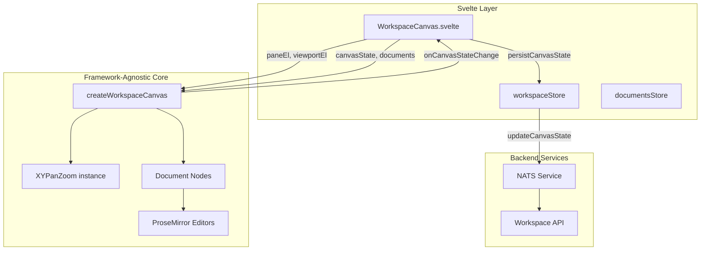
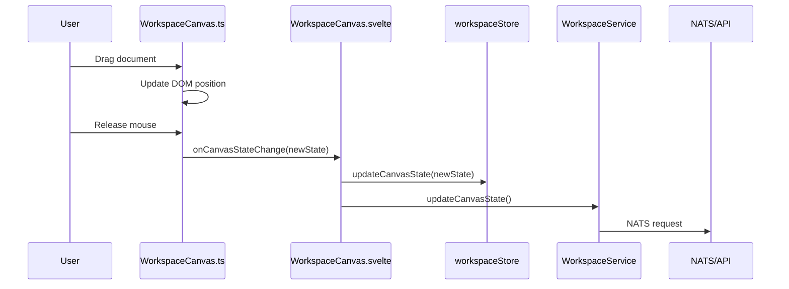

# Workspace Canvas

This module renders the main workspace view—a zoomable, pannable canvas where documents appear as draggable, resizable cards with embedded ProseMirror editors.

## What It Does

When you open a workspace, you see a canvas. On that canvas are document nodes. You can:

- **Pan** the canvas by clicking and dragging empty space (or two-finger scroll on trackpad)
- **Zoom** with pinch gestures or Ctrl+scroll
- **Drag** documents by grabbing the top overlay bar
- **Resize** documents from any corner
- **Edit** content directly—ProseMirror editors are embedded in each card

All of this happens without the Svelte component knowing the details. It just passes DOM refs and gets callbacks when things change.

## Architecture



## How It Works

### Initialization

1. Svelte mounts and binds `paneEl` and `viewportEl` refs
2. `createWorkspaceCanvas()` is called with these refs plus initial data
3. XYPanZoom attaches to the pane for viewport control
4. Document nodes are created as DOM elements and appended to viewport

### Viewport Transform

The viewport element uses CSS transforms for pan/zoom:

```
transform: translate(${x}px, ${y}px) scale(${zoom})
```

XYPanZoom fires `onTransformChange` on every pan/zoom. We update the CSS and notify Svelte via `onViewportChange`. The Svelte layer debounces and persists to backend.

### Document Nodes

Each canvas node becomes a `div.workspace-document-node` with:

```
┌─────────────────────────────────────────┐
│ .document-drag-overlay (20px, cursor:move)
├─────────────────────────────────────────┤
│                                         │
│  .document-node-editor                  │
│  (ProseMirror lives here)               │
│                                         │
└─────────────────────────────────────────┘
  ↖ resize     resize ↗
  handle       handle

  ↙ resize     resize ↘
  handle       handle
```

### Drag and Resize

Both drag and resize temporarily disable XYPanZoom's panning to prevent conflicts:

```typescript
panZoom.update({
    ...panZoomConfig,
    panOnDrag: false,
    userSelectionActive: true,
    connectionInProgress: true
})
```

After mouse-up, we re-enable panning and commit the new position/dimensions via `onCanvasStateChange`.

### ProseMirror Integration

Each document node instantiates a `ProseMirrorEditor`. The editor container has `.nopan` so clicking inside doesn't pan the canvas. Content changes fire `onDocumentContentChange` which the Svelte layer forwards to `DocumentService`.

## State Flow



## Files

| File | Purpose |
|------|---------|
| `WorkspaceCanvas.ts` | Core logic: pan/zoom setup, node creation, drag/resize handlers |
| `workspace-canvas.scss` | All styles for canvas, nodes, handles, editors |

## CSS Classes

| Class | Purpose |
|-------|---------|
| `.workspace-canvas` | Root container |
| `.workspace-pane` | Pan/zoom target |
| `.workspace-viewport` | Transformed container for nodes |
| `.workspace-document-node` | Individual document card |
| `.document-drag-overlay` | Top bar for dragging |
| `.document-node-editor` | ProseMirror container |
| `.document-resize-handle` | Corner resize controls |
| `.nopan` | Prevents panning when interacting |
| `.is-dragging` / `.is-resizing` | State classes during interaction |
