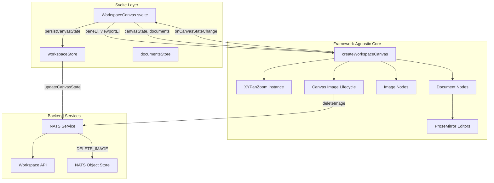

# Workspace Canvas

This module renders the main workspace view—a zoomable, pannable canvas where documents and images appear as draggable, resizable cards.

## What It Does

When you open a workspace, you see a canvas. On that canvas are nodes (documents or images). You can:

- **Pan** the canvas by clicking and dragging empty space (or two-finger scroll on trackpad)
- **Zoom** with pinch gestures or Ctrl+scroll
- **Drag** nodes by grabbing the overlay (top bar for documents, anywhere for images)
- **Resize** nodes from any corner (images preserve aspect ratio)
- **Edit** document content directly—ProseMirror editors are embedded in document cards
- **Add images** via the toolbar button which opens an upload modal

All of this happens without the Svelte component knowing the details. It just passes DOM refs and gets callbacks when things change.

## Node Types

### Document Nodes
- Contain embedded ProseMirror editors
- Have a drag overlay at the top (20px)
- Free resize (no aspect ratio constraint)

### Image Nodes
- Display uploaded images from workspace storage
- Have a full-area drag overlay
- Resize preserves aspect ratio (stored when image is uploaded)
- Automatically deleted from storage when removed from canvas

## Architecture



## How It Works

### Initialization

1. Svelte mounts and binds `paneEl` and `viewportEl` refs
2. `createWorkspaceCanvas()` is called with these refs plus initial data
3. XYPanZoom attaches to the pane for viewport control
4. Document nodes are created as DOM elements and appended to viewport

### Viewport Transform

The viewport element uses CSS transforms for pan/zoom:

```
transform: translate(${x}px, ${y}px) scale(${zoom})
```

XYPanZoom fires `onTransformChange` on every pan/zoom. We update the CSS and notify Svelte via `onViewportChange`. The Svelte layer debounces and persists to backend.

### Document Nodes

Each canvas node becomes a `div.workspace-document-node` with:

```
┌─────────────────────────────────────────┐
│ .document-drag-overlay (20px, cursor:move)
├─────────────────────────────────────────┤
│                                         │
│  .document-node-editor                  │
│  (ProseMirror lives here)               │
│                                         │
└─────────────────────────────────────────┘
  ↖ resize     resize ↗
  handle       handle

  ↙ resize     resize ↘
  handle       handle
```

### Image Nodes

Image nodes have a simpler structure:

```
┌─────────────────────────────────────────┐
│                                         │
│  .image-node-content                    │
│  (contains img element)                 │
│                                         │
│  .image-drag-overlay                    │
│  (covers entire image for dragging)     │
│                                         │
└─────────────────────────────────────────┘
  ↖ resize     resize ↗
  handle       handle

  ↙ resize     resize ↘
  handle       handle
```

Image resize always preserves aspect ratio using the `aspectRatio` value stored when the image was uploaded.

On image load the client verifies the image's natural aspect ratio and will auto-correct the node's dimensions if a mismatch is detected (this helps self-heal nodes created by older clients). When a correction is necessary the client persists the corrected `dimensions` and updated `aspectRatio` via the normal canvas state persistence flow (`onCanvasStateChange` / `commitCanvasState`).

Resizing uses a stable diagonal-based calculation to preserve aspect ratio smoothly during diagonal drags and avoid axis-switching jumps that can cause jitter during resize. Resize handles are dynamically sized and positioned (computed from the current viewport zoom) so they remain a uniform screen-pixel size and precisely aligned to the image corners regardless of canvas zoom or image scale.

### Image Lifecycle

When an image node is removed from the canvas, the `canvasImageLifecycle` tracker detects the change and triggers deletion from NATS Object Store via the `WORKSPACE_IMAGE_SUBJECTS.DELETE_IMAGE` NATS subject.

### Drag and Resize

Both drag and resize temporarily disable XYPanZoom's panning to prevent conflicts:

```typescript
panZoom.update({
    ...panZoomConfig,
    panOnDrag: false,
    userSelectionActive: true,
    connectionInProgress: true
})
```

After mouse-up, we re-enable panning and commit the new position/dimensions via `onCanvasStateChange`.

Note: viewport transforms are only re-applied when the saved viewport actually changes. This prevents temporary zoom/pan flashes when unrelated canvas updates (for example, image onload corrections) occur.

Rendering note: full re-renders are triggered when node structure or document load state changes; position/dimension updates are handled directly in the DOM during drag/resize to avoid unnecessary work.

### ProseMirror Integration

Each document node instantiates a `ProseMirrorEditor`. The editor container has `.nopan` so clicking inside doesn't pan the canvas. Content changes fire `onDocumentContentChange` which the Svelte layer forwards to `DocumentService`.

## State Flow


## Files

| File | Purpose |
|------|---------|
| `WorkspaceCanvas.ts` | Core logic: pan/zoom setup, node creation, drag/resize handlers |
| `workspace-canvas.scss` | All styles for canvas, nodes, handles, editors |
| `canvasImageLifecycle.ts` | Tracks image nodes and deletes orphaned images from storage |

## CSS Classes

| Class | Purpose |
|-------|---------|
| `.workspace-canvas` | Root container |
| `.workspace-pane` | Pan/zoom target |
| `.workspace-viewport` | Transformed container for nodes |
| `.workspace-document-node` | Individual document card |
| `.workspace-image-node` | Individual image card |
| `.document-drag-overlay` | Top bar for dragging documents |
| `.image-drag-overlay` | Full-area overlay for dragging images |
| `.document-node-editor` | ProseMirror container |
| `.image-node-content` | Image container |
| `.image-node-img` | The actual img element |
| `.document-resize-handle` | Corner resize controls (shared by both node types) |
| `.nopan` | Prevents panning when interacting |
| `.is-dragging` / `.is-resizing` | State classes during interaction |
